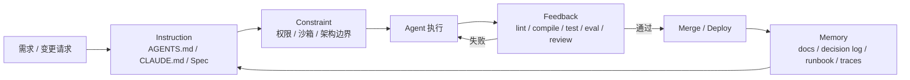
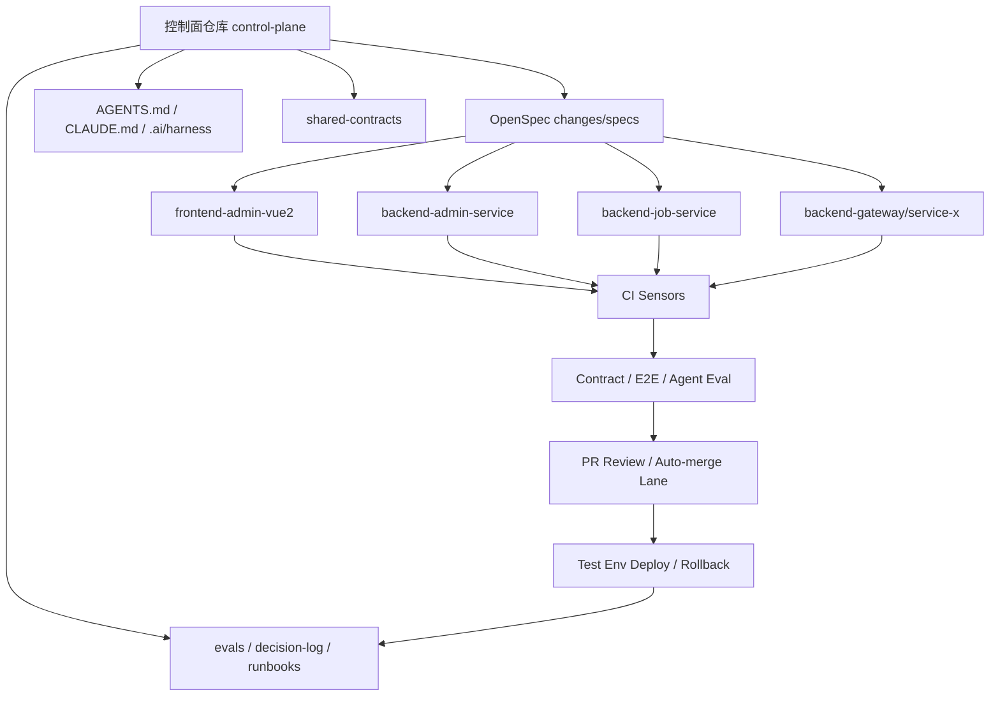

# AI Coding Agent 语境下的 Harness Engineering

> SUPERSEDED by docs/architecture/harness-workflow-and-design-principles.md.
> Historical research context only; do not use this file as the active execution SSOT.

## 执行摘要

这份报告的结论很明确：**Harness Engineering 不是“把 prompt 写得更好”**，而是为 AI Coding Agent 搭建一套**可控、可验证、可回放、可持续优化**的外部工程系统。它把“模型会不会写代码”这个问题，升级成“这套系统能不能稳定地产出符合架构、权限、安全、测试、交付要求的变更”这个工程问题。OpenAI 将 harness 描述为包围模型的完整契约，包括 instructions、tools、routing、output requirements 与 validation checks；Martin Fowler / Thoughtworks 则把它进一步拆成 feedforward 的 guides 与 feedback 的 sensors。citeturn15view6turn30view0turn25search0turn25search1

对你这样的多仓全栈业务系统来说，Harness Engineering 的重点不是“让 Agent 更聪明”，而是让 Agent 在**已知边界内可靠地工作**：变更必须先有 spec；修改前要做代码理解与影响分析；修改后必须过 lint / compile / unit / contract / E2E / eval；权限默认最小化；长链路任务必须有 memory 与 decision log；多仓变更要有统一控制面。Anthropic、OpenAI、Google 三方官方资料都在不同层面强调了相同方向：持久化项目说明、工具约束、权限控制、hooks、可观测性、eval 与 CI/CD 自动化，才是把 Agent 嵌入工程体系的关键。citeturn17view0turn17view1turn17view2turn19view0turn21view0turn21view1turn21view10turn21view11turn30view0

你追求的“**100% 自动化价值**”这个目标，方向上是对的，但工程上不应该理解为“从第一天起对所有任务都无人值守”，而应该理解为：**对一类边界清晰、风险受控、验证充分的任务，实现 100% 可托付自动化**。Stripe 明确指出，支付场景里“mostly correct 也是 failure”；Databricks 的 coSTAR 说明，没有测试与 refinement loop，agent 就是在盲飞；Thoughtworks 也把验证和 feedback 放到了比 prompt 更高的优先级。更可落地的做法是按风险等级逐步开放自动化，从“有人盯着”的 supervised lane，走向“有强门禁才自动合并”的 bounded autopilot，而不是一次性宣称“全仓无人值守”。这个分阶段里程碑是本文的核心落地建议。citeturn28view1turn26view0turn25search2turn24view2turn30view0

对你当前工具栈的判断也很明确：**OpenSpec、GitNexus、Maven、repo rules、hooks、skills、知识库都应该纳入 harness**。其中，OpenSpec 负责“变更意图与任务边界”，GitNexus 负责“代码理解与影响分析”，Maven / 前端构建与测试负责“确定性反馈传感器”，skills / Superpowers 负责“可复用 procedural workflow”，知识库则是 memory 的主干，而不是可有可无的附件。尤其在 Vue2 + Java + Spring Cloud + MySQL + Redis + RabbitMQ + Nacos + XXL-JOB 的多仓业务系统里，**知识库不是加分项，而是基础设施**。citeturn31view0turn31view1turn32view2turn33view3turn30view0turn17view0turn36view0

## 概念澄清与中文参考文章

### A 一句话定义

**Harness Engineering** 是：在 AI Coding Agent 之外，系统化设计一整套**指令、约束、反馈、记忆与编排**机制，使其在真实代码库中能够以可审计、可验证、可持续优化的方式完成软件变更；它关注的不是“提示词本身”，而是**Agent 运行的整个工程环境**。citeturn15view6turn24view2turn25search0

结合你的语境，可以把它更接地气地理解为：**让 AI 不只会“写代码”，而是会在你的团队规则、架构边界、权限管理、测试闭环、知识沉淀和交付流程里“按规矩干活”**。这也正是 OpenAI、Anthropic、Google、Thoughtworks 最近资料里共同强调的工程化方向。citeturn15view6turn17view0turn17view1turn24view4turn25search1

### B 和其他概念的区别

| 概念 | 主要关注点 | 典型输入 | 典型输出 | 失败方式 | 在你的工程里扮演的角色 |
|---|---|---|---|---|---|
| Prompt Engineering | 单次对话如何表达任务 | 一段 prompt | 一次回答/一次改动 | 说不清、漏信息、措辞歧义 | 只是入口层 |
| Context Engineering | 让模型“看到什么” | 代码片段、文档、检索结果、历史上下文 | 更高相关性的输出 | 上下文过载、关键事实缺失、上下文腐烂 | 是 harness 的一部分 |
| Agent Engineering | 设计 agent 的运行时：模型、tools、routing、loops | 模型 + 工具 + agent runtime | 可执行 agent | tool 乱用、循环失控、状态丢失 | 是 harness 的执行内核 |
| Test Harness | 对“软件”做测试的环境与 runner | 被测代码 + fixture + runner | 测试结果 | 覆盖不足、fixture 不真实 | 是 feedback 的子集 |
| Harness Engineering | 对“coding agent”做外部工程控制 | 指令、权限、反馈、memory、CI/CD、eval、review | 稳定、可控、可优化的交付系统 | 规则冲突、边界失守、验证失真、记忆过期 | 你的目标系统本体 |

这几个概念的层级关系可以概括为：**prompt < context < agent runtime < harness**。OpenAI 把 harness 写成“full contract around the model”；Fowler/Thoughtworks 用 guides 和 sensors 区分 agent 行动前后的控制；Databricks 则把 agent、test harness、judge suite、refine loop 放进同一个闭环里。换言之，Harness Engineering 并不是替代这些概念，而是把它们组织成一套可运行的工程系统。citeturn30view0turn25search0turn25search1turn26view0

### C 参考文章提炼

#### 得物技术公众号文章

**是否能打开原文**：本次研究中，直接打开你给的微信公众号链接时，web 工具没有成功解析原页；因此我**未能直接引用微信原页正文**。  
**实际参考来源**：我实际使用了两类材料来参考这篇文章：其一是**你提供的正文抓取摘要**；其二是**腾讯云开发者社区的授权转载页**，该页与原题名一致，标注“得物技术”、作者“盖伦”，并显示“原创声明：本文系作者授权腾讯云开发者社区发表”。因此，这篇文章在本报告中的使用方式应视为：**用户提供的原文摘要 + 授权转载页交叉校验**，而不是对微信公众号原页本身的直接读取。citeturn35view0

| 项目 | 内容 |
|---|---|
| 标题 | 基于 Harness + SDD + 多仓管理模式的 AI 全栈开发实践｜得物技术 |
| 作者 / 公众号 | 盖伦 / 得物技术 |
| 发布时间 | 腾讯云转载页显示 2026-05-07 11:09:57；你提供的原始页面 HTML `ct` 为 2026-05-06 18:30:22 +08，这一时间我未能在微信原页直接复核 |
| 实际参考 | 你的正文抓取摘要 + 腾讯云开发者社区授权转载页 |
| 文章定位 | 中文入门参考与实践经验总结，属于高价值二级来源，而非最终权威 |

从腾讯云转载页能够确认，这篇文章的结构包括：Harness 思维、全栈工作区与 Codebase Indexing、SDD 驱动全栈生成、多 Agent 并行、分阶段联调与测试介入等章节；转载页的概述也明确把 Harness 定义成“给 AI 一个已有实现作为参照，让它照着复刻，而不是凭空创造”。这和你给出的抓取摘要高度一致。citeturn35view0

**核心观点**：  
这篇文章最有价值的地方，不是“AI 能写前后端”，而是它把全栈 AI 开发拆成了四个工程动作：**参考实现约束、规范先行、并行自治、阶段化验证**。其内核是：  
一是让 AI **参考既有功能** 而不是自由发挥；  
二是把前后端工作放进同一工作区或至少同一认知上下文；  
三是先生成 SDD / spec / tasks，再分派多个 Agent；  
四是通过 mock、独立构建、联调、测试 review 收口。这个框架对“已有业务系统上的增量功能”非常有效，尤其适合前后端字段、接口、交互必须对齐的场景。这个判断与 Thoughtworks 对 spec-driven development、feedback sensors 和 human-on-the-loop 的观点高度一致。citeturn35view0turn24view4turn25search1turn24view2

**有价值的框架**：  
这篇文章最值得保留的三个框架是：  
其一，“**Harness 思维 = 模仿既有实现**”，很适合业务系统中的 CRUD、列表/表单、接口延展类需求；  
其二，“**前后端 SDD 分治 + 契约对齐**”，本质上是把契约作为并行开发桥梁；  
其三，“**三阶段验证**”，即前端 mock、自建后端验证、最终联调，这是一套非常适合企业业务系统的低摩擦收口方式。Databricks、Stripe 的公开实践都说明，真正决定 agent 是否可用的，不是单次生成质量，而是能不能在真实环境与真实验证器中闭环。citeturn35view0turn26view0turn28view1

**可能的不足**：  
这篇文章的问题不在方向，而在**一手来源和工程细节不足**。它更强调方法论，总体上没有像官方文档那样明确区分：哪些是 instructions、哪些是 tool permissions、哪些是 structural tests、哪些是 eval datasets、哪些是 production observability。对于“多仓索引如何持续更新”“权限具体怎么配”“hooks 在不同 agent 中如何落地”“CI/CD 自动化门禁如何设计”“LLM-as-judge 如何校准”的细节，仍需回到一级来源。这个不足并不削弱它的启发价值，但意味着它更适合作为“中文路线图”，不够适合作为唯一依据。citeturn35view0turn17view1turn19view0turn26view0turn26view5

**需要回溯一级来源验证的点**：  
需要验证的重点包括：AGENTS.md 的正式作用边界、CLAUDE.md / hooks / permissions 的官方语义、MCP 与 skills 的职责分工、eval-driven improvement loop 的实现方式，以及“人类应该在回路中哪一层”这一架构问题。这些一级资料都已在本文后续回溯。citeturn16view3turn17view0turn17view1turn18view0turn17view2turn30view0turn24view2

#### 阿里云文章

**是否能打开原文**：可以。  
**实际参考来源**：阿里云开发者社区原文页面。citeturn32view1turn33view2

| 项目 | 内容 |
|---|---|
| 标题 | 告别“氛围编程”：基于 Harness 治理和 SDD 的团队级 AI 研发范式演进与实践 |
| 作者 / 平台 | 王树新 / 阿里云开发者社区 |
| 发布时间 | 2026-05-14 |
| 实际参考 | 阿里云原文 |
| 来源属性 | 中文二级来源，且页面声明“本文内容由阿里云实名注册用户自发贡献，仅代表个人观点” |

这篇文章的核心主张是：团队不能只盯着“AI 出码率”，而要盯“交付周期和总工作量是否真的下降”。作者在文章中写到，团队的 AI 出码率已经达到 80%–90% 以上，但交付周期并没有明显缩短，因此转向用 SDD 与 Harness 解决从需求到部署的全链路问题。文章把 SDD 写成 Specify → Plan → Implement → Validate 四阶段，并把 Harness 拆成上下文工程、架构约束、反馈回路与熵管理、人类监督四个支柱。citeturn33view2turn33view3

**有价值的框架**：  
这篇文章比很多二手科普更强的一点，是它明确把**知识库**提到了基础设施层。作者给出“项目层 / 技术层 / 资产层”的三层知识结构，并强调用顶层 `README.md` 作为单一事实来源，同时把 memory 当成长期项目中的结构化上下文管理能力。这一点与你的问题高度相关：**知识库不是“不太重要”，而是 Harness 里的 Memory 主体**。如果没有项目知识、技术规范和可复用资产，Agent 在多仓业务系统里必然不断重复问问题、重复犯错、重复做出架构发明。citeturn33view3

**可能的不足**：  
文章明显带有团队方法论总结的风格，因此“Qoder 的 Quest Spec”“Memory”“全流程自动化”都带有平台化语义，但缺少跨工具可迁移的技术细节。它没有细讲到不同 Agent 的权限机制、hooks 事件模型、技能装载策略、CI 中的信任边界，也没有给出 judge alignment、trajectory eval 或 production observability 的具体校准方法。换句话说，它说清了“为什么要这么做”，但没有完全说清“用不同生态时怎么落地”。citeturn33view2turn33view3turn26view0turn26view5turn21view1

**需要回溯一级来源验证的点**：  
最需要回溯的是：  
一，AGENTS/CLAUDE/skills/hook/MCP 的官方语义；  
二，eval 与 judge 应如何校准；  
三，automation 的边界到底放在“merged”之前还是“deployed”之后；  
四，如何用结构测试与架构 fitness function 处理 AI 引发的 code entropy。后文都给出一手依据。citeturn16view3turn17view0turn17view1turn26view0turn25search7

## 一级来源回溯

### D 一手资料回溯

下表优先列出这次研究中最值得全栈开发者直接阅读的一手资料与高质量工程实践。评分说明：**可信度**以来源权威性与是否一手为主；**实战价值**以能否直接转化为文件、命令、CI、hooks、eval、权限或工作流为主。评分本身属于本文的**实践判断**。  

| 标题 | 来源机构 / 作者 | 链接 | 发布时间 | 来源类型 | 可信度 | 实战价值 | 适合全栈 | 有代码/可执行示例 | 主要收获 |
|---|---|---|---|---|---:|---:|---|---|---|
| Harness engineering: leveraging Codex in an agent-first world | OpenAI / Ryan Lopopolo | 官方文档 citeturn15view6turn16view3 | 2026-02-11 | 官方 | 5 | 5 | 是 | 否 | 把 harness 定义成围绕 agent 的环境、反馈与控制系统；强调短 AGENTS、docs 索引、linters、structural tests、entropy cleanup |
| AGENTS.md | OpenAI Developers | 官方文档 citeturn14view2 | 滚动文档 | 官方 | 5 | 5 | 是 | 是 | 说明 AGENTS.md 的发现规则、作用边界、推荐写法与多层覆盖关系 |
| Codex best practices | OpenAI Developers | 官方文档 citeturn14view3 | 滚动文档 | 官方 | 5 | 5 | 是 | 是 | 给出最小化说明、验证优先、工具使用、沙箱与反馈闭环等最佳实践 |
| Build an Agent Improvement Loop with Traces, Evals, and Codex | OpenAI Cookbook | 可执行 notebook citeturn30view0 | 2026-05-12 | 官方 | 5 | 5 | 是 | 是 | 把 traces → feedback → evals → ranked harness changes → Codex handoff 串成闭环 |
| Build iterative repair loops with Codex | OpenAI Cookbook | 可执行 notebook citeturn30view1 | 2026-05-11 | 官方 | 5 | 5 | 是 | 是 | “Review → Repair → Validate” 的通用闭环范式，适合把修复动作结构化 |
| Using skills to accelerate OSS maintenance | OpenAI DevDay/Cookbook 相关资料 | 官方资料 citeturn12search7turn15view7 | 2026-03-09 | 官方 | 5 | 4 | 是 | 是 | skills 适合做按需加载的 procedural knowledge，而不是把所有规则塞进全局 prompt |
| Claude Code overview | Anthropic | 官方文档 citeturn17view0 | 滚动文档 | 官方 | 5 | 5 | 是 | 是 | Claude Code 是 agentic coding tool，本质是把模型、工具、计划、执行放进同一 runtime |
| Memory with CLAUDE.md | Anthropic | 官方文档 citeturn17view0turn17view1 | 滚动文档 | 官方 | 5 | 5 | 是 | 是 | CLAUDE.md 是持久化项目记忆；支持全局、项目、子目录与个人记忆分层 |
| Claude Code hooks | Anthropic | 官方文档 citeturn17view2 | 滚动文档 | 官方 | 5 | 5 | 是 | 是 | hooks 能在 PreToolUse / PostToolUse 等事件上自动执行策略、校验或阻断 |
| Claude Code permissions | Anthropic | 官方文档 citeturn18view0turn19view0 | 滚动文档 | 官方 | 5 | 5 | 是 | 是 | 权限通过工具层生效，而不是靠 prompt 自觉；还支持通过 additional directories 控制访问范围 |
| Claude Code GitHub Actions | Anthropic | 官方文档 citeturn13search1 | 滚动文档 | 官方 | 5 | 4 | 是 | 是 | 说明如何把 Claude Code 放进 CI 做 issue/PR 自动化 |
| Monitor usage with OpenTelemetry | Anthropic | 官方文档 citeturn13search18 | 滚动文档 | 官方 | 5 | 4 | 是 | 是 | 给 coding agent 可观测性出口，便于成本、事件与失败链路分析 |
| Gemini CLI | Google / google-gemini | 官方 GitHub 仓库与文档 citeturn21view0turn21view4 | 持续更新 | 官方 / GitHub | 5 | 4 | 是 | 是 | 支持 sandbox、MCP、trusted folders、extensions，适合作为对比参考 |
| Run Gemini CLI in GitHub Actions | Google | 官方 GitHub Action citeturn21view1turn21view2 | 2026-04-24 起文档可见 | 官方 | 5 | 4 | 是 | 是 | 明确指出 CI 中需要显式信任工作区，强调不要在不可信输入上开启高权限 |
| Agent Development Kit | Google | 官方文档 citeturn21view7turn21view8 | 滚动文档 | 官方 | 5 | 4 | 是 | 是 | ADK 提供 Skills、Evaluation、Tracing、Tooling 体系，适合看 agent 工程基础设施 |
| Evaluate Gen AI agents | Google Cloud Vertex AI | 官方文档 citeturn21view11turn21view14 | 滚动文档 | 官方 | 5 | 4 | 是 | 是 | 给出 agent 评测与轨迹分析思路，可迁移到 coding-agent eval |
| Harness engineering for coding agent users | Martin Fowler / Thoughtworks | 一手方法论文章 citeturn25search0 | 2026-03 | 一手方法论 | 5 | 5 | 是 | 否 | 最清晰地提出 guides 与 sensors 这套 mental model |
| Feedback sensors for coding agents | Thoughtworks Technology Radar | 一手方法论 / Radar | citeturn25search1 | 2026-04-15 | 一手方法论 | 5 | 5 | 是 | 否 | 确定性质量门禁要直接接入 agent 工作流，失败后触发 self-correction |
| coSTAR: How we ship AI agents at Databricks fast, without breaking things | Databricks | 工程博客 citeturn26view0 | 2026-03-20 | 工程博客 | 5 | 5 | 是 | 否 | 真实说明 scenario / trace / judge / refine 如何构成 agent 的测试-改进系统 |
| Can AI agents build real Stripe integrations? | Stripe | 工程博客 citeturn28view1 | 2026-03-02 | 工程博客 | 5 | 5 | 是 | 否 | 强调 production-realistic benchmark、browser + codebase + DB + docs search + MCP 一起评估 |
| stripe/ai benchmarks | Stripe GitHub | GitHub 仓库 citeturn29view0 | 持续更新 | GitHub / 工程实践 | 5 | 5 | 是 | 是 | 开源了 benchmark 结构：environment / grader / solutions，适合照着做内部 coding-agent eval |
| LangChain AgentEvals / LangSmith trajectory evals | LangChain | 官方 docs + GitHub citeturn26view4turn26view5turn26view6turn26view7 | 持续更新 | 官方 / GitHub | 4 | 4 | 是 | 是 | trajectory eval、LLM-as-judge、CI/CD eval pipeline，都能迁移到 coding-agent 场景 |
| OpenSpec | Fission-AI | 官方 GitHub + CLI 文档 citeturn31view0turn31view1 | 持续更新 | GitHub / 官方项目 | 4 | 5 | 是 | 是 | specs / changes / validate / instructions / workspace，是“规范驱动”层的强工具 |
| GitNexus | abhigyanpatwari | 官方 GitHub 仓库 citeturn32view2 | 持续更新 | GitHub / 官方项目 | 4 | 5 | 是 | 是 | 给 agent 提供 query / context / impact / detect_changes 等代码图谱能力，且支持多仓 |
| Superpowers | obra | GitHub 项目 | citeturn36view0 | 持续更新 | GitHub / 工程实践 | 3 | 4 | 是 | 是 | 把 spec、plan、subagent、TDD、review、worktree 做成可复用 skills；适合吸收流程，不宜无脑全盘照搬 |

除上表外，值得做补充参考的还有 OpenHands Benchmarks 与 Aider SWE-Bench harness。前者提供标准化 benchmark pipeline，后者展示了一个非常朴素但实用的“**编辑成功 + lint pass + 预置测试通过 = plausible solution**”重试式 harness，对于“先把闭环跑起来”很有启发。citeturn26view3turn26view2

## 核心框架与工具接入

### E Harness Engineering 核心框架

OpenAI、Databricks、Thoughtworks/ Fowler 的一手资料，可以合并成一个很实用的统一框架：**Instruction → Constraint → Feedback → Memory → Orchestration**。其中，Instruction 和 Constraint 更偏 feedforward controls，目的是提高“第一次就做对”的概率；Feedback 更偏 sensors，目的是让 agent 在人类介入前先自我纠正；Memory 负责长期上下文与经验沉淀；Orchestration 则负责把这一切组织成多阶段、多仓、多 Agent 的可执行流程。citeturn15view6turn25search0turn25search1turn26view0



#### Instruction

Instruction 解决的问题是：**Agent 不知道你真正想要什么，以及“正确做法”长什么样**。OpenAI 建议把 durable guidance 放进 AGENTS.md，并且保持简洁、像目录一样指向更具体的 markdown；Anthropic 则把 CLAUDE.md 作为持久化 memory 文件，在全局、项目、子目录层级进行加载。对业务系统而言，Instruction 的目标不是“多说”，而是“把长期稳定的规则写清楚”。citeturn14view2turn17view0turn17view1

在你的全栈项目里，Instruction 的落地应该分三层：  
第一层是**跨工具公共层**，也就是 `AGENTS.md`，写 repo 概览、目录地图、必须先读的 spec/plan、关键命令、完成定义；  
第二层是**工具方言层**，例如 `CLAUDE.md`、`.cursor/rules/**`、`.ai/harness/*.md`；  
第三层是**变更级指令层**，也就是每个 change 的 `proposal.md / spec.md / plan.md / tasks.md`。OpenSpec 正是为第三层设计的。citeturn31view0turn31view1turn17view1turn14view2

Instruction 是否有效，要看三个指标：**第一次生成的采纳率、澄清问题的数量是否下降、同类变更是否越来越少出现风格/命名/架构漂移**。如果你发现 AGENTS.md 越写越长、互相矛盾、没人维护，那通常说明你把手册写成了百科全书，而不是做成“入口 + 索引 + 规则层次”。这是最常见的坑。citeturn14view2turn15view8

#### Constraint

Constraint 解决的问题是：**即使 agent 知道规则，也未必会遵守；仅靠 prompt 禁止并不可靠**。Anthropic 的权限文档很明确：权限是由工具层执行的，不是靠模型自觉；Google 在 Gemini CLI 的 trusted folders 与 GitHub Actions 文档里也反复强调，信任边界、沙箱与 workspace trust 必须显式配置，特别是在 CI 中。citeturn18view0turn19view0turn21view1turn21view2turn21view4

对你的系统，Constraint 至少要有四种：  
一是**资源约束**，例如禁止改 `application-prod.yml`、`.env*`、`k8s/prod/**`、Nacos 线上配置脚本；  
二是**命令约束**，例如允许 `mvn -pl <module> -DskipTests compile`，但禁止 `kubectl apply`、禁止 `git push origin main`、禁止删除整仓文件；  
三是**架构约束**，例如 Frontend 只能调用 API SDK，Controller 不能直接调 Mapper，XXL-JOB handler 不能内嵌复杂业务逻辑，MQ consumer 不能跳过 application service；  
四是**变更范围约束**，跨仓接口变更必须伴随 spec 更新、契约快照变更与前后端联动 PR。后两类最好用结构测试和静态规则固化，而不是写在 prompt 里自求多福。citeturn25search7turn24view5turn33view3

Constraint 是否有效，看的是：**被拒绝的危险操作是否清晰、架构越界是否能在提交前被阻断、是否还存在“明知不该做但 agent 还是做了”的情况**。最大的坑是“把约束写进 prompt，却不给工具层和 CI 层任何硬门禁”。那不叫约束，只叫愿望。citeturn18view0turn21view1turn25search1

#### Feedback

Feedback 解决的问题是：**写出来不等于写对了，写对了也不等于业务没坏**。Databricks 的 coSTAR 把 scenario、trace、judge、refine 组织成完整测试体系；Thoughtworks 明确提出 feedback sensors for coding agents；OpenAI 的 Cookbook 则把 traces、feedback、evals、ranked changes 与 Codex handoff 串成 improvement loop。citeturn26view0turn25search1turn30view0

在全栈业务项目里，Feedback 应分成三层：  
第一层是**确定性传感器**：lint、compile、unit、integration、contract、E2E；  
第二层是**半确定性评估**：LLM-as-judge、trajectory eval、运行过程评估；  
第三层是**人类反馈**：架构 review、产品逻辑验收、线上回归判断。LangChain 与 Vertex 的资料都说明，光看 final answer 不够，很多 agent 问题出在“中间路径”——也就是 tool 调用顺序、是否查了该查的资料、是否绕过了必要步骤。citeturn26view5turn26view6turn21view11turn21view14

Feedback 是否有效，要看：**失败是否能触发自动修复、评测是否和人工判断对齐、同类错误是否在后续变更中显著减少**。最大的坑有三个：  
一，只做 happy path；  
二，让 LLM judge 没有对齐 human golden set；  
三，把 E2E 留到最后，导致前面所有“通过”都只是局部假象。Stripe 的 benchmark 之所以有价值，正因为它把 codebase、browser、database、docs search 与真实 grader 放进一个 production-realistic 环境里。citeturn26view0turn28view1turn29view0

#### Memory

Memory 解决的问题是：**长任务上下文丢失、多仓知识割裂、同类教训无法沉淀**。Anthropic 用 CLAUDE.md 给出持久化项目记忆的官方入口；OpenAI 在 harness 文章里建议把 AGENTS.md 做成更大知识库的目录；阿里云文章则更直白地把知识库分成项目层、技术层、资产层，并强调 README 作为单一事实来源。citeturn17view0turn17view1turn15view6turn33view3

对你的多仓系统，我建议把 Memory 明确拆成三种：  
**稳定记忆**：架构图、服务地图、命名规范、中间件使用约定、公共异常码、队列与任务规范；  
**变更记忆**：每个 change 的 spec、plan、decision log、风险说明、未决项；  
**运行记忆**：agent hooks 摘要、失败案例、eval 结果、回归问题、最终复盘。  
第一类适合放 `docs/`、`README.md`、`AGENTS.md`、`CLAUDE.md`、`.ai/harness/`；第二类适合放 `openspec/changes/<change-id>/`；第三类适合放 `evals/results/`、`runbooks/`、`decision-log/`。这不是可选优化，而是多仓全栈 harness 的核心骨架。citeturn31view0turn17view1turn33view3turn30view0

Memory 是否有效，可以看：**agent 是否还在反复问相同问题、前后端是否仍重复出现字段不一致、旧 bug 是否反复重演**。最大的坑，是一上来就做“大而全知识库”，却没有版本控制、没有索引、没有 freshness 机制。Harness 里的知识库应该先是**版本化 Markdown + 清晰索引 + 可被 agent 精准引用**，而不是先上一个空洞的向量数据库。citeturn15view6turn33view3turn31view0

#### Orchestration

Orchestration 解决的问题是：**任务怎么拆、谁先做、谁后做、跨仓怎么同步、失败后怎么回路**。Anthropic 的 subagents、hooks、GitHub Actions，OpenAI 的 improvement loop，GitNexus 的多仓全局 registry，OpenSpec 的 change / workspace 设计，都是编排层的不同切面。citeturn17view2turn13search1turn30view0turn32view2turn31view1

在你的项目里，最简单也最有效的编排方式不是“上来就做 swarm”，而是三层：  
**控制面**：control repo / workspace，承载 OpenSpec、AGENTS、共享规则与统一 eval；  
**执行面**：每个前后端 repo 各自由一个 agent 或 subagent 处理；  
**收口面**：统一 PR gate、契约校验、E2E、人工 review、部署回滚。  
如果一个需求要改 Vue2 管理端、Java 服务、SQL schema、消息消费与 XXL-JOB，最危险的不是写代码本身，而是没有“谁先改契约、谁负责 mock、谁负责发布顺序”的显式编排。citeturn35view0turn32view2turn24view2

Orchestration 是否有效，看：**并行度有没有提升、冲突有没有减少、是否还能追踪每个变更从 spec 到 deploy 的证据链**。最大的坑是“多 Agent 但无边界”，最后变成多人踩同一分支、同一文件、同一决策，表面并行，实际增熵。citeturn24view2turn24view6turn25search9

### 知识库、工具接入与自动化目标

先回答你追问的两个核心问题。

第一，**这些工具要不要纳入 harness**？答案是：**要，而且要按层接**。  
第二，**知识库重不重要**？答案是：**非常重要，它就是 harness 的 memory 主体之一，不是“以后再说”的附属物**。OpenAI、Anthropic 与阿里云文章实际上都指向同一结论：持久化可索引的项目知识，是 agent 持续可靠工作的前提。citeturn15view6turn17view1turn33view3

| 工具 / 机制 | 是否纳入 harness | 所属层 | 推荐接法 | 备注 |
|---|---|---|---|---|
| OpenSpec | 是 | Instruction / Memory / Orchestration | 所有需求、能力、接口契约变更先落 `changes/<id>/`；PR gate 跑 `validate`；控制面统一维护 | 官方 workspace 仍是 beta，规划层可用，执行层不要深度绑定未来不稳定接口 |
| GitNexus | 是 | Memory / Feedback / Orchestration | 修改前 `impact`，编码中 `query/context`，提交前 `detect_changes`，索引过期时 `analyze` | 非常适合你的多仓代码理解与 blast radius 分析 |
| `rg` / `git grep` | 是 | Fallback | 当索引过期、MCP 不可用、或做 quick scan 时使用 | 不是主工具，只是兜底 |
| Maven | 是 | Feedback | compile / targeted test / integration test 全部做成 sensors | 这是 Java 侧最硬的确定性反馈层 |
| 前端 lint / unit / E2E | 是 | Feedback | Vue2 仓单独跑 lint、组件测试、代理联调、E2E smoke | 前后端契约问题不能只靠后端 compile 发现 |
| Superpowers / skills | 是，但**选择性接入** | Instruction / Orchestration | 把其中适合你的流程性技能作为“按需调用的程序化工作流”引入，而不是把全部技能设成全局强制规则 | 更像 reusable workflow packs，不是 trust boundary |
| 知识库 | 是，而且是一级能力 | Memory | 先做版本化 markdown、目录索引与 decision log，再决定是否上向量检索 | 对多仓企业项目不是 optional |

关于 **Superpowers / skills**，我的建议是：**接入，但只接“你真正会复用的技能”，不要把它当总控中枢**。OpenAI、Anthropic、Google 都在不同体系里支持 skills / extensions / plugin 这类“按需装载的 context + procedure”；Superpowers 则把 brainstorming、plan、subagent、TDD、review 这些工作流封装成了可复用技能。它适合做“流程外挂”，不适合代替你自己的 AGENTS / 权限 / CI 基线。换句话说：**skills 应该是 harness 的插件层，不是宪法层**。citeturn15view7turn17view2turn21view7turn36view0

关于 **知识库**，我给一个非常直接的判断：  
如果你的项目是**两个或多个前后端仓库 + 大量中间件 + 历史包袱**，那知识库的重要性不是降低，而是更高。Vue2 管理端、Spring Cloud 服务、MySQL 表、Redis key、RabbitMQ 交换机、Nacos 配置、XXL-JOB 任务、接口约定、错误码、运营规则，这些知识通常**不全在代码里**。如果 harness 里没有知识库，Agent 能通过 GitNexus 看懂代码关系，却仍然可能看不懂“为什么要这样做”。对这类系统，推荐从**版本化文档库**而不是从“RAG 平台”起步。citeturn33view3turn15view6turn17view1

最后说“**100% 自动化价值**”。你的理解方向是对的：**95% 自动化但仍要人盯着，本质上没有释放认知带宽**。Stripe 公开写到支付集成里“mostly correct 就是 failure”；Thoughtworks 认为真正稀缺的是 verification；OpenAI 与 Databricks 的闭环也都说明，自治程度必须建立在 feedback gate 越来越可信之上。基于这些资料，我给出的**实践建议**是：把“100% 自动化”理解为“**对某个任务类别的 100% 可托付自动化**”，并按风险分层推进，而不是做整仓统一口号。citeturn28view1turn25search2turn30view0turn26view0

| 阶段 | 自动化水平 | 适用任务 | 进入条件 | 是否建议上线 |
|---|---|---|---|---|
| 辅助模式 | Agent 提案，人类逐步指挥 | 文案、小范围重构、测试补齐 | 基本命令与只读工具 | 是 |
| 监督模式 | Agent 能独立完成小任务，但必须人工批准 | 单仓小变更、bugfix、文档更新 | lint/compile/unit 稳定 | 是 |
| 受边界自动驾驶 | Agent 可自动修复并自动提 PR | 有明确 allowed paths 的改动 | impact + tests + contract + hooks | 强烈建议作为主目标 |
| 条件式自动合并 | 低风险改动通过就自动 merge | 文档、测试、样式、局部 CRUD | judge-human 对齐、回滚成熟、逃逸率低 | 只在低风险 lane 建议 |
| 无人值守闭环 | 生成、验证、合并、部署全自动 | 非核心业务、平台脚手架、重复性维护 | 高覆盖 eval、最小权限、可观测性、自动回滚 | 仅建议做局部试点 |
| 高风险业务自动化 | 涉及支付、权限、计费、跨服务关键链路 | 极少数场景 | 需要近乎生产级 benchmark 与强审计 | 暂不建议默认启用 |

这张分层表是本文的**实践建议模型**，不是某个官方框架原文；但它和 Stripe、OpenAI、Databricks、Thoughtworks 的公开经验是相容的。你的北极星可以是“100% 自动化价值”，但落地路径一定是“**按任务类建立越来越可信的自动化 lane**”。citeturn28view1turn30view0turn26view0turn24view2

## 多仓全栈落地方案

### F 全栈开发落地方案

对你的实际项目，我推荐采用**控制面仓库 + 多业务仓库 + 知识/契约共享层**的结构，而不是强行把所有代码放进一个巨型 monorepo。原因有三个：  
一，OpenSpec 适合承载 change/spec/plan/instructions，但 workspace 功能仍处于 beta；  
二，GitNexus 已经支持全局 registry 与多仓服务；  
三，Anthropic 的权限体系支持通过 additional directories 控制可访问目录。也就是说，你完全可以**保留独立仓库边界，同时获得统一的 agent 控制面**。citeturn31view1turn32view2turn19view0



#### 推荐目录结构

下面这个目录不是“把业务仓 hard-copy 到一个仓”，而是**本地工作区 / 控制面布局**。业务仓仍然可以各自独立。以下结构属于**实践建议模板**。

```text
ai-workspace/
├─ control-plane/
│  ├─ AGENTS.md
│  ├─ CLAUDE.md
│  ├─ .ai/
│  │  └─ harness/
│  │     ├─ architecture.md
│  │     ├─ coding-rules.md
│  │     ├─ test-strategy.md
│  │     ├─ permissions.md
│  │     └─ release-policy.md
│  ├─ .cursor/
│  │  └─ rules/
│  │     ├─ common.mdc
│  │     ├─ frontend-vue2.mdc
│  │     └─ backend-java.mdc
│  ├─ openspec/
│  │  ├─ specs/
│  │  └─ changes/
│  ├─ docs/
│  │  ├─ README.md
│  │  ├─ system-map.md
│  │  ├─ service-catalog.md
│  │  ├─ api-contracts.md
│  │  ├─ nacos-config-map.md
│  │  ├─ mq-topology.md
│  │  ├─ xxl-job-map.md
│  │  └─ decision-log/
│  ├─ evals/
│  │  ├─ datasets/
│  │  ├─ rubrics/
│  │  └─ results/
│  ├─ scripts/
│  │  ├─ openspec-gate.sh
│  │  ├─ gitnexus-preflight.sh
│  │  ├─ run-targeted-tests.sh
│  │  └─ agent-eval.sh
│  └─ shared-contracts/
│     ├─ openapi/
│     ├─ json-schema/
│     └─ mock-fixtures/
├─ repos/
│  ├─ frontend-admin-vue2/
│  ├─ backend-admin-service/
│  ├─ backend-order-service/
│  ├─ backend-job-service/
│  └─ gateway-or-bff/
└─ .gitnexus/
```

#### AGENTS.md 示例

OpenAI 建议 AGENTS.md 保持简洁、像目录，不要写成百科全书；因此下面这个模板刻意控制在“入口文档”的范围内。这个模板属于**实践建议**。citeturn14view2turn15view8

```markdown
# AGENTS.md

## Workspace purpose
This workspace hosts a multi-repo enterprise full-stack system:
- frontend: Vue2 + Element UI admin
- backend: Java + Spring Cloud + MySQL + Redis + RabbitMQ + Nacos + XXL-JOB
- control-plane: OpenSpec, rules, evals, contracts

## Read this first
Before coding, read in order:
1. `control-plane/openspec/changes/<change-id>/spec.md`
2. `control-plane/openspec/changes/<change-id>/plan.md`
3. `control-plane/.ai/harness/architecture.md`
4. `control-plane/.ai/harness/coding-rules.md`
5. `control-plane/docs/api-contracts.md`

## Mandatory preflight
Before editing code:
1. Run impact analysis for target repo.
2. Confirm allowed paths from `plan.md`.
3. If contract changes, update both backend and frontend specs before code.

## Mandatory tools
- Code understanding: GitNexus first; fallback to `rg` / `git grep`
- Spec gate: OpenSpec
- Build/test:
  - backend compile: `mvn -pl <module> -DskipTests compile`
  - backend targeted test: `mvn -pl <module> -Dtest=<TestClass> test`
  - frontend lint/unit: use repo package scripts
- Never mark a task done without command evidence.

## Allowed behavior
- Reuse existing implementation patterns.
- Prefer smallest viable diff.
- Keep architecture boundaries intact.
- Update docs/spec/decision log when behavior or contract changes.

## Forbidden behavior
- Do not modify prod config, secrets, deployment manifests, or DB migrations unless `plan.md` explicitly allows it.
- Do not change API contracts in code without updating contract docs/spec.
- Do not bypass tests, hooks, or permission prompts.
- Do not refactor unrelated modules “while you are here”.

## Definition of done
A change is done only if:
- spec/plan/tasks are consistent
- impacted repos compile
- targeted tests pass
- contract checks pass
- evidence summary is added to PR / task note
```

#### CLAUDE.md 示例

CLAUDE.md 应该写 Anthropic 特有的运行偏好，例如 subagents、hooks、权限与压缩策略，而不是重复 AGENTS.md 的通用规则。以下模板为**实践建议**。citeturn17view0turn17view1turn17view2turn18view0

```markdown
# CLAUDE.md

## Scope
This file is Claude-specific. Global project rules live in `../AGENTS.md`.

## Operating mode
- Default to supervised mode.
- Never use bypass permissions.
- Use one subagent per repo or per clearly bounded task.
- For cross-repo changes:
  - frontend subagent owns UI and API call adaptation
  - backend subagent owns controller/service/domain/repository changes
  - reviewer subagent checks spec compliance and architecture boundaries

## Required workflow
1. Read `spec.md` and `plan.md`
2. Run code understanding / impact analysis
3. Edit only allowed paths
4. After each batch, run targeted checks
5. Summarize evidence before requesting review

## Permissions notes
- Treat `application-prod.yml`, `bootstrap-prod.yml`, `.env*`, `k8s/prod/**`, `db/migration/**` as protected
- Ask before editing `nacos-config-map.md`, MQ topology, or job scheduling config
- Never push directly to protected branches

## Hooks expectations
- PreToolUse should block dangerous file writes and dangerous shell commands
- PostToolUse should trigger targeted verification
- Stop hook should write a concise run summary:
  - changed files
  - commands run
  - failed/passed checks
  - unresolved risks

## Compaction / memory
When context is compacted, preserve:
- current change-id
- impacted repos/modules
- pending blockers
- latest command evidence
- unresolved contract or business questions
```

#### spec.md 示例

下面以“结束语管理”这种你前面提到的典型后台功能为例，给一个**多仓全栈变更级 spec 模板**。这是**实践建议模板**，并吸收了得物文章里“前后端拆 spec、先对齐契约”的做法。citeturn35view0

```markdown
# spec.md

## Change ID
closing-message-admin

## Business goal
在管理后台新增“结束语”配置能力，支持列表、搜索、新增、编辑、逻辑删除、排序，并在相关业务场景按优先级返回结束语。

## Repos in scope
- repos/frontend-admin-vue2
- repos/backend-admin-service
- control-plane/shared-contracts

## Non-goals
- 不改线上生产配置中心结构
- 不做跨业务场景的统一文案平台
- 不引入新的中间件

## Data model
Entity: ClosingMessage
- id: bigint
- scene_code: varchar(64)
- title: varchar(128)
- content: text
- priority: int
- status: tinyint
- deleted: tinyint
- created_at / updated_at

## Backend contract
- GET /api/admin/closing-messages
- POST /api/admin/closing-messages
- PUT /api/admin/closing-messages/{id}
- DELETE /api/admin/closing-messages/{id}
- POST /api/admin/closing-messages/sort

## Frontend behavior
- 新增 Tab：结束语
- 支持列表、搜索、分页
- 新增/编辑弹窗
- 拖拽排序
- 删除二次确认
- 错误提示与空态处理

## Constraints
- Controller -> Application -> Domain -> Infra
- Controller 禁止直接访问 Mapper
- 前端页面只通过 API SDK 访问后端
- 接口字段命名以后端 contract 为准
- 新字段必须同步 mock fixture 与 contract snapshot

## Acceptance criteria
- 后端 compile + targeted tests pass
- 前端 lint + unit smoke pass
- contract snapshot updated
- staging smoke verifies list/create/edit/delete/sort
- priority sorting is stable and deterministic
```

#### plan.md 示例

plan 不应该是空泛 TODO，而应该是**明确 repo、模块、文件、验证方式、回滚点**的执行计划。以下为**实践建议模板**。

```markdown
# plan.md

## Batch A: contract first
1. Update `shared-contracts/openapi/closing-message.yaml`
2. Update mock fixtures
3. Add decision log for sorting behavior
Verification:
- contract diff reviewed
- frontend/backend field mapping checked

## Batch B: backend
1. Add entity/repository/service/controller changes in backend-admin-service
2. Add DB migration only if explicitly approved
3. Add unit tests for service and sort logic
4. Add integration test for list/create/edit/delete
Verification:
- `mvn -pl backend-admin-service -DskipTests compile`
- `mvn -pl backend-admin-service -Dtest=ClosingMessage* test`

## Batch C: frontend
1. Add new tab and route
2. Add API SDK methods
3. Add list/search/dialog components
4. Add mock mode fixtures and error-state coverage
Verification:
- `npm run lint`
- `npm run test:unit`
- local mock smoke passes

## Batch D: integration
1. Point frontend proxy to test backend
2. Run smoke E2E for happy path and edge states
3. Verify field mapping and sort persistence
Verification:
- Playwright smoke
- contract snapshot matches actual API

## Batch E: release evidence
1. Run impact analysis
2. Summarize changed files/modules/processes
3. Attach evidence to PR
Rollback:
- feature flag / route hide / revert commit
```

#### coding rules 示例

对你这个栈，**架构边界必须落到可执行规则**。下面是建议写进 `coding-rules.md` 的核心内容。属于**实践建议**，但它背后的原则来自 OpenAI 的 structural tests / entropy cleanup 与 Thoughtworks 的 architecture drift reduction。citeturn15view8turn25search7

```markdown
# coding-rules.md

## Backend
- 禁止 Controller 直接调用 Mapper / DAO
- 禁止 Service 层直接拼装 HTTP 响应对象
- 禁止 XXL-JOB Handler 编写核心业务逻辑，Handler 只做调度入口
- RabbitMQ Consumer 必须落到 Application Service，不得直接写库
- Nacos 配置 key 变更必须附带配置映射文档更新
- Redis key 必须在 `docs/redis-key-map.md` 记录命名约定
- 跨服务 DTO 只允许通过 `shared-contracts` 维护

## Frontend
- 页面层只能调用 API SDK，不得直接拼接后端路径
- Table / Form 组件优先复用现有模式
- 页面状态、弹窗状态、空态与错误态必须显式处理
- Mock 数据字段与后端 contract 完全一致
- 组件命名和目录结构遵循现有 admin 模块

## Cross-repo
- 任何接口字段改动必须同时更新：
  - backend contract
  - frontend API typings / adapters
  - mock fixtures
  - decision log
- 不允许“顺手”重构无关模块
```

#### test strategy

你的测试策略不能只盯单元测试，因为你的系统故障面分散在**接口契约、数据持久化、中间件拓扑、配置中心、定时任务与前端交互链路**上。Stripe 的 benchmark 和 Databricks 的 coSTAR 都说明，只有把**真实环境的 verifier** 放进流程，agent 才不会“看似通过，实则业务错”。citeturn28view1turn26view0

| 层级 | 前端 Vue2 | 后端 Java | 目标 |
|---|---|---|---|
| 构建级 | lint / build | `mvn -pl <module> -DskipTests compile` | 快速发现语法与依赖问题 |
| 单元级 | 组件、store、formatter | service / domain / util | 约束核心业务逻辑 |
| 集成级 | API adapter + mock 契约 | MySQL / Redis / RabbitMQ / mapper / application service | 发现资源与框架集成问题 |
| 契约级 | OpenAPI/JSON schema snapshot | controller response snapshot | 防字段名与语义漂移 |
| 任务/消息级 | N/A | XXL-JOB handler、MQ consumer flow | 防调度链路与消息处理破坏 |
| 联调级 | 代理 test env | test env service | 覆盖真实接口映射 |
| E2E 级 | Playwright / Cypress smoke | 配合测试环境 | 验证业务路径 |
| Agent Eval 级 | 任务场景 + judge | 任务场景 + judge | 验证 agent 是否按 spec 正确工作 |

**实践建议**：  
后端优先做三类“能挡住 AI 乱改架构”的测试：  
一，**ArchUnit / 自定义结构测试**，验证包依赖边界；  
二，**契约快照测试**，验证接口字段；  
三，**中间件最小集成测试**，验证 Redis key、MQ handler、XXL-JOB handler 是否还在正确链路上。  
前端优先做三类：  
一，页面级 smoke；  
二，API adapter 契约校验；  
三，mock 与真实接口字段的一致性校验。这个组合比“单纯多写单元测试”更适合业务后台。citeturn25search1turn25search7turn28view1

#### CI workflow

CI 不只是“跑测试”，而是 harness 的**最终仲裁层**。对多仓系统，我建议用“两层门禁”：  
**repo-level gate** 负责本仓编译、单测、结构规则与契约快照；  
**control-plane gate** 负责 OpenSpec、跨仓契约、E2E、agent eval 与发布证据。  
如果你现在不是 GitHub Actions，也完全可以把同样阶段搬到 Jenkins/GitLab；关键是阶段设计，不是平台品牌。citeturn13search1turn26view6turn31view1

下面给一个**repo-level PR gate** 的 YAML 示例。属于**实践建议模板**。

```yaml
name: pr-gate

on:
  pull_request:

jobs:
  spec_guard:
    runs-on: ubuntu-latest
    steps:
      - uses: actions/checkout@v4
      - name: Validate OpenSpec change
        run: |
          ./control-plane/scripts/openspec-gate.sh

  impact_analysis:
    runs-on: ubuntu-latest
    steps:
      - uses: actions/checkout@v4
      - name: GitNexus detect changes
        run: |
          npx gitnexus analyze --skip-embeddings || true
          ./control-plane/scripts/gitnexus-preflight.sh

  backend_compile_test:
    runs-on: ubuntu-latest
    if: contains(github.event.pull_request.title, '[backend]') || always()
    steps:
      - uses: actions/checkout@v4
      - name: Set up JDK
        uses: actions/setup-java@v4
        with:
          distribution: temurin
          java-version: '17'
      - name: Compile
        run: mvn -pl backend-admin-service -DskipTests compile
      - name: Targeted tests
        run: mvn -pl backend-admin-service -Dtest=ClosingMessage* test

  frontend_lint_unit:
    runs-on: ubuntu-latest
    if: contains(github.event.pull_request.title, '[frontend]') || always()
    steps:
      - uses: actions/checkout@v4
      - name: Set up Node
        uses: actions/setup-node@v4
        with:
          node-version: '20'
      - name: Install
        run: cd repos/frontend-admin-vue2 && npm ci
      - name: Lint
        run: cd repos/frontend-admin-vue2 && npm run lint
      - name: Unit
        run: cd repos/frontend-admin-vue2 && npm run test:unit

  contract_and_e2e:
    runs-on: ubuntu-latest
    needs: [backend_compile_test, frontend_lint_unit]
    steps:
      - uses: actions/checkout@v4
      - name: Contract check
        run: ./control-plane/scripts/check-contracts.sh
      - name: Smoke E2E
        run: ./control-plane/scripts/run-smoke-e2e.sh

  agent_eval:
    runs-on: ubuntu-latest
    needs: [contract_and_e2e]
    steps:
      - uses: actions/checkout@v4
      - name: Run coding-agent eval cases
        run: ./control-plane/scripts/agent-eval.sh
```

#### eval 脚本思路

你的对象不是“业务对话 agent”，而是“coding agent”。因此 eval dataset 不该只写 prompt/output，而要写成**变更场景 + allowed paths + verifier + rubric**。OpenAI、Databricks、Stripe、LangChain 的资料都指向同一原则：**真实 traces、真实环境、真实 verifier、必要时再叠加 judge**。citeturn30view0turn26view0turn29view0turn26view5

建议你的 `evals/datasets/*.yaml` 用下面这种结构。属于**实践建议模板**。

```yaml
id: closing-message-admin
repos:
  - backend-admin-service
  - frontend-admin-vue2
change_id: closing-message-admin
prompt: >
  基于 spec 与 plan 完成结束语管理功能，不得修改受保护文件。
allowed_paths:
  - repos/backend-admin-service/**
  - repos/frontend-admin-vue2/**
  - control-plane/shared-contracts/**
forbidden_paths:
  - "**/application-prod.yml"
  - "**/.env*"
  - "**/k8s/prod/**"
required_checks:
  - mvn -pl backend-admin-service -DskipTests compile
  - mvn -pl backend-admin-service -Dtest=ClosingMessage* test
  - cd repos/frontend-admin-vue2 && npm run lint
  - cd repos/frontend-admin-vue2 && npm run test:unit
  - ./control-plane/scripts/check-contracts.sh
grader:
  deterministic:
    - compile_pass
    - unit_pass
    - contract_pass
    - allowed_path_only
  llm_judge:
    - spec_conformance
    - architecture_boundary_respected
    - ui_behavior_complete
```

评分逻辑建议采用“**确定性优先，judge 补充**”：  
先看 compile / test / contract / allowed paths；  
这些不过，直接 fail；  
这些都过，再让 LLM judge 检查 spec 一致性、架构边界、UI 行为完整性。  
如果你要把这个 eval 用于自动 merge，那么 judge 结果一定要先和人工 golden set 对齐。Databricks 专门提醒过这一点：**test your tests**。citeturn26view0turn26view5

#### hooks 设计

如果你采用 Claude Code，hooks 可以直接成为 harness 的实时执行器；如果你采用其他 agent，至少也要保留**git hooks + CI hooks** 这两层可移植机制。Anthropic 已公开 hooks 事件机制，GitNexus 也明确支持通过 hooks 做 context enrichment 与 stale-index 检测。citeturn17view2turn32view2

建议你设计三类 hooks。以下是**实践建议**：  
**PreToolUse**：拦危险操作。  
- 禁止改受保护文件。  
- 禁止危险命令。  
- 检查是否存在 `spec.md` / `plan.md`。  
- 检查是否已做 impact analysis。  

**PostToolUse**：做增量验证。  
- 编辑 Java 文件后跑 targeted compile。  
- 改 controller / DTO 后跑 contract snapshot。  
- 改 Vue 页面后跑 lint + unit smoke。  
- git commit 后检查 GitNexus 索引是否 stale，需要时提示 `npx gitnexus analyze`。  

**Stop / SessionEnd**：沉淀运行记录。  
- 汇总 changed files。  
- 汇总命令证据。  
- 写 unresolved risks。  
- 写给下一轮 agent 的 compact summary。  

#### MCP 接入思路

MCP 很适合做“**只暴露该暴露的能力**”。Anthropic、Google、Stripe 的资料都说明，MCP 的价值不只是接更多工具，而是给 agent 一个结构化、可控的工具边界。Stripe 的 benchmark 甚至把 terminal、browser 与文档搜索统一包装成 MCP server，以保证所有模型在相同 harness 下工作。citeturn17view3turn21view3turn28view1

对你的项目，我建议默认接四类 MCP，且尽量**只读优先**：

| MCP 能力 | 默认权限 | 用途 | 建议 |
|---|---|---|---|
| GitNexus MCP | 读为主，重命名可审批 | query / context / impact / detect_changes | 必接 |
| 知识库 / 文档 MCP | 只读 | 读取架构文档、契约、决策日志、服务地图 | 必接 |
| 环境 / 配置元数据 MCP | 只读 | 读 Nacos key 元信息、任务名、交换机名，不返回 secrets | 推荐 |
| 浏览器 / 测试环境 MCP | 仅测试环境 | 管理后台联调、E2E 校验 | 推荐 |
| 数据库 schema MCP | 只读 | 查表结构、索引、历史 migration 元数据 | 推荐 |
| Secret / 凭证代理 MCP | 只返回句柄，不返回明文 | 让 agent 能“使用凭证”但“看不到秘密” | 高价值，但需专门设计 |

其中最重要的原则是：**让 agent 通过 MCP 使用能力，而不是直接拿到高权限凭证**。这和 Stripe 在 agentic auth / zero-knowledge credential 方向上的思路是同一类设计，只是你现在先不必上那么复杂。当前阶段，做到“测试环境凭证在 CI 或 broker 内托管，agent 只拿到可调用能力”就已经很强了。citeturn28view1turn21view1

#### 如何做权限控制

权限控制不是写一句“请谨慎操作”，而是把资源分成可读、可改、需审批、绝对禁止四类。Anthropic 和 Google 的官方文档都非常支持这种思路。citeturn18view0turn19view0turn21view1turn21view4

| 资源 / 动作 | 默认策略 |
|---|---|
| 代码文件（变更白名单内） | Allow |
| 运行本地编译 / 测试命令 | Allow |
| 读文档、读接口契约、读 schema | Allow |
| 修改共享 contract | Ask |
| 修改 DB migration | Ask 且必须有 spec 变更 |
| 修改 Nacos 配置模板 / 任务调度配置 | Ask |
| 浏览器访问测试环境 | Ask / Allow（按 lane） |
| 写 `.env*`、prod 配置、部署清单 | Deny |
| `git push protected branch` | Deny |
| 生产部署、线上数据变更 | Deny |

#### 如何防止 AI 乱改架构

“别乱改架构”这种话没意义。真正有效的是**把架构变成可执行约束**。OpenAI 在 harness 文章里提到 structural tests、linters 与熵治理；Thoughtworks 也专门提出了 architecture drift reduction with LLMs。citeturn15view8turn25search7

对你的栈，建议这样做。以下为**实践建议**：  
后端用 **ArchUnit / 自定义依赖扫描规则** 固化 `controller -> application -> domain -> infra`；  
前端用 **ESLint import rules / 目录边界规则**，禁止越层 import；  
契约层用 **OpenAPI / JSON schema diff** 固化接口；  
跨服务边界用 **GitNexus impact** 做 preflight；  
每次做较大变更时，用 `decision-log` 记录“为什么这次允许例外”。  
也就是说，**架构保护要变成测试与规则，而不是 review 时的口头禅**。citeturn32view2turn25search7turn25search9

#### 如何验证 AI 改动没有破坏业务

业务没坏，不能只靠“测试全绿”判断。Stripe 已经说明，真实业务成功需要 end-to-end verification；Databricks 也强调同一套 tests 会跑在 CI 和生产反馈链路里；LangChain / Vertex 都提示要看 trajectory 与运行路径，而不仅是最终输出。citeturn28view1turn26view0turn26view6turn21view11

因此我建议你把“没有破坏业务”拆成四个证据：  
一，**确定性证据**：编译、单测、集成、契约、E2E；  
二，**过程证据**：agent 运行中有没有跳过必须步骤；  
三，**环境证据**：真实测试环境 smoke 是否通过；  
四，**业务证据**：关键路径上的验收脚本、截图、日志、创建对象回查是否符合预期。  
对企业后台项目，很实用的一招是：**把每个 change 对应的 3–5 个核心业务场景写成黄金脚本**，让 agent 每次变更后都必须跑一遍。citeturn28view1turn26view0turn30view0

## 路线图、风险与最小实践

### G 四周实践路线

这四周路线的目标不是“把所有自动化都做完”，而是**把你现在的多仓项目，从零散使用 AI 工具，升级到有最小 harness 的团队工程系统**。其中每一周都应该留下**可审计的产物**，而不是只留学习笔记。整体路线设计综合了 OpenAI 的 improvement loop、Anthropic 的 hooks / permissions / memory、Thoughtworks 的 feedback sensors、以及 Databricks / Stripe 的验证导向实践。citeturn30view0turn17view1turn17view2turn18view0turn25search1turn26view0turn28view1

| 周次 | 学习目标 | 要读的资料 | 要做的实验 | 交付物 | 验收标准 |
|---|---|---|---|---|---|
| 第 1 周 | 建立统一概念：什么是 harness，为什么不是 prompt | OpenAI harness / AGENTS / best practices；Anthropic overview / memory；Fowler harness engineering citeturn15view6turn14view2turn14view3turn17view0turn17view1turn25search0 | 选一个已有小需求，试着把“口头需求”改写成 spec + plan + done 定义 | `control-plane/docs/what-is-harness.md`，第一版 `AGENTS.md` | 团队能清楚区分 prompt、context、agent、harness |
| 第 2 周 | 给现有项目加 instructions 与 memory | OpenSpec docs；Aliyun 与得物文章做中文辅助；GitNexus README citeturn31view0turn31view1turn33view3turn35view0turn32view2 | 建 control repo；为一个真实变更写 `proposal/spec/plan/tasks`；接入 GitNexus 分析一个 repo | `openspec/changes/<id>/`、`CLAUDE.md`、项目知识目录 | Agent 开始前能自动找到 spec、plan、架构文档与关键命令 |
| 第 3 周 | 把 feedback / permissions / hooks 接上 | Anthropic hooks / permissions；Thoughtworks feedback sensors；Databricks coSTAR citeturn17view2turn18view0turn25search1turn26view0 | 做 PreToolUse / PostToolUse 原型；加 compile/test/contract gate；固化受保护路径 | hooks 脚本、CI pipeline、受保护文件清单 | agent 越界会被挡；改完代码会自动跑最小验证 |
| 第 4 周 | 做最小可行 coding-agent harness | OpenAI improvement loop；Stripe benchmark；LangSmith / AgentEvals citeturn30view0turn28view1turn29view0turn26view5turn26view6 | 为一个真实功能做场景化 eval；让 agent 自动提 PR；人工 review 后合并 | `evals/datasets/*.yaml`、`agent-eval.sh`、一个真实 PR | 至少一个低风险任务可在“spec → code → test → PR”闭环内完成 |

如果你要把这四周的路线压成一句话，那就是：  
**第一周把“概念”讲清，第二周把“说明书”建起来，第三周把“护栏和传感器”接好，第四周选一个低风险 lane 真跑通。**  
这样做的好处是：每周都能留下结构化产物，且能持续复用，而不是每次换一个 agent 又从头来过。citeturn31view0turn17view1turn25search1turn30view0

### H 风险和控制方法

下面这张表是基于你列出来的风险项，结合前述一手资料整理出的**工程控制清单**。表中的控制措施属于**实践建议**，但原则与方向由 OpenAI、Anthropic、Thoughtworks、Databricks、Stripe 等资料支撑：**风险不能靠人工兜底，而要前移为 feedforward controls + feedback sensors + auditable workflow**。citeturn24view2turn25search1turn26view0turn28view1

| 风险 | 典型表现 | 工程控制方法 |
|---|---|---|
| AI 乱改架构 | 直接跨层调用、顺手重构、引入无关依赖 | 结构测试、依赖边界规则、allowed paths、impact analysis、设计先于实现 |
| 忘记上下文 | 重复问同一问题、前后端字段再次不一致 | `AGENTS.md` + `CLAUDE.md` + spec/plan + decision log + docs 索引 |
| 代码看似能跑但业务错 | compile 通过、逻辑语义错 | 黄金业务场景、契约测试、staging smoke、judge + human review |
| 测试通过但产品逻辑错 | happy path 绿、边界场景漏 | 明确验收标准、边界用例、空态/异常态/E2E 脚本 |
| 多 Agent 冲突 | 同文件并发改、决策不一致 | 一任务一责任；一 repo 一执行 agent；统一 control repo；worktree/分支隔离 |
| 权限过大 | agent 可触碰 prod 文件或危险命令 | 最小权限、目录白名单、命令白名单、CI trust boundary |
| secret 泄漏 | 读 `.env`、把密钥写进日志或代码 | 受保护路径、secret scanner、brokered credentials、审计日志 |
| 成本失控 | 长回合、重复试错、无止境 self-repair | 设回合上限、分层模型、只对高价值 lane 开 judge / browser / E2E |
| 代码熵增 | 重复模块、命名漂移、风格飘 | 重用参考实现、结构测试、定期 entropy cleanup、review checklist |
| 生成代码不可维护 | 过度抽象、奇怪封装、脱离团队俗成 | 参考实现优先、最小 diff、禁止无 spec 的“顺手优化” |
| 人类 review 失效 | reviewer 只看 diff，不看证据链 | PR 必附 spec/plan/impact/tests/eval 证据，review 人只做高价值判断 |

这些风险里，最常被低估的是 **“测试全绿但产品逻辑还是错”**。今天很多团队把 harness 理解成“给 agent 套 lint + unit test”，但 Stripe、Thoughtworks、Databricks 的实践都说明，真正难的是**定义什么才叫业务上正确**。所以你后面真正要投入时间的，不是把 prompt 再磨 20 次，而是把“正确”的定义写成可执行 specification、golden scenarios 与 review surface。citeturn28view1turn25search2turn26view0

### I 最小可行实践

如果你今天就开始学 Harness Engineering，我建议你不要做“大而全平台”，而是用 **1 天做一个“可运行的最小闭环”**。这个最小项目的目标不是提效最大，而是让你亲手搭出 Harness 的五个组件。最适合你的 1 天小项目是：

**项目题目**：  
在现有多仓项目中，为一个“后台列表 + 后端 CRUD + 契约联动”的小需求，搭一个最小 Harness 闭环。  
比如：**新增一个后台配置项管理页**，或者你前面提到的“结束语管理”最小版。  

**范围限定**：  
- 只改 1 个前端 repo + 1 个后端 repo + 1 份 shared contract  
- 不碰生产配置、不碰数据库复杂迁移、不做跨服务联动  
- 必须有 spec、plan、impact、compile、unit、contract、PR 证据  

这套做法之所以合适，是因为它刚好覆盖了 Harness 的最关键元素：spec 驱动、参考实现、跨仓契约、最小权限、自动反馈、人工收口。它的结构也与得物、Aliyun、OpenAI、Databricks 的实践足够一致。citeturn35view0turn33view3turn30view0turn26view0

#### 一天内可完成的任务清单

**上午**  
准备控制面与入口文档。  
- 建 `control-plane/`  
- 写第一版 `AGENTS.md`  
- 写 `CLAUDE.md`  
- 建 `openspec/changes/<id>/spec.md`、`plan.md`  
- 在 `docs/README.md` 写项目索引  
- 对前后端两个 repo 跑一次 `npx gitnexus analyze`  

**中午前**  
加最小门禁。  
- 写受保护文件清单  
- 写一个 PreToolUse hook，阻止改 prod 文件  
- 写 `openspec-gate.sh`  
- 写 `run-targeted-tests.sh`  

**下午**  
让 agent 真干一轮。  
- 让 agent 读取 spec/plan  
- 先做 `gitnexus impact`  
- 完成后端最小 CRUD  
- 完成前端最小列表页 / 表单  
- 跑 compile / lint / unit / contract  
- 生成 PR 摘要  

**晚上**  
做最小 eval。  
- 写 1 条 `evals/datasets/<id>.yaml`  
- 明确 allowed paths  
- 跑 1 次 deterministic grader  
- 人工复核结果  
- 把失败点写进 `decision-log`  

#### 一天项目的交付物

你今天下班前应该至少拿到这些文件。下面仍然是**实践建议**。

```text
control-plane/
├─ AGENTS.md
├─ CLAUDE.md
├─ openspec/changes/closing-message-admin/spec.md
├─ openspec/changes/closing-message-admin/plan.md
├─ docs/README.md
├─ docs/decision-log/closing-message-admin.md
├─ scripts/openspec-gate.sh
├─ scripts/run-targeted-tests.sh
├─ evals/datasets/closing-message-admin.yaml
└─ evals/results/closing-message-admin-run1.md
```

#### 一天项目的验收标准

这个最小项目的通过标准，应该是下面五条，而不是“AI 写出了代码”：

1. **Agent 在动手前读了 spec / plan**  
2. **改动前做了 impact 分析**  
3. **改动后过了 compile / lint / unit / contract**  
4. **没有碰受保护文件，也没有越出 allowed paths**  
5. **PR 或结果摘要里能看到证据链**  

只要这五条成立，你就已经不是在“玩 AI 编程工具”，而是在真正实践 Harness Engineering 了。下一步只是把这条 lane 从 1 个需求复制到 10 个需求，再决定哪些 lane 可以逐步从 supervised 走向 bounded autopilot。citeturn30view0turn25search1turn32view2turn31view1

### 开放问题与局限

这次研究仍有几处需要明确说明。  
第一，你提供的微信公众号原文链接在本次工具链下**未能直接解析**，因此得物文章的内容提炼实际依赖于**你提供的正文抓取摘要**以及**腾讯云开发者社区的授权转载页**做交叉校验，而不是对微信原页本身的直接引注。citeturn35view0

第二，OpenSpec 的 workspace 命令官方明确标注为 **beta**，因此它很适合用来做“多仓规划层聚合”，但不建议你现在就把所有长期自动化都深度绑定在这个接口之上。对你的场景，更稳妥的方案是：**控制面仓库 + 独立业务仓 + GitNexus 多仓索引 + 统一 CI 门禁**。citeturn31view1turn32view2

第三，关于“100% 自动化”，本文给出的阶段模型属于**实践建议**，不是某个官方框架原文；它是基于 Stripe 对高风险正确性的要求、OpenAI/Databricks 的 improvement loop 与 Thoughtworks 的 human-on-the-loop 共同推导出来的工程路线。它的核心不是“追求一把梭”，而是“**让每一类任务进入可托付的自动化 lane**”。citeturn28view1turn30view0turn26view0turn24view2

一句话收束整份报告：**Harness Engineering 的本质，不是让 AI 更会写代码，而是让你的团队终于能放心把一类代码工作交给 AI 去做，并且知道它为什么值得被信任。** 这正是你所说“补齐最后 5%”的工程意义。citeturn15view6turn24view2turn25search2
