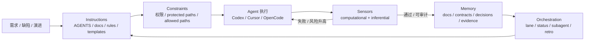
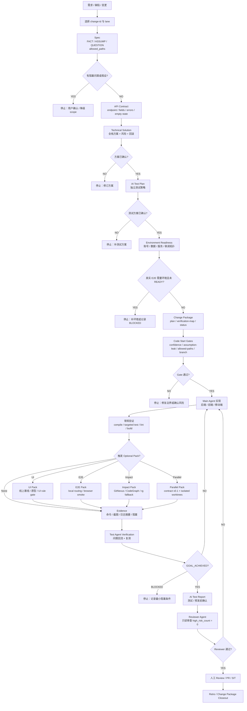

# Harness 工作流与设计理念

> 本文是 SFA AI Harness 的当前总览入口，用于新人 onboarding、解释 Harness 机制、需求复盘和团队推广前对齐。历史研究、目标方案和详细规则仍保留在各自文档中；本文只沉淀当前可执行的工作流和设计理念。

## 一句话定位

SFA AI Harness 是多业务仓 AI Coding 的控制面。它不承载业务代码，而是为 Codex、Cursor、OpenCode 和相关 Agent 提供统一的事实源、规则、模板、验证脚本、状态卡、证据包和复盘记录。

它要解决的不是“让 AI 多写代码”，而是让 AI 在清晰、可验证、可回滚的边界内持续推进，并在不清楚或风险升高时及时停止。

## 设计理念与行业借鉴

| 设计原则 | 行业先进经验 | Harness 本地化落地 |
| --- | --- | --- |
| 短入口 + 渐进披露 | OpenAI Harness Engineering 和 AGENTS.md 实践强调 `AGENTS.md` 应像目录，不是百科；复杂上下文按需读取。 | 根 `AGENTS.md` 只放硬规则和索引；细节放入 `docs/`、`templates/`、`rules/`、`lanes/`、`skills/`。 |
| 事实优先，推断显性化 | Stripe 的真实集成评估强调 mostly correct is failure；Karpathy 的 agentic engineering 要求开发者能解释边界和失败模式。 | Spec 和方案必须区分 `FACT`、`ASSUMP`、`QUESTION`；未确认推断不得进入实现。 |
| Guides + Sensors 双层约束 | Martin Fowler 将 Harness 分为 Guides 和 Sensors；Thoughtworks 强调 feedback sensors 给 coding agent 反向压力。 | Guides 是 AGENTS、rules、templates、skills；Sensors 是 confidence、allowed paths、assumption leak、technical solution、reviewer 等 gate。 |
| 先确定性，再推断性 | Fowler 区分 Computational 与 Inferential；Databricks coSTAR 也强调 judge loop 需要先和人工 golden set 对齐。 | 默认先跑 shell gate、compile、targeted test、lint、build；Reviewer Agent、GitNexus、CodeGraph、golden eval 作为更高层补充。 |
| 工具权限强于模型自觉 | Anthropic Permissions 和 Hooks 说明权限、hook、exit code 阻断应由工具层执行，而不是依赖模型“记得”。 | protected paths、业务仓分支、dirty worktree、环境凭据、DB 写入等通过 gate 和流程停止点兜底。 |
| Context Engineering 控制上下文体积 | Karpathy 强调上下文太少 agent 看不见，太多会变笨且变贵；program.md 模式用高层意图、约束、白黑名单驱动 agent。 | 当前 active change 是默认事实源；历史 `changes/` 只按 change-id、接口、模块、字段定向检索，不全量灌入上下文。 |
| 极简 subagent，避免 agent swarm | Anthropic/Codex subagent 适合有边界的探索、测试和审查；Stripe Minions 强调 one-shot end-to-end，而不是无限拆代理。 | 默认只使用只读 Explorer / Reviewer。实现 Agent 并行必须有 contract v0.1、独立 worktree 和清晰 ownership。 |
| 记忆进入 repo，证据可追溯 | OpenAI Harness Engineering 强调知识如果不在 repo，对 agent 等于不存在；Databricks coSTAR 强调 Scenario / Trace / Assess / Refine。 | `docs/`、`contracts/`、`decision-log/`、`changes/<change-id>/evidence.md` 成为团队可 review 的版本化事实源。 |
| 不先上大平台和 RAG | OpenAI/Codex 最佳实践强调工具只在解锁真实 workflow 时引入；RAG 起步阶段会增加不可追溯成本。 | 起步使用 Markdown 知识库、Feishu/Lark CLI、脚本 gate 和本地证据；RAG、CI 深度集成和无人值守放到后续阶段。 |

行业来源明细见 `../../harness-engineering-target-plan.md` 的“一手资料引用清单”。本文只保留与当前 Harness 机制直接对应的借鉴点，不把研究综述全文搬入日常入口。

## 五层心智模型

- Instructions 负责告诉 Agent 怎么做。
- Constraints 负责告诉 Agent 什么不能碰、什么时候必须停。
- Sensors 负责用脚本、测试、审查和证据反向校验。
- Memory 负责把可复用事实沉淀到 repo。
- Orchestration 负责把阶段、角色、状态卡和复盘串成闭环。

## 完整工作流程

## 三类停止点

| 停止点 | 触发条件 | 处理方式 |
| --- | --- | --- |
| 业务口径不清 | 新字段语义、状态流转、权限、错误码、默认值、回滚策略无法从 PRD、用户、代码或 contract 证明。 | 停止实现，写入 spec / status card，由用户确认或降级 scope。 |
| 工程边界不安全 | 触碰 protected paths、生产配置、DB migration、secrets、发布脚本、主分支、范围外 dirty diff。 | 停止修改，补 allowed paths、台账、回滚和二次确认。 |
| 验证证据不足 | 技术方案、AI 测试方案、环境 readiness、Test Agent、Reviewer、E2E 证据缺失或失败。 | 不声明通过，补验证或记录 BLOCKED 和最小缺口。 |

## Optional Packs

默认低风险 CRUD 不加载所有流程。只有命中触发条件时才追加 pack：

| Pack | 触发条件 | 作用 |
| --- | --- | --- |
| UI Pack | PRD UI、复杂交互、截图/页面 URL、线上基线或 UI 规范缺口。 | 先锁定线上基线和样板，必要时做原型并人工确认。 |
| E2E Pack | 浏览器真实路径、本地前后端联调、PC smoke、小程序 smoke。 | 使用 local routing / harness proxy / 浏览器证据，不把业务 `.env` 改成本地代理。 |
| Test Agent Pack | Tier M/L、行为风险高、测试/预发前、用户要求 AI 测试报告。 | 独立测试策略、Test Agent 验收、AI 测试报告闭环。 |
| Environment Pack | 环境、账号、数据、VPN、设备、DB 权限或跨系统联调会影响验证结论。 | 先记录 runtime standard、integration topology、账号来源、数据和阻塞。 |
| Temporary State Pack | 本地服务、storage、二维码、临时数据、debug flag、mock 开关需要清理或交接。 | 用 temporary state ledger 收口，避免把临时状态遗留给团队。 |
| Impact Pack | 改公共 API、DTO、Service、Mapper、权限、登录、奖励、审核等核心流程。 | 用 GitNexus、CodeGraph 或 rg 降级证据识别影响面。 |
| Parallel Agent Pack | API contract 达到 v0.1，前后端可并行，且有独立 worktree。 | Backend Agent 只提 contract delta，Frontend Agent 只读 contract，Orchestrator 统一集成。 |

## 当前执行口径

- 新需求默认从 `changes/<change-id>/spec.md`、`docs/contracts/<change-id>-api.md`、`changes/<change-id>/harness-status.md` 开始。
- 新需求只使用 `changes/<change-id>/` 作为 harness 控制面；不创建顶层 `openspec/`，业务仓已有 OpenSpec 只作为 legacy context 读取。
- `README.md` 和 `AGENTS.md` 是入口，不承载完整细节；完整机制以本文、lane、template、gate 和 active change 产物为准。
- 给人工 review / 用户确认的正文默认中文；代码标识、命令、API path、field、enum、error code、YAML key 和引用原文保持原样。
- Main Agent 可以持续执行已确认计划，但最终目标达成必须由 Test Agent、Reviewer gate 和人工 review 共同收口。

## 阅读路径

| 场景 | 先读 | 再读 |
| --- | --- | --- |
| 新人理解 Harness | 本文 | `../onboarding.md`、`../../README.md` |
| 启动真实需求 | `../../AGENTS.md` | `../architecture/repo-registry.md`、`../../lanes/fullstack-crud.md` |
| 设计全栈方案 | `../../templates/technical-solution.md` | `../../templates/ai-test-plan.md`、`../../templates/harness-status.md` |
| 执行前检查 gate | `../README.md#sensors` | 对应 `../../scripts/*-gate.sh` |
| 复盘和推广 | 本文 | `changes-retention-policy.md`、`../decision-log/` |
