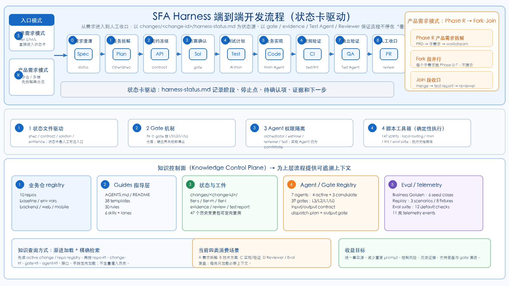
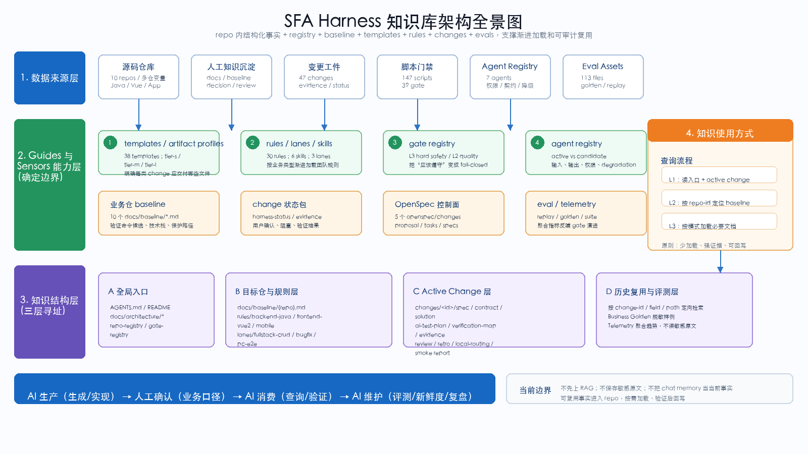
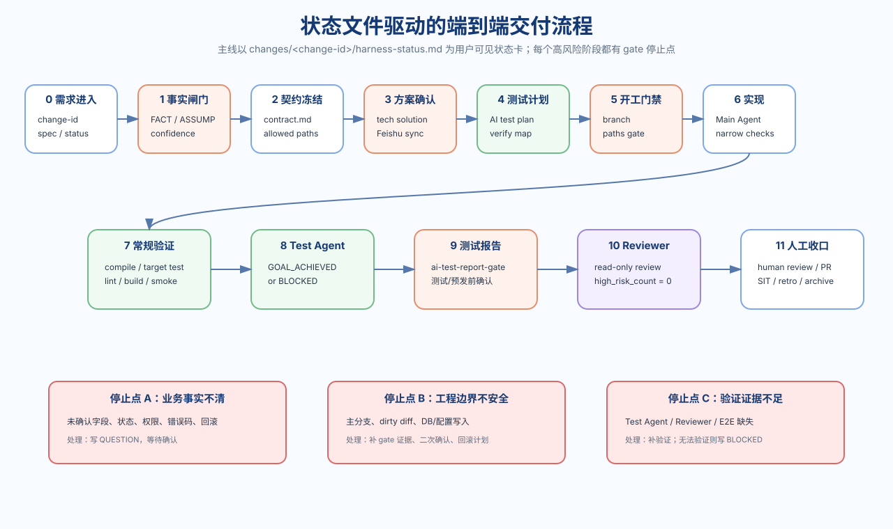
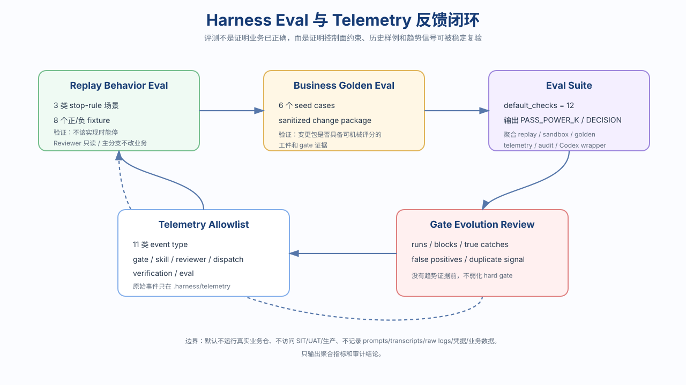

# 从 AI Coding 到 SFA Harness Engineering：SFA 控制面整体架构

作者：SFA AI Harness  
数据口径：本仓当前文件扫描，2026-07-06  
阅读对象：需要理解、评审或推广当前 harness 工作方式的 SFA 研发同学

> 本文是 `sfa-ai-harness` 控制面的整体架构说明。文风参考《从AI Coding到Harness Engineering的端到端工程开发实践》，但数据、流程、边界均来自本仓当前文件。  
> 本文只描述 harness 控制面，不进入业务代码实现。

## 一、为什么 SFA 需要自己的 Harness Engineering

在 SFA 多仓研发里，AI Coding 的问题通常不是“模型不会写代码”，而是它很容易在错误边界里高效地产出代码。

一个真实需求可能同时涉及 Java 后端、Vue2 管理后台、H5、小程序、iOS、Android、Nacos、DB、SIT 环境、下载中心、审批流、埋点、导出、权限和历史数据。单靠一个对话窗口把这些上下文一次性讲清楚，成本很高，也很难保证每次都讲得一致。

当前 `sfa-ai-harness` 的定位不是承载业务代码，而是作为 SFA 多仓 AI Coding 的控制面：它提供统一事实源、规则、模板、验证脚本、状态卡、证据包、Agent 权限和评测反馈，让 AI 在可验证、可停止、可回滚的边界内推进。

当前仓库已经形成一组可见规模：

| 维度 | 当前事实 |
| --- | --- |
| 业务仓 registry | 10 个：4 个后端、4 个前端/H5/小程序、2 个移动端 |
| 控制面脚本 | 131 个 `scripts/` 文件 |
| Gate | 38 个 `*-gate.sh` |
| 模板 | 38 个 `templates/` 文件 |
| 规则文件 | 27 个 `rules/` 文件 |
| 本仓 Skill | 6 个 `skills/*/SKILL.md` |
| 变更包 | 50 个 `changes/<change-id>/` |
| Legacy OpenSpec audit package | 4 个，已迁移到 `changes/*/legacy-openspec/` |
| Eval 文件 | 113 个 |
| Business Golden seed case | 6 个 |
| Behavior Replay 场景 | 3 类 stop-rule 场景，8 个 fixture |

这套体系的核心目标可以概括成一句话：**不是让 AI 多写代码，而是让 AI 在工程边界内交付需求。**

## 二、整体架构：知识控制面 × 端到端交付工程 × 评测反馈工程

当前 SFA Harness 可以拆成三块能力：

1. **知识控制面**：把业务仓、baseline、规则、模板、Agent registry、gate registry、历史 change、评测样例沉淀为 repo 内可追溯事实。
2. **端到端交付工程**：以 `changes/<change-id>/harness-status.md` 为用户可见状态卡，把需求从 spec、contract、solution、test plan、implementation、verification、review 串成闭环。
3. **评测反馈工程**：用 replay fixture、business golden、eval suite 和 telemetry 反向衡量 harness 本身是否稳定，而不是只靠“这次感觉顺利”。



这张图里的关键点是：当前 harness 不是单一工具，而是一套闭环系统。

- `AGENTS.md`、`README.md`、`docs/architecture/*` 是入口和规则源。
- `templates/`、`rules/`、`skills/`、`lanes/` 是 Guides，告诉 Agent 如何做。
- `scripts/*-gate.sh` 是 Sensors，用确定性检查给 Agent 反向压力。
- `config/agent-registry.yml` 给 Agent 权限、输入、输出和降级策略定边界。
- `evals/` 与 `.harness/telemetry` 记录控制面表现，后续用于判断 gate 是否有效、是否误伤、是否可以合并或软化。

## 三、Knowledge Control Plane：让 AI 先拿到正确事实

当前仓库没有先上 RAG，也没有把所有历史聊天记录塞进上下文。它采用的是更可审计的方式：把重要事实放进 repo，用结构化路径、registry 和 gate 来按需加载。



### 3.1 事实入口

`docs/architecture/repo-registry.md` 是业务仓入口，当前登记了 10 个 repo id。每个 repo 使用环境变量定位，例如 `$SFA_REPO_BACKEND_SALES_MANAGEMENT`、`$SFA_REPO_FRONTEND_MAP_SYSTEM`，避免把个人绝对路径写进共享文件。

当前仓库类型覆盖：

- 后端：`backend-sales-management`、`backend-sfa-backend`、`backend-ceo-member`、`backend-sfa-root`
- 前端/H5/小程序：`frontend-map-system`、`frontend-sign-up`、`frontend-merchant-wechatapp`、`frontend-sfaintl`
- 移动端：`mobile-sfa-ios`、`mobile-sfa-android`

这层解决的是“AI 应该去哪几个仓找事实”的问题。

### 3.2 Guides：让规则可复用，而不是每次重新 prompt

当前 Guides 主要包括：

- `AGENTS.md`：硬性工作流、保护行为、停止点和语言策略。
- `templates/`：从 `spec.md`、`technical-solution.md`、`ai-test-plan.md` 到 `review.md`、`environment-readiness.md`、`retro.md` 的工件模板。
- `rules/`：Java、Vue2、微信小程序、iOS、Android、legacy SFA Web 规则。
- `lanes/`：`fullstack-crud`、`bugfix-fast`、`pc-e2e-smoke` 三类执行路径。
- `skills/`：Explorer、Reviewer、Diagnose、Handoff、Grill、TDD 等本仓可复用技能。

这层解决的是“AI 应该按什么团队规则工作”的问题。

### 3.3 Registry：把散落定义变成机器可读契约

当前有三个核心 registry：

| Registry | 作用 |
| --- | --- |
| `docs/architecture/repo-registry.md` | 业务仓清单、类型、路径变量、候选验证命令 |
| `config/agent-registry.yml` | Agent 身份、权限、runtime、输入/输出工件、gate 消费关系 |
| `docs/architecture/gate-registry.md` | 39 个 gate 的 stage、tier、owner、保护目的和未来动作 |

Agent registry 当前精选 7 个 Agent：

| Agent | 当前级别 | 权限边界 |
| --- | --- | --- |
| `sfa-harness-orchestrator` | active | 控制面可写 |
| `sfa-harness-explorer` | active | 只读 |
| `sfa-harness-reviewer` | active | 只读 |
| `sfa-test-agent` | active | 测试执行 |
| `sfa-backend-agent` | candidate | contract 后可写 |
| `sfa-frontend-agent` | candidate | UI rules + contract 后可写 |
| `sfa-mobile-agent` | candidate | mobile contract 后可写 |

这层解决的是“Agent 能做什么、什么时候能做、做完交什么”的问题。

## 四、端到端交付工程：状态卡驱动，而不是聊天历史驱动

在当前 harness 中，一个真实需求不应该只存在于对话窗口里，而应该落到 `changes/<change-id>/`。其中 `harness-status.md` 是用户可见状态卡，配合 `spec.md`、`contract.md`、`technical-solution.md`、`ai-test-plan.md`、`evidence.md`、`review.md` 等工件，把需求推进过程显性化。



### 4.1 三档 change profile

`docs/architecture/change-artifacts-spec.md` 定义了三档工件 profile：

| Profile | 场景 | 必需根工件 |
| --- | --- | --- |
| `tier-s` | 单仓小修、文档或低风险脚本 | `spec.md`、`harness-status.md`、`evidence.md` |
| `tier-m` | 普通全栈或多文件业务变更 | 在 Tier S 基础上增加 `plan.md`、`contract.md`、`technical-solution.md`、`verification-map.md`、`ai-test-plan.md`、`test-agent-verification.md`、`agent-dispatch-plan.md`、`skill-usage.md`、`review.md` |
| `tier-l` | 跨仓、高风险、真实环境依赖或发布前风险高 | Tier M 全部文件 + `environment-readiness.md`、`ai-test-report.md`、`decisions.md` |

这样做的价值是：小需求不被 Tier L 流程拖死，大需求也不能只靠一句“已实现”糊过去。

### 4.2 当前主流程

当前 README 和 workflow 文档描述的主线是：

```text
status
-> spec
-> contract
-> technical solution
-> AI test plan
-> environment readiness
-> plan / verification map
-> implementation
-> Main Agent regular tests
-> Test Agent verification loop
-> AI test report
-> reviewer
-> PR / SIT
-> retro
```

这条主线的重点不是每一步都“写文档”，而是每个阶段都有明确的进入条件、输出工件和停止点。

### 4.3 三类停止点

当前 harness 的保护重点可以归纳为三类停止点：

1. **业务事实不清**：字段语义、状态流转、权限、错误码、默认值、回滚策略无法从 PRD、用户、代码或 contract 证明时，不进入实现。
2. **工程边界不安全**：触碰生产配置、secrets、DB migration、Nacos 生产配置、发布脚本、主分支、范围外 dirty diff 时，必须停止并确认。
3. **验证证据不足**：技术方案、AI 测试方案、环境 readiness、Test Agent、Reviewer、E2E 证据缺失时，不声明完成。

这些停止点和文章里的“状态文件驱动”“hook 防偷停”思想类似，但当前 SFA harness 更强调 gate 和用户可见状态卡。

## 五、Sensors：39 个 Gate 把“应该遵守”变成“必须通过”

当前 `docs/architecture/gate-registry.md` 登记了 39 个 gate，并按风险分成 L3、L2、L1、L0。

| 层级 | 作用 | 示例 |
| --- | --- | --- |
| L3 hard safety | 保护事实、分支、路径、环境、DB、临时状态等硬边界 | `confidence-gate.sh`、`business-code-start-gate.sh`、`environment-readiness-gate.sh`、`diff-hygiene-gate.sh` |
| L2 delivery quality | 保护方案、测试、Reviewer、UI、Agent 派发质量 | `technical-solution-gate.sh`、`ai-test-plan-gate.sh`、`reviewer-gate.sh`、`ui-rule-gate.sh` |
| L1 process hygiene | 保护流程卫生、文档结构、知识引用、可审计性 | `change-artifacts-gate.sh`、`skill-usage-gate.sh`、`retro-gate.sh` |
| L0 optional advisory | 改善分析质量，但默认不应阻断普通工作 | `codegraph-evidence-gate.sh` |

这里的关键原则是：**不能把流程依从性交给模型自觉。**  
比如“不要在主分支改业务代码”“不要把未确认假设写进实现”“真实 E2E 前先确认环境与账号数据”，这些都应该由 gate fail-closed，而不是靠 Agent 记得。

## 六、Agent 体系：少量精选角色，权限先于智能

当前 harness 没有引入大量 Agent，也没有把所有任务都拆给子 Agent。它的策略更保守：

- Orchestrator 是唯一控制面写入者。
- Explorer / Reviewer 默认只读。
- Test Agent 只做测试验证，不越权实现。
- Backend / Frontend / Mobile implementation agent 仍是 candidate，必须在 contract、allowed paths、业务仓分支、gate 都满足后才允许派发。

这与“专家 Agent 每个只做一件事”的方向一致，但当前 SFA harness 更强调：**默认不并行实现；只有契约达到 v0.1、worktree 隔离、candidate confirmation 明确后，才允许 implementation agent。**

## 七、评测反馈工程：评测 harness 本身，而不是只看单次需求是否顺

如果没有评测，harness 很容易退化成一堆看似严格但不知道是否有效的文档和脚本。当前仓库已经有三层评测反馈：



### 7.1 Behavior Replay

`evals/harness-behavior/replay/` 当前覆盖三类 stop-rule 场景：

- `technical-solution-stop`：没有 confirmed technical solution / AI test plan 时不能提前实现。
- `reviewer-readonly`：Reviewer 只能输出 findings，不能顺手改代码。
- `main-branch-business-edit-stop`：主分支或未隔离 worktree 下不能改业务代码。

这些 replay fixture 用正/负样例校准 Agent 是否遵守 harness 停止点。

### 7.2 Business Golden

`evals/business-golden/` 当前有 6 个 seed cases：

- 4 个 PASS：`fullstack-crud-pass`、`long-promo-sku-single-pack-unit-pass`、`download-center-export-integration-pass`、`add-distribution-qr-estimated-reward-amount-pass`
- 2 个 FAIL：`missing-smoke-report-fail`、`allowed-path-violation-fail`

它们不 checkout 真实业务仓，不碰 DB、Feishu、凭据或生产日志，只验证一个业务变更包是否具备可机械评分的工件和 gate 证据。

### 7.3 Eval Suite 与 Telemetry

`docs/architecture/harness-eval-suite.md` 定义了 `scripts/harness-eval-suite.sh`，默认聚合 12 类检查，并输出 `EVAL_SUITE_TOTAL`、`EVAL_SUITE_PASSED`、`BUSINESS_GOLDEN_TOTAL`、`REPLAY_FIXTURE_MATCHED`、`PASS_POWER_K`、`DECISION` 等指标。

`docs/architecture/harness-telemetry.md` 定义了 11 类 allowlisted event，例如：

- `gate_run`
- `skill_route_event`
- `reviewer_event`
- `agent_dispatch_event`
- `verification_run_event`
- `human_confirmation_event`
- `eval_trial_event`
- `eval_suite_event`

Telemetry 的边界也很明确：原始事件只放 `.harness/telemetry/events.jsonl`，不进版本控制；可 review 的总结只允许聚合计数和结论，不保存 prompt、transcript、原始日志、凭据、cookie、客户数据或 SQL 结果。

## 八、当前实践原则

结合当前仓库事实，可以把 SFA Harness 的工程原则总结为：

- **事实进入 repo，推断留在状态卡**：`[FACT]`、`[ASSUMP]`、`[QUESTION]` 要分开，未确认假设不能进入实现。
- **状态文件替代聊天记忆**：长期事实落到 `changes/<change-id>/`、`docs/`、`evals/`，而不是依赖某个窗口上下文。
- **Guides 告诉 Agent 怎么做，Sensors 决定能不能过**：规则可以被读漏，gate 不能被绕过。
- **确定性动作脚本化**：脚本负责检查、生成、聚合、路由和验证；Agent 负责理解、判断、实现和解释。
- **权限先于能力**：Reviewer 再强也只读；implementation agent 再方便也必须 contract 后、worktree 隔离后再启用。
- **评测控制面，不伪装成业务验收**：eval suite 通过只证明 harness 资产内部一致，不证明真实业务行为已经上线正确。
- **硬门禁不能靠感觉软化**：gate 未来是否合并、软化或退休，需要 runs、blocks、true catches、false positives、duplicate signal 等 telemetry 支撑。

## 九、和参考文章的差异

参考文章的系统重点是“应用宝活动平台重构中的 AI 端到端开发体系”，它有更完整的业务知识库生成、内部平台集成、Fork-Join 并行开发和发布链路。

当前 SFA Harness 更像一个保守但可落地的控制面：

| 维度 | 参考文章方向 | 当前 SFA Harness 状态 |
| --- | --- | --- |
| 知识库 | 大规模服务文档自动生成与新鲜度检测 | repo 内 registry、baseline、rules、changes、eval metadata，尚未 RAG 化 |
| 流程驱动 | `product-state.json` / `e2e-state.json` + hook | `changes/<id>/harness-status.md` + gate + scripts |
| Agent 并行 | DAG + worktree + Fork-Join | 默认保守；implementation agent 为 candidate，需 contract 和 worktree |
| DevOps 集成 | TAPD、Rick、123、七彩石、伽利略等 | 当前以本地脚本、Feishu sync、local routing、eval/telemetry 为主 |
| 评测体系 | 文中提到仍待完善 | 当前已有 replay、business golden、suite、telemetry 的本地控制面评测 |

这意味着当前 SFA Harness 的优势不是“自动化程度最高”，而是“边界更明确、门禁更可审计、适合多仓业务改动逐步纳入”。

## 十、下一步建议

如果要把这版草稿继续推进成正式文章或飞书文档，我建议下一步按三件事收口：

1. **确认叙事主线**：是面向团队推广，还是面向领导汇报，还是面向后续建设方案。三者同样的架构图，措辞和重点不同。
2. **补真实案例串联**：选 2-3 个已脱敏 change，例如下载中心导出、预估奖励、BD overstaff 埋点，把当前架构如何发挥作用讲出来。
3. **把 SVG 图升级为白板图或正式视觉图**：当前 SVG 是可 review 的草图，适合先确认信息结构；正式发布可再转成飞书白板或统一视觉风格图片。

当前版本的核心结论是：**SFA Harness 已经从“提示词和模板集合”演进为一个轻量控制面。它用状态卡、registry、gate、Agent 权限和 eval/telemetry，把 AI Coding 放进可审计的工程流程里。**
