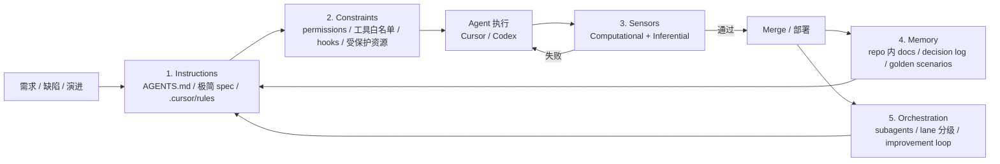
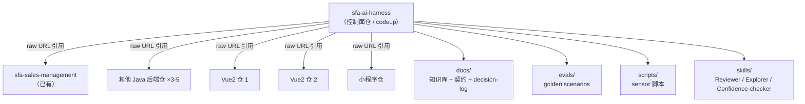

# AI Coding Agent Harness 目标方案：基于一手资料的工程落地

> SUPERSEDED by docs/architecture/harness-workflow-and-design-principles.md.
> Historical research and target-plan context only; do not use this file as the active execution SSOT.

> 本文用于把 `docs/deep-research-report.md` 里描述的"目标 harness"（OpenAI / Anthropic / Google / Fowler / Karpathy / Databricks / Stripe 等公开实践）落到你这个具体场景：**2 个 Vue2 + 1 个小程序 + 4–6 个 Java 后端 + 阿里云 + codeup + Cursor / 桌面 Codex 双工具**。
>
> 目标是先用 1 个月（Phase 0–2）跑通最小闭环，再逐步推广到团队。
>
> 当前仓库里的 `.ai/harness/` 是你之前的探索版本，本文不修改它，**作为参考但不作权威**。最终事实源以本文为准，并在 1 个月闭环结束后，决定哪些规则升级回 `.ai/harness/`。
>
> **决策原则**：每条建议都标注一手来源；对没有一手依据的判断，明确写"实践建议"。

---

## 0. 执行摘要

**结论先行 5 句**：

1. **不优化当前 `.ai/harness/`，新建一份控制面方案**。控制面以"100 行 AGENTS.md + 渐进披露的 docs/" 为骨架，遵循 OpenAI Harness 团队、Anthropic、Fowler 的一致建议。来源：OpenAI Lopopolo "AGENTS.md as table of contents not encyclopedia"；Anthropic Claude Code "short, accurate AGENTS.md is more useful"。

2. **解决你 4 个核心痛点的不是"再加规则"，而是 4 个机制**：
   - **置信度门**（Confidence Gate）：任何业务规则、字段、状态、权限、错误码必须先标 ≥95% 才能写进实现，否则进 Open Questions 区。
   - **三标签事实/假设/疑问法**：方案文档每段必须标 `[FACT]` / `[ASSUMPTION]` / `[QUESTION]`，顶部 5 行 "Top User Decisions" 强制可见。
   - **Tier-by-default 渐进披露**：默认极简模板，复杂度评分触发后才加重；AGENTS.md 100 行硬上限。
   - **多 agent 最小化**：默认只用两个 subagent 角色（read-only Explorer、read-only Reviewer），实现 agent 仍是主线程；不再写 agent-briefs。

3. **6 级自动化阶段** 按 Fowler "Computational vs Inferential" 和 Stripe "mostly correct is failure" 重新定义客观进入条件，**不要把它当成时间表**，而是 lane 的资格标签。

4. **知识库形态**：采用 **A+B 混合**——版本化 Markdown 进 control-plane 仓（事实源）+ 飞书索引到 Markdown 的脚本（不让团队改习惯）+ **不上 RAG**（起步阶段反模式）。来源：OpenAI Lopopolo "if not in the repo, it doesn't exist"；Karpathy autoresearch `program.md` 模式。

5. **Phase 0–2 的 1 个月闭环目标**只有 1 个：**用 1 个真实低风险 Fullstack CRUD 需求，跑通"AGENTS 100 行 + 契约 + 前后端实现 + 4 个 sensors + 1 个 reviewer subagent + Pre-PR 自审 + 1 条 golden scenario eval"** 的端到端链路。任何额外内容延后。

---

## 1. 目标与硬约束（来自你的回答）

| 项 | 你的设定 | 对方案的约束 |
| --- | --- | --- |
| 服务对象 | 团队多个前端 + 多个后端仓 | 必须有"控制面 + 业务仓"双层结构 |
| 时间盒 | Phase 0–2 一个月闭环 | 不做长期平台投资；只做 MVP |
| "100% 自动化"的定义 | 业务目标/契约/上线风险点拍板，其余自动；只要 AI 100% 清晰就不用干预 | 必须有**置信度门**强制 AI 暴露不清楚的地方 |
| 任务类别限制 | 不限（取决于 AI 是否清晰） | 自动化 lane 进入条件按"清晰度/可验证性"而非"任务类型" |
| Lane 框架 | 按 deep-research 的 6 级 | 必须给 6 级在你场景下的客观定义 |
| 当前 lane 优先级 | 前后端一套 harness | Fullstack CRUD Lane 是第一目标 |
| 工具栈 | Cursor + 桌面 Codex；阿里云；阿里 codeup；Vue2 / 小程序 / Java；Feign + 飞书契约 | 不能依赖 GitHub Actions / Anthropic 平台；hooks 优先用本地脚本 |
| 现状未知项 | 后端测试覆盖率、前端工具链、ArchUnit、契约快照 | 把"现状盘点"作为 Phase 0 的硬交付 |
| 成本约束 | 考虑成本 | 不上 RAG / 不做大平台 / 不做 LLM-as-judge SaaS |

**核心痛点（你给的，按权重排序）**：

1. AI 写技术方案细节差、可读性差，分不清需要人工确认的部分。
2. AI 把不是 95–100% 确认的事写进方案/代码（**最关键，本方案首要解决的问题**）。
3. 当前 harness 笨重。
4. 多 agent 管理混乱。

---

## 2. 一手资料综述：本方案的判断基础

> 我在动手前已经回去校验过下面这些一手来源（不依赖 deep-research-report 的二手转引）。每个建议在后文引用时会回标到这里。

### 2.1 OpenAI

| 来源 | 关键判断 |
| --- | --- |
| Lopopolo, "Harness engineering: leveraging Codex in an agent-first world", OpenAI Engineering, 2026-02-11 [openai.com/index/harness-engineering] | (1) AGENTS.md 必须像目录而不是百科，约 100 行；(2) 架构不变量必须用 custom linter + structural test 机械化执行，错误信息要写"如何修复"给 agent 自己读；(3) 周期性"garbage collection" agent 防止熵增；(4) 让应用本身可被 agent 检查（DOM、logs、metrics、traces）；(5) **不要"try harder"**，agent 卡住时要识别"什么能力缺失"并加进 repo；(6) 知识必须落到 repo，"Slack/飞书等于不存在"。|
| AGENTS.md spec, agentsmd 社区 + OpenAI Codex 仓 [agents.md] | (1) 是 README for agents；(2) progressive disclosure；(3) 嵌套 AGENTS.md 优先级更高；(4) 直接 user 指令优先级最高。|
| Codex Best Practices, OpenAI Developers [developers.openai.com/codex/learn/best-practices] | (1) 强 prompt 的 4 要素：Goal / Context / Constraints / Done when；(2) 复杂任务先 Plan mode；(3) AGENTS.md 短而准确比长而泛更有用；(4) 重复犯错才加规则；(5) skills = 一项稳定工作；(6) automations 调度稳定后的工作；(7) subagents 用于卸载有边界的探索/测试/triage。|
| Build an Agent Improvement Loop with Traces, Evals, and Codex, OpenAI Cookbook [developers.openai.com/cookbook] | traces → feedback → evals → ranked changes → Codex handoff 的可执行闭环。|

### 2.2 Anthropic

| 来源 | 关键判断 |
| --- | --- |
| Claude Code Memory / CLAUDE.md, Anthropic Docs [docs.anthropic.com/en/docs/claude-code/claude-md] | 四层 memory：Org / User / Project / Path-scoped；CLAUDE.md 写规则，auto memory 由 Claude 自己写学到的东西。|
| Hooks Reference, Anthropic Docs [docs.anthropic.com/en/docs/claude-code/hooks] | PreToolUse 可阻断；PostToolUse 可触发 lint/format；hook 通过 JSON 协议工作；exit code 2 = 关键阻断。|
| Permissions, Anthropic Docs [docs.anthropic.com/en/docs/claude-code/permissions] | 工具层强制 deny → ask → allow，"CLAUDE.md 写在那里不等于会执行，**permissions 是 Claude Code 强制的，不是模型自觉**"。|
| Subagents, Anthropic Docs [code.claude.com/docs/en/sub-agents] | 每个 subagent 独立 context window + `allowed_tools` 白名单；built-in Explore subagent 是 read-only，禁 Write/Edit。|

### 2.3 Google

| 来源 | 关键判断 |
| --- | --- |
| Gemini CLI Hooks, geminicli.com/docs/hooks | 相同的 BeforeTool/AfterTool/SessionStart/SessionEnd 模型；hooks 必须写 JSON 到 stdout，debug 走 stderr；exit code 2 阻断。|
| Trusted Folders, geminicli.com | 显式信任工作区才允许 hooks/MCP/skills/settings 生效。|
| Vertex AI Agent Evaluation, cloud.google.com/vertex-ai/generative-ai/docs/models/evaluation-agents | trajectory metrics（exact / in-order / any-order / precision / recall / single-tool）：**不只看最终答案，还看路径**。|

### 2.4 Martin Fowler / Thoughtworks

| 来源 | 关键判断 |
| --- | --- |
| Fowler, "Harness engineering for coding agent users", martinfowler.com/articles/harness-engineering.html, 2026-04-02 | (1) Agent = Model + Harness；(2) 两类控制：**Guides (feedforward)** + **Sensors (feedback)**；(3) 两种执行：**Computational** 确定性快 vs **Inferential** 推断慢贵；(4) 三类 harness：**Maintainability / Architecture fitness / Behaviour**；(5) Behaviour harness 是"屋里的大象"——最难的；(6) "Quality left"：检查越早越好；(7) Greenfield vs Legacy 的可 harness 度不同。|
| Thoughtworks Tech Radar, "Feedback sensors for coding agents", Trial, 2026-04 | sensors 给 agent 反向压力让它自我纠正；自定义 linter 错误信息直接给 LLM 读以触发 self-correction（"a positive kind of prompt injection"）。|

### 2.5 Karpathy

| 来源 | 关键判断 |
| --- | --- |
| Karpathy on Context Engineering（"Software is Changing Again"演讲 + 推特原文 + autoresearch 仓） | (1) Context Engineering > Prompt Engineering；(2) 信息太少 agent 看不见，太多模型变笨且贵；(3) 从 vibe coding 走向 agentic engineering——开发者必须能解释 edge cases、failure modes；(4) PR review 时间因为 AI 反而长 91%（不是 AI 写得差，而是 reviewer 必须重建被跳过的理解）。|
| Karpathy autoresearch / program.md, github.com/karpathy/autoresearch | program.md 模式：**高级别意图 + 约束 + 可改/不可改文件白黑名单 + 时间盒 + 简洁度偏好 + TSV 结果日志**。|

### 2.6 工程团队实战

| 来源 | 关键判断 |
| --- | --- |
| Databricks coSTAR, databricks.com/blog/costar-..., 2026-03 | coupled Scenario / Trace / Assess / Refine；**Judge Loop（对齐 AI judges 与 human）+ Agent Loop（用 trusted judges 自动 refine）**；验证时间从 2 周减到几小时；test 既跑 CI 也跑生产。|
| Stripe AI benchmarks, stripe.com/blog/can-ai-agents-..., 2026-03 + github.com/stripe/ai | 11 个 production-realistic 环境；MCP 包装 terminal+browser+docs；"**mostly correct is failure**"；agent 平均 63 turns 才完成。|

---

## 3. Harness 五层模型（基于 Fowler + Lopopolo + Anthropic + Karpathy）

> 这是本方案的"心智模型"。后续所有具体设计都对应到这 5 层之一。



| 层 | 一手依据 | 你这里的具体落点 |
| --- | --- | --- |
| **1. Instructions（指令）** | OpenAI Lopopolo + Anthropic CLAUDE.md + Codex Best Practices | 100 行 AGENTS.md + control-plane `docs/` 索引 + 各业务仓 30 行入口 + `.cursor/rules/*.mdc` 按 globs 触发 |
| **2. Constraints（约束）** | Anthropic Permissions + Gemini CLI Trusted Folders + Lopopolo "structural test" | 受保护文件清单 + Cursor `.cursor/rules` deny + Codex `~/.codex/config.toml` sandbox + ArchUnit / dependency-cruiser / ESLint import boundary |
| **3. Sensors（反馈传感器）** | Fowler guides/sensors + Thoughtworks Tech Radar + Stripe minions | Computational：mvn compile / mvn test / lint / build / contract diff / GitNexus impact / mechanical-quality 脚本。Inferential：reviewer subagent + golden scenario eval |
| **4. Memory（记忆）** | Lopopolo "system of record" + Karpathy program.md + Anthropic memory hierarchy | control-plane `docs/`：架构图、服务地图、Redis key、MQ 拓扑、XXL-JOB 地图、错误码、运营规则 + 飞书索引脚本 + `decision-log/` |
| **5. Orchestration（编排）** | Anthropic subagents + Codex subagents + Fowler "harness templates" | Tier 分级（轻/重）+ 默认主线程实现 + read-only Explorer / Reviewer subagent + lane 进入条件矩阵 + improvement loop 每两周一次 |

**关键判断**：

- 当前 `.ai/harness/` 在 1（Instructions）和 5（Orchestration）写得过重，2（Constraints）过轻（没有 permission 强制、没有 hooks），3（Sensors）只有 Computational 没有 Inferential，4（Memory）只有 task-level 没有 team-level。
- 本方案把重心放在**先把 2 / 3 / 4 补齐，1 / 5 反向减重**。

---

## 4. 针对你 4 个核心痛点的具体机制

> 这是本方案的核心。每个痛点都给一个**机制（不是规则）**，机制要么是模板结构，要么是脚本/hook，要么是 subagent 行为，**有对应一手依据**。

### 4.1 机制 A：95% 置信度门（Confidence Gate）

**对应痛点 #2**：AI 把不是 95–100% 确认的事写进方案/代码。

**一手依据**：
- Fowler："Correctness is outside any sensor's remit if the human didn't clearly specify what they wanted in the first place."
- Stripe："a mostly correct integration is a failure; payments require 100% accuracy."
- Karpathy（agentic engineering）：开发者必须能解释 edge cases / failure modes，"vibe coding is passive acceptance of output"。

**机制设计**：

1. **Spec 模板强制 4 段结构**：
   ```
   ## ✅ FACTS（来源：PRD 原文 / 用户已确认 / OpenSpec / 现有契约）
   ## ⚠️ ASSUMPTIONS（来源：AI 推断 / 经验补全 / 类似系统默认；置信度 < 95% 全部进这里）
   ## ❓ OPEN QUESTIONS（必须人工回答才能动手的问题）
   ## 🎯 TOP 3 USER DECISIONS NEEDED（出现在文档第一屏）
   ```

2. **每个业务规则、字段、状态、权限、错误码、默认值 必须前缀置信度标签**：
   - `[FACT]` = ≥95%（PRD 原文 + 用户确认 + 现有代码契约）
   - `[ASSUMP]` = 70–94%（AI 推断但合理）
   - `[QUESTION]` = <70%（必须问）

3. **硬规则**：
   - `[ASSUMP]` 内容**禁止**进入实现代码；要么先升级到 `[FACT]`，要么降级到 Open Questions 或 Non-goal。
   - `[QUESTION]` 没有用户回答前，对应代码段**禁止**写。
   - 任何"看起来是断言但没标置信度"的句子由 Pre-PR sensor 检测（见 4.5 sensor 设计）。

4. **AI 引导 prompt（写进 AGENTS.md）**：
   > 写技术方案或代码前，对每条业务规则自问："这条来自 PRD 原文还是我的推断？置信度多少？" 推断 < 95% 必须标 `[ASSUMP]` 或 `[QUESTION]`，不得伪装成 `[FACT]`。

5. **失败模式防护**：
   - 防止 AI"为了通过门禁假装高置信"：Reviewer subagent（4.4）的核心任务之一就是 reverse-review 所有 `[FACT]` 是否真的有 PRD/contract/code 来源。
   - 防止 AI"标 ASSUMP 后偷偷写进代码"：Pre-PR sensor 扫描 spec 中所有 `[ASSUMP]` 关键词，检查实现 diff 中是否出现对应符号。

**这一条解决用户痛点 #2 的 80%**，因为它把"推断"从隐式变显式。

---

### 4.2 机制 B：三标签 + Top Decisions 顶部前置

**对应痛点 #1**：AI 写技术方案细节差、可读性差、分不清需要人工确认。

**一手依据**：
- OpenAI Codex Best Practices："Goal / Context / Constraints / Done when" 4 要素 prompt。
- Karpathy autoresearch program.md：高级别意图 + 约束 + 可改/不可改 + 时间盒 + 输出格式，**统一在文档顶部**。
- Lopopolo：当一切都标 important 时，没有东西真的 important（"too much upfront guidance becomes non-guidance"）。

**机制设计**：

每份 spec / technical-plan 必须遵循固定可读结构（第一屏可见决策项）：

```markdown
# <Change ID>

## 🎯 一句话目标
（≤ 50 字）

## 🚦 Top 3 User Decisions Needed
1. <决策点 1，附置信度和默认建议>
2. <决策点 2>
3. <决策点 3>

## 📦 Scope
- IN: ...
- OUT: ...
- Non-goal: ...

## ✅ FACTS
（来自 PRD / 用户确认 / 现有契约的事实）

## ⚠️ ASSUMPTIONS
（AI 推断、需要 reviewer 二次确认、置信度 < 95%）

## ❓ OPEN QUESTIONS
（阻塞性问题，必须先答）

## 📐 Design（仅在 ASSUMPTIONS 升级到 FACTS 后展开）
- API 契约 → 链接到 contracts/<id>.md
- 数据模型 → 链接到 docs/data-models/<id>.md
- 流程图（仅复杂状态/token/异常时）

## 🧪 Done When
- [ ] 验证项 1（命令）
- [ ] 验证项 2

## 🔁 Rollback
- 一句话回滚方案

## 📝 Provenance
- PRD: <飞书链接>
- 复用样板: <repo path>
- 相关 OpenSpec: <change-id>
```

**硬规则**：
- 文档**第一屏**必须能看到：一句话目标、Top 3 Decisions、Scope。
- AI 写完 spec 必须自检：如果 Top 3 Decisions 都是空的，说明你已经替用户做了这些决策——重写。
- 长度上限：Tier S/M 的 spec ≤ 200 行；Tier L 的 ≤ 500 行；超过必须拆成多个 change。

**为什么这个结构有效**：
- 一手依据：OpenAI Lopopolo 强调 progressive disclosure——读者不需要全文就知道是否要拍板。
- 现有 `.ai/templates/technical-plan.md` 有 30+ 个章节、每个表 5–7 列，AI 经常"为了填而填"——这就是痛点 #1 和 #3 的根源。

---

### 4.3 机制 C：Tier-by-default 渐进披露

**对应痛点 #3**：harness 笨重。

**一手依据**：
- OpenAI Lopopolo：AGENTS.md 100 行硬上限；剩下放 docs/ 由 agent 按需取。
- Anthropic Codex Best Practices："Keep it practical. A short, accurate AGENTS.md is more useful than a long file full of vague rules."
- Fowler "Quality left"：检查越早越好，但不是所有检查都该早；按成本和频率分布。
- Karpathy program.md：5 分钟时间盒，简洁优先。

**机制设计**：

| 文件 / 模板 | 上限 | 何时全用 | 何时减重 |
| --- | --- | --- | --- |
| `AGENTS.md`（control-plane） | **100 行** | 永远 | 任何超过 100 行的内容必须拆到 `docs/` |
| 业务仓 `AGENTS.md` | **30 行** | 永远 | 仅写"指向 control-plane 的 raw URL + 本仓 build/test 命令 + 本仓特例" |
| `.cursor/rules/*.mdc` 单文件 | **150 行** | 单一职责（一个 globs 触发一个文件） | 用 `globs` 触发，不全局 always-apply |
| Spec / technical-plan（Tier S/M） | **200 行** | 永远 | 超过必须拆 |
| Spec / technical-plan（Tier L） | **500 行** | 复杂功能 | 超过必须拆 change |
| `code-constraints.md` 同类规则 | **保留**，但**移出主入口** | 实现期间按需读 | 仅在写 Java 代码时被 globs 触发 |

**Tier 自动判断**（用 1 个简单脚本，比当前的复杂度评分门更轻）：

```
INPUT: change 描述 + 受影响文件列表 + 是否新增 API + 是否动 DB

DECISION:
- 任何"恢复既有行为"的缺陷修复 → Tier S（极简模板）
- 1–2 个接口 + 不动 DB / 状态机 / 权限 → Tier M（短模板）
- 3+ 接口 / 改 DB / 改状态机 / 跨服务 → Tier L（完整模板）
- 需求量大 + 可独立拆分 → Tier XL（先拆再评 Tier）
```

**与当前 harness 的差异**：
- 当前 32 条原则 + 600 行 README + 30+ 章节模板 → **新方案默认只让 AI 看 100 行 AGENTS.md + 一份对应 Tier 的 spec 模板（≤ 200 行）**。
- 当前 code-constraints.md 13 章 → **保留全部内容**，但拆成 4 份 `.cursor/rules/*.mdc`（backend-java / frontend-vue2 / mybatis-xml / sql-ddl），按 globs 触发。
- 当前 32 条原则的 README → **降级为 docs 索引文件**，不强制全文加载。

**减重原则**（按 Lopopolo "garbage collection" 思路）：
- 每两周做一次 harness 自审：哪些规则触发过、哪些从未触发、哪些被绕过。从未触发或经常被绕过的进入候选删除清单。
- 删除前先做"反向验证"：把被删的规则写成 sensor（Computational lint 或 Inferential reviewer prompt），由 sensor 替代。

---

### 4.4 机制 D：多 agent 最小化（默认 2 个 read-only subagent）

**对应痛点 #4**：多 agent 管理混乱。

**一手依据**：
- Anthropic Subagents 文档：built-in Explore subagent 是 read-only（禁 Write/Edit）；自定义 subagent 必须显式 `allowed_tools` 白名单。
- Codex Best Practices："use subagents to offload bounded work"；保持主线程聚焦核心问题。
- Fowler："A reviewer agent responsible for running checks and triggering corrections" 或 "a companion process running in parallel"。
- Stripe minions："one-shot, end-to-end" 模式：避免无限多 agent 嵌套。

**机制设计**：默认只用 2 个 subagent 角色，**都是 read-only**。

| Subagent | 工具白名单 | 触发条件 | 输出位置 |
| --- | --- | --- | --- |
| **Explorer**（探索） | Read / Glob / Grep / GitNexus | spec 写完前 / impact 分析 / 找样板 / 搜契约 | 直接进 spec 的 FACTS 区 |
| **Reviewer**（反向审查） | Read / Glob / Grep / GitNexus / 测试命令 | spec 完成后 / 实现完成后 | `<change>/review.md` |

**实现 agent 仍是主线程**——不再拆成多个写代码的 subagent，避免"多人踩同一文件"。

**Reviewer subagent 的 prompt 模板**（写进 control-plane `skills/reviewer.md`）：

```markdown
你是 Reviewer subagent，read-only。任务：

1. 不读实现 agent 的解释/总结；只读 spec、契约、diff、测试结果、PRD。
2. 找 5 类问题：
   - FACTS 标记不实（找不到 PRD/contract/code 来源）
   - ASSUMPTIONS 偷溜进了实现代码（在 diff 中搜对应符号）
   - 越界 diff（动了 spec scope 之外的文件）
   - 隐性功能（实现了 PRD 没写的行为，例如自动清空、自动排序、默认状态迁移）
   - 验证缺口（Done When 中的 checkbox 没有对应证据）
3. 给"反例假设"：如果这个实现有 bug，最可能在哪个入口/数据状态/异常路径出现？
4. 输出格式：
   - HIGH/MEDIUM/LOW 风险列表
   - 每条风险写：证据位置 + 建议修复 + 是否阻塞合并
5. 不下"通过/不通过"判断，由人决定。
```

**何时用更多 agent**：
- 大需求拆分多个 bounded task 时，可启用多个**实现 subagent**（每个独立 worktree + 独立 allowed paths），但触发门槛是：
  - **必须有冻结的 API 契约**（contract 是它们之间的协议）
  - **必须有清晰的文件 ownership**（每个 agent 自己的目录不重叠）
  - **必须有总指挥（人类）**判断合并顺序
- 这种情况在 1 个月闭环里**不试**，留到 Phase 3 之后。

**与当前 harness 的差异**：
- 当前 README 写了 6 种 agent 角色（总指挥 / PRD-契约 / 架构 / 实现 / 独立 reviewer / QA-harness）+ agent-briefs 文件夹 + agent-review.md → **太复杂**。
- 新方案：**默认只跑 Reviewer，必要时跑 Explorer**。所有"判断"由你（人）做。
- 不再写 agent-briefs.md：subagent 通过 `allowed_tools` + 短 prompt 启动，不依赖手工 brief。

---

### 4.5 机制 E：Sensors 传感器栈（Computational + Inferential）

**对应痛点**：所有 4 个痛点的"反馈层"。

**一手依据**：Fowler harness engineering 全文；Thoughtworks Tech Radar "feedback sensors for coding agents"；Lopopolo "custom linter messages with remediation instructions"。

**机制设计**：分两层。

#### 4.5.1 Computational Sensors（必须先做）

| Sensor | 实现方式 | 何时触发 | 失败后行为 |
| --- | --- | --- | --- |
| Java compile | `mvn -pl <module> -DskipTests compile` | PostToolUse Edit/Write 后 | 阻断，AI 自动修复 |
| Java targeted test | `mvn -pl <module> -Dtest=<Class>` | 实现段落完成后 | 阻断 |
| Frontend lint | `pnpm/yarn/npm lint`（按 Vue2 项目） | PostToolUse 前端文件 Edit 后 | 阻断 |
| Frontend build | `pnpm/yarn build` | 实现段落完成后 | 阻断 |
| GitNexus impact | `npm exec --yes --package gitnexus@1.6.4 -- gitnexus impact <symbol>` | 修改函数/类前 | HIGH/CRITICAL 阻断并要求确认 |
| GitNexus detect_changes | `... gitnexus detect_changes` | Pre-PR 自审前 | 列出意外受影响范围，AI 解释 |
| Confidence Gate scanner | 自定义脚本：扫 spec 文件中所有 `[FACT]` 检查溯源；扫 diff 是否出现 `[ASSUMP]` 中提到的未确认符号 | Pre-PR 自审前 | 列违规项 |
| Allowed-paths checker | 自定义脚本：检查 diff 是否在 spec 声明的 `allowed_paths` 内 | Pre-PR 自审前 | 越界即阻断 |
| Mechanical quality | 现有 `check-mechanical-quality.rb`（保留）：`System.out`、`printStackTrace`、logger 拼接、`select *`、`${}`、空 catch | PostToolUse Java/XML | 列违规项，AI 修 |
| ArchUnit（**新增**） | Java 模块：增加 1 个 ArchUnit 测试包，验证 Controller 不直 调 Mapper / Application 不直 调 Mapper / Domain 无 HTTP 注解 | `mvn test` 时跑 | 失败即阻断 |
| ESLint import boundary（**新增**） | Vue2 仓：用 `eslint-plugin-import` 或 `eslint-plugin-boundaries` | lint 时跑 | 失败即阻断 |

**关键设计**：sensor 失败信息必须写"如何修复"给 LLM 读（Lopopolo + Thoughtworks 推荐）：

```
ERROR: Controller [com.x.UserController] depends directly on Mapper [com.x.UserMapper].
FIX: Move the call to an Application Service. See sample at sfa-sales-management-application/src/main/java/com/wantwant/sfa/.../CustomerVisitRuleService.java line 40.
```

#### 4.5.2 Inferential Sensors（Phase 2 末尾才做）

| Sensor | 实现 | 何时跑 |
| --- | --- | --- |
| Reviewer subagent | 见 4.4 | 实现完成后、Pre-PR 前 |
| Golden scenario eval | 1 条 hand-written scenario：输入 PRD 摘要 + spec → AI 生成实现 → 跑全套 Computational sensors → 加上 Reviewer subagent → 输出"通过 / 失败 / 需人工审" | Phase 2 末尾跑通 1 条；后续每个 lane 加 3–5 条 |

**为什么 Inferential 放后做**：
- Fowler："non-deterministic; results are more probabilistic"，所以**先确定性后推断性**。
- Databricks coSTAR：判官循环（judge loop）必须先和 human golden set 对齐才能信；这是 Phase 3 之后的事。

---

## 5. 落地架构：控制面 + 业务仓 + Cursor/Codex 双工具 + 阿里 codeup

### 5.1 仓库拓扑



**控制面仓 `sfa-ai-harness`**（新建在 codeup 上）：

```text
sfa-ai-harness/
├── AGENTS.md                       # 100 行硬上限
├── README.md                       # 给人类读的说明
├── docs/
│   ├── architecture/               # 系统地图、服务拓扑
│   ├── contracts/                  # 跨服务 API 契约（OpenAPI 或 Markdown）
│   ├── data-models/                # 主要表 / Redis key / MQ topic
│   ├── ops/                        # XXL-JOB 地图、Nacos 配置地图
│   ├── error-codes.md              # 错误码权威清单
│   ├── decision-log/               # 每个重大决策一个 .md
│   └── samples/                    # 可模仿的代码样板索引
├── templates/
│   ├── spec-tier-s.md              # 极简模板
│   ├── spec-tier-m.md              # 短模板
│   ├── spec-tier-l.md              # 完整模板
│   └── pre-pr-review.md            # Pre-PR 自审清单
├── rules/
│   ├── backend-java.mdc
│   ├── frontend-vue2.mdc
│   ├── miniapp.mdc
│   ├── mybatis-xml.mdc
│   └── sql-ddl.mdc
├── skills/
│   ├── reviewer.md                 # Reviewer subagent
│   ├── explorer.md                 # Explorer subagent
│   └── confidence-checker.md       # 置信度扫描
├── evals/
│   ├── datasets/                   # golden scenarios
│   └── results/                    # 历史运行结果
├── scripts/
│   ├── confidence-gate.sh          # 扫 spec 标签合规
│   ├── allowed-paths.sh            # 检查 diff 是否越界
│   ├── feishu-to-md-sync.sh        # 飞书 → Markdown 索引
│   ├── harness-self-audit.sh       # 两周一次 harness 复盘
│   └── lane-decision.sh            # 自动判断 Tier
├── lanes/
│   ├── bugfix-fast.md
│   ├── backend-small-feature.md
│   └── fullstack-crud.md
└── changes/
    └── <change-id>/
        ├── spec.md
        ├── plan.md
        ├── review.md
        └── evidence.md
```

**业务仓只放 stub**（每个仓 30 行）：

```markdown
# AGENTS.md (sfa-sales-management)

This repo is governed by sfa-ai-harness control plane.

**Read first:**
- Control plane AGENTS.md: <codeup raw URL>/sfa-ai-harness/AGENTS.md
- Active change spec: ../sfa-ai-harness/changes/<change-id>/spec.md

**Commands:**
- Compile: `mvn -pl <module> -DskipTests compile`
- Test: `mvn -pl <module> -Dtest=<Class> test`
- GitNexus: `npm exec --yes --package gitnexus@1.6.4 -- gitnexus <command>`

**Repo-specific overrides:**
- (none yet)

**Protected paths:**
- `**/application-prod.yml`
- `**/bootstrap-prod.yml`
- `**/k8s/prod/**`
- `**/db/migration/**`

**Layering rule（强制）:**
- Controller 不直接调 Mapper
- Application 不直接调 Mapper（必须经 Domain）
- 详见控制面 `rules/backend-java.mdc`
```

### 5.2 Cursor / Codex 双工具适配

| 工具 | 配置位置 | 关键文件 | 一手依据 |
| --- | --- | --- | --- |
| **Cursor** | 业务仓内 `.cursor/rules/*.mdc` | 通过 `globs` 触发，对应 control-plane `rules/*.mdc` 的镜像 | Cursor Rules 官方文档：`alwaysApply: false` + `globs` 自动注入 |
| **Codex 桌面** | `~/.codex/config.toml`（个人）+ 业务仓 `.codex/config.toml`（仓） | AGENTS.md 自动读取；Skills 走 `~/.agents/skills` 或仓 `.agents/skills` | OpenAI Codex Best Practices：repo + global config 双层 |

**双工具共用**：
- `AGENTS.md`：双方都默认读取（由 OpenAI 推动的事实标准，Cursor 也支持）。
- `docs/`：通过 AGENTS.md 索引指向，progressive disclosure。
- 跨工具 skills：写成 `SKILL.md` 标准（OpenAI Codex / Anthropic Claude Skills 都用此格式）。

### 5.3 控制面 → 业务仓的同步策略（不依赖 GitHub Actions）

阿里 codeup 不一定有完整 Actions 生态，所以采用 **3 选 1 渐进方案**：

| 方案 | 实现 | 优点 | 缺点 |
| --- | --- | --- | --- |
| **A. raw URL 引用** | 业务仓 AGENTS.md 写 codeup raw URL；AI 工具按需 fetch | 0 成本，永远最新 | 工具必须能联网拉 raw；Codex 桌面可以，Cursor 也支持 |
| **B. git submodule** | 每个业务仓加 `.harness/` 作为 control-plane 仓的 submodule | 离线可用 | 需要每次手动 update；学习成本 |
| **C. 同步脚本** | control-plane `scripts/sync-to-repos.sh`，本地或 CI 跑，自动 PR 业务仓 | 灵活 | 多一层脚本维护 |

**Phase 0–2 推荐 A**（最低成本），如果发现 raw URL 不可靠再切 B。

### 5.4 受保护资源 + permissions

由于阿里 codeup 没有 GitHub-style 的 PR codeowners，**permissions 主要靠工具层**：

| 资源 | 工具层强约束 | Sensor 兜底 |
| --- | --- | --- |
| `application-prod.yml` / `.env*` / `k8s/prod/**` | Cursor `.cursor/rules/*.mdc` 写 deny + Codex sandbox 写 read-only | Pre-PR allowed-paths 脚本兜底 |
| `db/migration/**` | 默认 ask，spec 明确允许后才 allow | DB migration 单独需要 user 拍板 |
| codeup push protected branch | 工具层无法管，靠 codeup branch protection | 部署流水线兜底 |
| 写线上 Nacos | 默认 deny（工具不暴露这种能力） | 永远人工 |

**一手依据**：Anthropic Permissions 文档明确"permissions are enforced by Claude Code, not the model"——意味着不能只写在 AGENTS.md 里。

---

## 6. 6 级自动化阶段：在你场景下的客观条件

> deep-research 给了 6 级框架，本节给**每级在你场景下的进入条件、退出条件、人工确认点**——按 Fowler 的 Computational/Inferential 区分和 Stripe 的 "mostly correct is failure" 原则。
>
> **关键判断**：6 级**不是**时间表（不是 Phase 1 → 2 → 3 …），**是 lane 的资格标签**。同一时刻你可以：Bugfix 走 4 级、CRUD 走 3 级、复杂业务走 2 级。

| 级别 | 名称 | 进入条件（必须**全部**满足） | 退出条件（任一触发即降级） | 人工拍板点 |
| --- | --- | --- | --- | --- |
| **1** | 辅助 | 任何任务 | 任何时候 | 全部步骤 |
| **2** | 监督 | 任务有 spec（哪怕 1 段话）；有 compile/lint/test 三件套；置信度门已实施 | AI 输出有 `[ASSUMP]`/`[QUESTION]` 未解决 | 业务目标 + 技术方案 + 实现每步 |
| **3** | 受边界自动驾驶 | （2）+ allowed_paths 明确 + GitNexus impact ≤ MEDIUM + 无 `[ASSUMP]`/`[QUESTION]` 残留 + golden scenarios 全过 | 触及保护资源；契约变更；DB 迁移；新增第 3+ 接口 | 业务目标 + 契约 + PR 摘要 |
| **4** | 条件自动合并 | （3）+ Reviewer subagent 0 HIGH 风险 + 5 次连续相同 lane 任务 0 escape rate + 自动回滚机制就位 | 任何 HIGH 风险；任何 escape；触及生产配置 | 仅 PR 摘要确认 |
| **5** | 无人值守 | （4）+ 该 lane 类任务在 SIT 通过率 ≥ 95% 持续 1 个月 + judge alignment ≥ 85%（与人工对齐） | 任何 anomaly | 周例 review |
| **6** | 高风险业务自动化 | 不建议默认启用（涉及订单/分销/财务/考核口径） | - | 全部步骤 + 上线前人工灰度 |

**用法举例（你 1 个月闭环结束后的现实预期）**：

| Lane | 1 个月后预期级别 | 何时进 4 级 | 何时进 5 级 |
| --- | --- | --- | --- |
| Bugfix Fast Lane | **2–3 级** | 试点 5 个 bugfix 0 escape | 看到 1 个月 0 SIT escape |
| Backend Small Feature Lane | **2 级** | 第二个月 | 不建议 |
| Fullstack CRUD Lane | **2 级** | 等契约校验 sensor 稳定后 | 不建议 |
| 复杂业务 / 状态机 / 权限 / 财务 | **始终 1–2 级** | 不进 4 | 永不进 5 |

**一手依据**：
- Stripe："a mostly correct integration is a failure"——所以 4–5 级只给低风险 lane。
- Fowler："Behaviour harness is the elephant in the room"——所以"业务正确性"自动化必须保守。
- OpenAI Lopopolo（OpenAI Harness 团队的内部产品才用 5 级，且有 6 个月铺垫和大量 sensor 投入）。

---

## 7. 知识库形态选型（深度调研 + 推荐）

> 你的现状：飞书 / Wiki / 代码注释散乱，没有统一来源。

### 7.1 选项对比

| 选项 | 来源依据 | 适用条件 | 成本 | 风险 |
| --- | --- | --- | --- | --- |
| A. 版本化 Markdown 进 control-plane 仓 | OpenAI Lopopolo "if not in the repo, it doesn't exist"；Karpathy autoresearch program.md | 中小团队、低成本起步 | 极低 | 维护责任明确才能不腐烂 |
| B. 飞书索引脚本 → Markdown 镜像 | OpenAI Codex Best Practices：MCP 用于"context outside the repo, changes frequently"；这里我们用脚本+缓存替代 MCP | 团队已经在飞书里写文档、不愿改习惯 | 低（写 1 个 sync 脚本） | 同步延迟；权限不一致 |
| C. RAG / 向量检索 | LangChain / LangSmith / 各家 RAG 实践 | 知识量极大、检索复杂、文档结构差 | 高（基础设施 + 维护 + 评估） | 不可追溯（agent 不知道为什么取到这条）；调优困难；起步反模式 |
| D. 混合 A + B + C | 大厂 / 后期演进 | 已经有 A/B 跑通后 | 极高 | - |

### 7.2 推荐：A + B 混合，**绝对不上 C（起步阶段）**

**核心依据**：
- **OpenAI Lopopolo**："push all relevant team knowledge into the repository as versioned, co-located artifacts. Slack discussions, Google Docs, and tacit human knowledge are invisible to agents."
- **Karpathy**：autoresearch 的 program.md 模式证明，**纯 Markdown + 清晰约束** 已经能驱动 10–20 个并行 agent。
- **Fowler**："Building this outer harness is emerging as an ongoing engineering practice, not a one-time configuration." 起步阶段必须可演进可追溯。
- **Anthropic Codex Best Practices**："Add tools only when they unlock a real workflow. Do not start by wiring in every tool you use." 同理适用于知识库。
- **Karpathy on context engineering**："Too much or too irrelevant, and the LLM costs might go up, and performance might come down." RAG 起步几乎必然过拉。

### 7.3 落地结构

```text
sfa-ai-harness/docs/
├── README.md                     # 入口索引（每个文件一句话功能）
├── architecture/
│   ├── system-map.md             # 业务域 → 服务 → 仓库的对应表
│   ├── service-catalog.md        # 每个 Java 服务的职责、输入、输出
│   └── frontend-map.md           # Vue2 / 小程序仓的页面入口、路由
├── contracts/
│   ├── README.md                 # 契约列表
│   └── <api-name>.md             # 每个跨服务 API 的契约
├── data-models/
│   ├── README.md
│   ├── <table>.md                # 每张主表的字段、索引、生命周期
│   ├── redis-key-map.md          # Redis key 命名规范
│   └── mq-topology.md            # MQ exchange/queue 拓扑
├── ops/
│   ├── nacos-config-map.md
│   ├── xxl-job-map.md
│   └── error-codes.md
├── decision-log/
│   ├── README.md
│   └── YYYY-MM-DD-<topic>.md
└── samples/
    ├── backend-controller.md
    ├── backend-service.md
    ├── frontend-table-page.md
    └── miniapp-page.md
```

### 7.4 飞书 → Markdown 索引脚本

`scripts/feishu-to-md-sync.sh` 设计要点：

- 不替换飞书：飞书仍是产品/运营/PRD 写作平台。
- 每周拉一次飞书"知识空间"中标了 `[harness]` 标签的文档，转成 Markdown 镜像到 `docs/feishu-mirror/`。
- AGENTS.md 索引同时指向原生 Markdown 和镜像。
- AI 优先读原生（更结构化），镜像作为补充。

**一手依据**：OpenAI Codex Best Practices 推荐的"don't copy-paste live information into prompts"原则——但起步阶段我们用低成本脚本替代 MCP。

### 7.5 何时升级到 RAG

满足**全部条件**才考虑：
1. control-plane `docs/` 已经超过 200 个 Markdown 文件。
2. 检索时常 miss（AI 找不到该读的文档）。
3. 团队有专人维护 embeddings + retrieval evaluation。
4. 已经试过更轻量的 file-name 索引、目录组织、AGENTS.md 索引仍不够用。

**这些条件在 1 个月闭环里几乎不可能满足**，所以**当前不上 RAG**。

---

## 8. Phase 0–2 一个月闭环：里程碑、交付物、验收

> 目标：用 1 个月，跑通 1 个真实 Fullstack CRUD 试点，证明这套 harness 的最小闭环可行。**不追求完整覆盖**，追求"端到端可演示 + 复盘可推广"。

### 8.1 总览

| Week | Phase | 北极星 | 必须交付 | 不做的事 |
| --- | --- | --- | --- | --- |
| W1 | 0 | 控制面立起来 + 试点选定 | `sfa-ai-harness` 仓建好；100 行 AGENTS.md；现状盘点；试点需求选定 | 不写完整规则；不动业务仓 |
| W2 | 1 | 最小控制包 + sensors 接通 | spec/plan/pre-pr 三套模板；4 个 Cursor rules；4 个核心 Computational sensors；Reviewer subagent 的 SKILL.md | 不上 ArchUnit / ESLint boundary（留 Phase 2）；不做 Inferential sensor |
| W3–W4 | 2 | 跑通试点 + 复盘 | 1 个 Fullstack CRUD 试点的 spec → 实现 → review → PR；1 条 golden scenario；1 份 retro 报告 | 不抽象通用层；不推广团队 |

### 8.2 Week 1：Phase 0 共识与基线

**目标**：建立控制面，选定试点，盘点现状。

| Day | 任务 | 交付物 | 验收 |
| --- | --- | --- | --- |
| D1 | 在 codeup 建 `sfa-ai-harness` 空仓；初始化目录结构（5.1 节） | 仓库 + 目录 skeleton + README | 你能 clone |
| D1 | 写第一版 100 行 AGENTS.md（附录 A） | `sfa-ai-harness/AGENTS.md` | 严格 ≤ 100 行 |
| D2 | 选试点需求：从最近排期的真实需求中选 1 个 Fullstack CRUD（理想：1 个 Vue2 页面 + 1–2 个后端接口 + 不动 DB） | `docs/decision-log/2026-XX-XX-pilot-selection.md` | 试点 ID、范围、风险声明 |
| D2 | 现状盘点：对**试点涉及的 1 个前端仓 + 1 个后端仓**做 baseline 盘点（不做全仓） | `docs/baseline/<repo>.md` | 见 8.5 |
| D3 | 把试点的 PRD 摘要进 `changes/<id>/spec.md`（用 Tier M 模板）；明确 FACTS / ASSUMPTIONS / OPEN QUESTIONS / Top 3 Decisions | `changes/<id>/spec.md` | 至少 3 个 OPEN QUESTIONS 暴露 |
| D3 | 你回答 Top 3 Decisions（人工拍板） | spec 更新到 V2 | 0 个 OPEN QUESTIONS 残留 |
| D4 | 跨仓契约写到 `docs/contracts/<api>.md`（用最简 Markdown 表格） | 契约文件 | 可作为前后端 mock 来源 |
| D5 | Week 1 复盘：哪些卡住了、为什么、下周必须先解决什么 | `docs/decision-log/2026-XX-XX-w1-retro.md` | - |

**Week 1 验收标准**：
1. 控制面仓存在且可访问。
2. 100 行 AGENTS.md 落地。
3. 1 个试点需求的 spec V2（FACTS only）落地。
4. 跨仓契约 Markdown 落地。
5. 现状盘点报告（见 8.5）落地。

### 8.3 Week 2：Phase 1 最小控制包

**目标**：sensors 和模板就位，让 AI 能被边界化驱动。

| Day | 任务 | 交付物 | 验收 |
| --- | --- | --- | --- |
| D1 | 写 3 个 spec 模板：tier-s / tier-m / tier-l（附录 B） | `templates/spec-tier-*.md` | 每个 ≤ 200 / 200 / 500 行 |
| D1 | 写 Pre-PR 自审模板（附录 C） | `templates/pre-pr-review.md` | 1 页 checklist |
| D2 | 写 4 个 Cursor rules：backend-java / frontend-vue2 / mybatis-xml / sql-ddl（每个 ≤ 150 行，使用 globs 触发） | `rules/*.mdc` | 试点仓 mirror 这些 rule |
| D2 | 业务仓 stub：在试点的前端仓 + 后端仓，每个仓加 30 行 `AGENTS.md`（指向控制面 + 本仓 commands + 受保护路径） | 业务仓 PR | merge |
| D3 | 写 4 个核心 Computational sensors（脚本）：<br>1. `confidence-gate.sh`（扫 spec 标签）<br>2. `allowed-paths.sh`（diff 越界）<br>3. `mvn-targeted-test.sh`（Java 目标测试）<br>4. `frontend-lint-build.sh`（Vue2 lint + build） | `scripts/*.sh` | 4 个脚本可独立运行 |
| D4 | 写 Reviewer subagent SKILL.md（4.4）；写 Explorer subagent SKILL.md | `skills/*.md` | Cursor 和 Codex 都能加载 |
| D4 | 写 1 个 hook 脚本：PostToolUse 后跑 `confidence-gate.sh`（Cursor hooks.json + Codex hooks） | `hooks/post-tool-use.sh` + 配置 | 改 spec 后自动跑 |
| D5 | 写第一条 golden scenario：用试点需求当 input，期望输出含 spec / 实现 / review；包括 deterministic grader（compile/test/contract pass）和 inferential placeholder | `evals/datasets/<id>.yaml` | 可手工运行 |
| D5 | Week 2 复盘 | retro.md | - |

**Week 2 验收标准**：
1. 3 个 spec 模板 + Pre-PR 模板 + 4 个 Cursor rules 落地。
2. 4 个核心 sensors 可独立运行通过。
3. Reviewer / Explorer subagent SKILL.md 落地，且至少在 Cursor 中能调用一次。
4. 业务仓 stub `AGENTS.md` merge。
5. 1 条 golden scenario 落地（可不通过，但结构完整）。

### 8.4 Week 3–4：Phase 2 跑通试点 + 复盘

**目标**：让 AI 真的端到端跑完一个需求，且全程在 harness 边界内。

| Phase | 任务 | 交付物 | 验收 |
| --- | --- | --- | --- |
| W3-D1 | 让 AI（Cursor 或 Codex 主线程）读 spec V2 → 生成实现计划（使用 Tier M plan 模板）→ 你拍板 | `changes/<id>/plan.md` | Top 3 Decisions = 0 残留 |
| W3-D2 | AI 实现后端：先调 Explorer subagent 找样板 → 写代码 → 跑 sensors → 自我修复直到全绿 | 后端 commit + evidence.md | 全部 Computational sensors pass |
| W3-D3 | AI 实现前端：先 Explorer 找样板 → 写代码 → 跑 lint/build → 自我修复 | 前端 commit + evidence.md | 全部 Computational sensors pass |
| W3-D4 | 调 Reviewer subagent：read-only 审 diff + spec 一致性 + 隐性功能 + 越界 | `changes/<id>/review.md` | HIGH = 0；MEDIUM 你判断 |
| W3-D5 | 跑试点的 golden scenario eval | `evals/results/<id>-w3.md` | 通过率记录 |
| W4-D1 | 你做 Pre-PR 自审 | `changes/<id>/pre-pr.md` | 全 checkbox |
| W4-D2 | 提 PR 到业务仓；自己做最终 CR | merge | - |
| W4-D3 | 上 SIT；执行试点的人工验收脚本 | SIT 报告 | 通过 |
| W4-D4 | **完整 retro**：耗时 vs baseline、字段不一致次数、AI 标 ASSUMPTION 的次数、越界次数、每条规则触发情况 | `docs/decision-log/2026-XX-XX-pilot-retro.md` | 见 9 节指标 |
| W4-D5 | 决定：哪些规则进 Phase 3 推广；哪些规则废弃；哪些规则需要重写 | `docs/decision-log/2026-XX-XX-rule-decisions.md` | - |

**Week 3–4 验收标准**：
1. 试点需求完整跑完：spec → plan → 实现 → review → PR → SIT。
2. 全程 0 个 `[ASSUMP]`/`[QUESTION]` 偷溜进实现。
3. Reviewer subagent 报告 HIGH 风险 = 0。
4. Pre-PR 自审无越界 / 无契约漂移 / 无隐性功能。
5. SIT 通过 / 上线就绪。
6. 完整 retro 给出"哪些规则真有用 / 哪些废"。

### 8.5 现状盘点（Week 1 D2）模板

每个仓盘点 1 页 Markdown：

```markdown
# Baseline: <repo-name>

## Build / Test / Lint
- Build command:
- Test command:
- Coverage（如果有）:
- Lint command:
- 已有 ArchUnit / dependency-cruiser？ Y / N

## Deps / Frameworks
- 主要依赖（前 10）:

## DB / 中间件
- 是否动 DB？哪些表？
- 是否动 Redis / MQ / XXL-JOB？

## 受保护资源
- 生产配置文件路径:
- 部署脚本路径:

## 当前 AI 工具使用
- 谁在用 Cursor？
- 谁在用 Codex？
- 谁在混用？

## 已知 pain points
- 1.
- 2.
```

---

## 9. 成功指标和评估方法

> 不用"AI 写了多少代码"做指标，按 Fowler / Stripe / Karpathy 的口径分**结果指标**和**过程指标**。

### 9.1 Baseline（Week 1 必须先量）

你需要在 Week 1 量出当前 baseline：

| 指标 | 量法 | Baseline 值（Week 1 D2 填） |
| --- | --- | --- |
| Tier S bugfix 平均耗时 | 看你最近 5 个 bugfix 的 commit 时间跨度 | __ 小时 |
| Tier M 后端小需求平均耗时 | 看 8 个现有 track | __ 工作日 |
| 前后端字段不一致 / 月 | 估算（联调发现 + 上线后发现） | __ 次 |
| AI 越界改动 / 周 | 你自己回忆 | __ 次 |
| 一次需求人工确认次数 | 看现有 track 的"待确认问题"数 | __ 次 |
| 你"harness 笨重"自评 | 1–5 分 | __ 分 |

### 9.2 一个月闭环结束的目标值

| 指标 | 目标 |
| --- | --- |
| 试点需求总耗时 | ≤ baseline 的 70% |
| 字段不一致 / 试点 | 0（因为有契约 + sensor） |
| AI 越界改动 / 试点 | 0（因为有 allowed-paths sensor） |
| AI 输出含 `[ASSUMP]` / `[QUESTION]` 比例 | ≥ 30%（健康信号——AI 暴露不确定性而不是猜） |
| AI 第一次实现就通过全部 Computational sensors 的比例 | ≥ 60% |
| Reviewer subagent 找到 HIGH 风险 | ≥ 1 次（健康信号——证明它有用） |
| 你"harness 笨重"自评 | ≤ baseline – 1 |
| 控制面 `docs/` 文件数 | ≥ 5 个核心文档 |
| Cursor rules 数 | 4 个；都 ≤ 150 行 |

### 9.3 三个月目标（Phase 3 之后）

| 指标 | 目标 |
| --- | --- |
| 至少 1 条 lane 进入 4 级（条件自动合并） | Bugfix Fast Lane |
| 跑过 ≥ 5 条 golden scenarios | 每条 lane 1–2 条 |
| 1 个其他人按 lane 完成 1 个低风险任务 | 验证可复制性 |
| 控制面 `docs/` 覆盖 8 大资产（system-map / service-catalog / contracts / redis-key / mq-topology / xxl-job / nacos / error-codes） | 至少 6/8 |
| Reviewer subagent 与你的判断 alignment | ≥ 80%（用每周复盘抽样比对） |

### 9.4 评估方法

每周必做（30 分钟）：

1. 跑 `scripts/harness-self-audit.sh`：统计本周哪些 rules / sensors 触发了、哪些没触发、哪些被绕过。
2. 抽 1 个本周完成的需求，做 blind diff review：自己装作 reviewer，列 5 个问题；对比 Reviewer subagent 的 review 报告，看 alignment。
3. 更新 `docs/decision-log/`：本周哪些规则失效要废、哪些缺失要加。

每两周必做（2 小时）：

1. retro 全部数据 → 决定 lane 是否升降级。
2. 删掉至少 1 条没触发过的规则（按 OpenAI Lopopolo "garbage collection" 原则）。
3. 加入 1 条由真实痛点触发的新规则（按 OpenAI Codex Best Practices "犯错两次才加规则"原则）。

---

## 10. 风险、待验证、未决问题

### 10.1 已识别风险

| 风险 | 影响 | 缓解 |
| --- | --- | --- |
| 阿里 codeup 不支持 webhook 或 raw URL 不稳定 | 控制面 → 业务仓同步失效 | 切方案 B（git submodule） |
| Cursor / Codex 桌面对 hooks 的支持有差异 | sensors 无法在两边都自动触发 | 退化为人工跑 `scripts/`；以脚本可独立运行为底线 |
| Reviewer subagent 在 Cursor 里调用方式（具体 API）需要验证 | 4.4 机制无法落地 | Phase 1 D4 必须先验证 |
| 团队成员一开始不愿意看 100 行 AGENTS.md | 规则形同虚设 | 把它写成"如果不读这 100 行，AI 会乱改你的代码"的真实痛点演示 |
| 飞书 → Markdown 同步脚本权限/API 受限 | 知识库 B 模式落空 | 退化为手工每周拷贝（先验证流程，再自动化） |
| AI 学会"伪装高置信度"绕过 Confidence Gate | 痛点 #2 解决不了 | Reviewer subagent 反向审查 + Pre-PR 抽检 + 你定期人工抽 5% |
| 试点需求在 Week 3 暴露契约根本性问题 | Week 3–4 进度延后 | 允许 retro 决定"延期是有效信号"——记录原因，不是失败 |
| 1 个月后 lane 一个都没进 3 级 | 信心受挫 | 接受现实——OpenAI Harness 团队也用了 6 个月+。能进 2 级稳定就是胜利 |

### 10.2 必须验证的一手依据空白

下面这些点我没在一手资料中找到直接答案，**Phase 0 必须验证**：

1. **Cursor 的 hook / lifecycle 支持程度**：Cursor Rules 文档明确支持 `.mdc` + globs，但 hooks（PreToolUse 等）的官方支持程度不如 Claude Code / Codex / Gemini CLI 明确。Phase 1 D2 必须实测 Cursor 是否支持 hook。
2. **Codex 桌面 vs Codex CLI 的差异**：OpenAI Codex Best Practices 给的是统一指导，但桌面版的 skills / subagents / automations 实际能力需要在你机器上试一遍。
3. **codeup 的 PR webhook / branch protection 能力**：阿里 codeup 文档需查证，决定 5.3 节最终选 A/B/C。
4. **GitNexus 多仓索引在你机器上的实际表现**：你目前是本地版；多个业务仓同时索引的内存/速度需测。

### 10.3 未决问题（你需要决定）

1. 控制面仓 `sfa-ai-harness` 的 owner 是你一个人还是 2–3 人共管？
2. 试点选哪个真实需求？（Week 1 D2 必须定）
3. 飞书知识库的 `[harness]` 标签由谁负责打？（决定 7.4 脚本的输入源）
4. Reviewer subagent 的"判断阈值"由谁校准？（建议你前 5 次人工和它对比，alignment ≥ 80% 后才信）
5. 1 个月闭环结束后，是把这套搬回 `.ai/harness/` 还是保留 `sfa-ai-harness` 独立仓？

---

## 11. 一手资料引用清单

> 本方案所有非"实践建议"的判断都引用此处。

### 11.1 OpenAI

1. Lopopolo, Ryan. *Harness engineering: leveraging Codex in an agent-first world*. OpenAI Engineering, 2026-02-11. <https://openai.com/index/harness-engineering>
2. *AGENTS.md*. agentsmd 社区 + OpenAI Codex 仓. <https://agents.md> 和 <https://github.com/openai/codex/blob/main/AGENTS.md>
3. *Codex Best Practices*. OpenAI Developers. <https://developers.openai.com/codex/learn/best-practices>
4. *Build an Agent Improvement Loop with Traces, Evals, and Codex*. OpenAI Cookbook. <https://developers.openai.com/cookbook/examples/agents_sdk/agent_improvement_loop>
5. *Building Consistent Workflows with Codex CLI & Agents SDK*. OpenAI Cookbook. <https://developers.openai.com/cookbook/examples/codex/codex_mcp_agents_sdk/building_consistent_workflows_codex_cli_agents_sdk>
6. *Customization*. OpenAI Codex. <https://developers.openai.com/codex/concepts/customization>

### 11.2 Anthropic

7. *Claude Code Memory / CLAUDE.md*. <https://docs.anthropic.com/en/docs/claude-code/claude-md>
8. *Hooks Reference*. <https://docs.anthropic.com/en/docs/claude-code/hooks> 和 <https://code.claude.com/docs/en/hooks.md>
9. *Configure Permissions*. <https://docs.anthropic.com/en/docs/claude-code/permissions>
10. *Create Custom Subagents*. <https://code.claude.com/docs/en/sub-agents>
11. *Subagents in the SDK*. <https://code.claude.com/docs/en/agent-sdk/subagents>

### 11.3 Google

12. *Gemini CLI Hooks*. <https://geminicli.com/docs/hooks/>
13. *Gemini CLI Trusted Folders*. <https://geminicli.com/docs/cli/trusted-folders/>
14. *Gemini CLI Sandbox*. <https://google-gemini.github.io/gemini-cli/docs/cli/sandbox.html>
15. *Evaluate Gen AI Agents*. Google Cloud Vertex AI. <https://cloud.google.com/vertex-ai/generative-ai/docs/models/evaluation-agents>
16. *Evaluate agents using the GenAI Client in Vertex AI SDK*. <https://cloud.google.com/vertex-ai/generative-ai/docs/agent-engine/evaluate>

### 11.4 Martin Fowler / Thoughtworks

17. Fowler, Martin. *Harness engineering for coding agent users*. martinfowler.com, 2026-04-02. <https://martinfowler.com/articles/harness-engineering.html>
18. Thoughtworks. *Harness engineering and agent feedback: Exploring AI coding sensors*. <https://www.thoughtworks.com/insights/blog/generative-ai/harness-engineering-agent-feedback-exploring-ai-coding-sensors>
19. Thoughtworks Technology Radar. *Feedback sensors for coding agents*. Trial, 2026-04. <https://www.thoughtworks.com/radar/techniques/feedback-sensors-for-coding-agents>

### 11.5 Karpathy

20. Karpathy, Andrej. *autoresearch / program.md*. <https://github.com/karpathy/autoresearch>
21. Karpathy on context engineering（vibe coding → agentic engineering 的公开论述，访谈 + 推特）。

### 11.6 工程团队

22. Databricks. *coSTAR: How We Ship AI Agents at Databricks Fast, Without Breaking Things*. 2026-03. <https://www.databricks.com/blog/costar-how-we-ship-ai-agents-databricks-fast-without-breaking-things>
23. Stripe. *Can AI agents build real Stripe integrations?* 2026-03-02. <https://stripe.com/blog/can-ai-agents-build-real-stripe-integrations>
24. Stripe. *stripe/ai benchmarks*. <https://github.com/stripe/ai>
25. Stripe Engineering. *Minions: Stripe's one-shot, end-to-end coding agents*. <https://stripe.dev/blog/minions-stripes-one-shot-end-to-end-coding-agents>

### 11.7 Cursor

26. Cursor. *Rules*. <https://cursor.com/docs/rules.md>

### 11.8 GitNexus（已用工具）

27. GitNexus 项目 README + skills 文档（本仓 `.claude/skills/gitnexus/`）。

---

## 附录 A：100 行 AGENTS.md 模板（控制面）

> 严格 ≤ 100 行。任何想加的内容都拆到 `docs/`。

```markdown
# AGENTS.md (sfa-ai-harness control plane)

> READ ME FIRST. 100-line table-of-contents file. Detailed rules live in docs/.

## What this is

This control plane governs how AI coding agents (Cursor / Codex / etc.) work
across the SFA business system: 4-6 Java repos, 2 Vue2 repos, 1 mini-program.

## Mandatory reads before doing anything

1. The active change spec at `changes/<change-id>/spec.md`
2. The 4 protected paths at the bottom of this file
3. The Confidence Gate rules (section "Confidence Gate" below)
4. Repo-specific AGENTS.md in the target business repo

## Confidence Gate (CRITICAL)

Before writing any business rule, field, status, permission, error code, or
default value into spec or code, ask: "Where does this come from? Confidence?"

- ≥95% (PRD / user / contract / existing code) → mark `[FACT]`
- 70-94% (inference) → mark `[ASSUMP]`, NEVER write into implementation
- <70% → mark `[QUESTION]`, MUST ask user before proceeding

If you skip the tag, the Pre-PR sensor will flag it.

## Spec structure (see templates/)

Every spec must have, in this order:
1. One-sentence goal (≤ 50 chars)
2. Top 3 User Decisions Needed
3. Scope (IN / OUT / Non-goal)
4. FACTS / ASSUMPTIONS / OPEN QUESTIONS
5. Design (only after ASSUMPTIONS upgraded to FACTS)
6. Done When (verifiable checkboxes)
7. Rollback (one sentence)
8. Provenance (PRD link, sample, OpenSpec)

## Mandatory tools

- Code understanding: GitNexus → `npm exec --yes --package gitnexus@1.6.4 -- gitnexus <command>`
- Spec gate: confidence-gate.sh, allowed-paths.sh
- Build/test: see business repo AGENTS.md for commands

## Subagents (use sparingly)

- Explorer: read-only research; no Write/Edit
- Reviewer: read-only diff review against spec; produces review.md
- DO NOT spawn implementation subagents unless explicitly approved

## Forbidden behavior

- Modifying protected paths without explicit user approval
- Writing `[ASSUMP]` content into implementation
- Refactoring unrelated modules "while you are here"
- Creating new abstractions without sample reference
- Bypassing sensors / hooks / permissions

## Definition of Done

A change is done only when:
- spec / plan / pre-pr exist and are consistent
- all Computational sensors pass
- Reviewer subagent reports 0 HIGH risk
- evidence.md attached to PR
- contract / sample / decision-log updated when behavior changes

## Protected paths (deny by default)

- `**/application-prod.yml`
- `**/bootstrap-prod.yml`
- `**/.env*`
- `**/k8s/prod/**`
- `**/db/migration/**` (unless spec explicitly allows)

## Where to look

- Architecture: docs/architecture/
- Cross-service contracts: docs/contracts/
- Data models / Redis keys / MQ: docs/data-models/
- Error codes: docs/error-codes.md
- Decision log: docs/decision-log/
- Sample patterns: docs/samples/
- Cursor rules: rules/*.mdc
- Reusable skills: skills/*.md

## When to update this file

- The agent makes the same mistake twice
- You leave the same review feedback more than once
- A new lane is added (link to lanes/<lane>.md)
- A new protected path emerges
```

---

## 附录 B：Tier-M Spec 模板（≤ 200 行）

```markdown
# <Change ID>

## 🎯 一句话目标
（≤ 50 字。例：在管理后台增加结束语配置页，支持列表/新增/编辑/删除/排序）

## 🚦 Top 3 User Decisions Needed
1. <决策点 1。例："新增的字段 priority 是否参与 list 默认排序？默认建议：是"。当前置信度：70%>
2. <决策点 2>
3. <决策点 3>

## 📦 Scope
- IN:
  - 后端：1 个 Spring 项目，2 个接口
  - 前端：1 个 Vue2 仓，1 个新页面
- OUT: 移动端、运营平台
- Non-goal: 多语言、权限按部门隔离

## ✅ FACTS

- [FACT] 来源：PRD 第 3 段。需要在管理后台支持结束语 CRUD。
- [FACT] 来源：现有契约 docs/contracts/admin-base.md。所有管理后台接口走 /api/admin。
- [FACT] 来源：用户确认 2026-XX-XX。删除走逻辑删除。

## ⚠️ ASSUMPTIONS

- [ASSUMP] 70% 字段 priority 默认升序。来源：类似页面的现有惯例。
- [ASSUMP] 80% 排序后 priority 字段持久化到 DB（而非前端临时拖拽）。

> 上面 ASSUMPTIONS 必须在动手前升级为 FACTS（用户答 + 写入 contracts/）。

## ❓ OPEN QUESTIONS

- [QUESTION] 排序冲突时是否提示用户？
- [QUESTION] 一次操作上限多少条？

## 📐 Design

> 仅当 OPEN QUESTIONS = 0 才展开。

### API 契约
→ 详见 `docs/contracts/closing-message.md`

### 数据模型
→ 详见 `docs/data-models/closing-message.md`

### 类职责
| Class | Layer | 职责 | 不负责 |
| --- | --- | --- | --- |
| ClosingMessageController | interfaces | HTTP 入口 | 业务编排 |
| ClosingMessageAppService | application | 用例编排 + 事务 | 持久化细节 |
| ClosingMessageDomain | domain | 排序规则 | HTTP 字段 |
| ClosingMessageMapper | infrastructure | 持久化 | 业务规则 |

### 流程图（仅复杂状态/token/异常时画）

无（CRUD 标准流程）。

## 🧪 Done When

- [ ] `mvn -pl backend-admin -DskipTests compile` pass
- [ ] `mvn -pl backend-admin -Dtest=ClosingMessage* test` pass
- [ ] `cd frontend-admin-vue2 && npm run lint && npm run build` pass
- [ ] `scripts/allowed-paths.sh` pass（diff 在 allowed_paths 内）
- [ ] `scripts/confidence-gate.sh` pass（无未标 spec 段落）
- [ ] Reviewer subagent 报告 HIGH = 0
- [ ] `docs/contracts/closing-message.md` updated
- [ ] SIT smoke：列表 / 新增 / 编辑 / 删除 / 排序 5 个路径通过

## 🔁 Rollback

revert commit + 隐藏前端路由（feature flag 或注释路由）

## 📝 Provenance

- PRD: <飞书链接>
- 复用样板:
  - Controller: sfa-sales-management-interfaces/.../CustomerVisitRuleController.java
  - AppService: sfa-sales-management-application/.../CustomerVisitRuleService.java
- 相关 OpenSpec change: <change-id>

## 🎚️ Tier & Confidence

- Tier: M
- Auto-progression: No（涉及前后端联调）
- Allowed paths:
  - `repos/sfa-sales-management/sfa-sales-management-application/**`
  - `repos/sfa-sales-management/sfa-sales-management-domain/**`
  - `repos/sfa-sales-management/sfa-sales-management-infrastructure/**`
  - `repos/sfa-sales-management/sfa-sales-management-interfaces/**`
  - `repos/frontend-admin-vue2/src/views/closing-message/**`
  - `sfa-ai-harness/docs/contracts/closing-message.md`
- Forbidden paths: 见 AGENTS.md "Protected paths"
```

---

## 附录 C：Pre-PR 自审 Checklist 模板（1 页）

```markdown
# Pre-PR Self-Review for <Change ID>

> 1 页。所有项必须有证据或明确 N/A 原因。

## Spec 一致性
- [ ] spec 中所有 `[ASSUMP]` 已升级为 `[FACT]` 或降级为 Non-goal/Residual risk
- [ ] spec 中所有 `[QUESTION]` 已被回答
- [ ] Top 3 User Decisions 全部 closed

## Diff 边界
- [ ] `scripts/allowed-paths.sh` pass
- [ ] `git diff` 中无受保护文件
- [ ] 无"顺手重构" → diff 中每个改动都对应 spec/plan 项

## Sensors
- [ ] Java compile pass
- [ ] Java targeted test pass
- [ ] Frontend lint pass
- [ ] Frontend build pass
- [ ] GitNexus detect_changes pass（实际影响符合 plan 预期）
- [ ] mechanical-quality 脚本 pass
- [ ] confidence-gate 脚本 pass
- [ ] ArchUnit pass（如果已接入）

## Reviewer subagent
- [ ] Reviewer 已运行
- [ ] HIGH 风险 = 0
- [ ] MEDIUM 风险已逐条决策
- [ ] LOW 风险已记录或忽略说明

## 隐性功能审查
- [ ] 我（人类）单独审视 diff 一遍，重点找 PRD 没写但实现了的：
  - 自动清空 / 自动排序 / 默认状态迁移 / 额外字段返回 / 额外权限放行或拦截
- [ ] 发现项已回到 spec 或删除

## 契约
- [ ] `docs/contracts/<api>.md` 已与实现字段一致
- [ ] 前端 mock fixture 与契约一致

## 证据 & 文档
- [ ] `evidence.md` 已附 sensor 输出摘要
- [ ] `decision-log/` 在涉及决策点时已新增条目
- [ ] PR 描述包含：spec 链接、Top 3 Decisions 状态、sensor 通过情况、Reviewer 摘要、Rollback 一句话

## SIT 准备（仅当涉及 SIT）
- [ ] curl/Postman 脚本就位
- [ ] 验证 SQL 就位
- [ ] 日志关键字 / trace ID 就位
- [ ] Rollback SQL / 步骤就位

## 残余风险
- 列出 ≤ 3 条，每条说明：风险描述 / 触发条件 / 监控方式 / 回滚方式

## 我（人类）确认
- 我已用 5 分钟阅读完整 diff
- 我承担合并后的责任
```

---

## 附录 D：Cursor Rule 模板（backend-java.mdc）

```markdown
---
description: Backend Java/Spring 项目规则。覆盖分层、Mapper/XML、日志、SQL、注解。
globs:
  - "**/*.java"
  - "**/resources/mapper/*.xml"
alwaysApply: false
---

# Backend Java Rules

## 分层（强制）
- Controller (`@RestController`) 不直接调 Mapper / Domain 持久化方法
- Application Service 不直接调 Mapper（必须经 Domain）
- Domain 不返回 HTTP/VO 对象
- 事务边界 (`@Transactional`) 仅在 Application Service

## 命名（强制）
- Request 以 `Request` 结尾，置于 application 模块
- Response 以 `VO` 结尾，置于 application 模块
- Entity 以 `Entity` 结尾，仅在 infrastructure
- Mapper 以 `Mapper` 结尾

## Swagger（强制，对外接口）
- Request/VO 类必须 `@ApiModel(description = "...请求/返回")`
- 所有字段必须 `@ApiModelProperty`，业务语义清晰
- `@NotNull/@NotBlank` 字段同步 `required = true`

## 日志（强制）
- SLF4J 占位符；禁止字符串拼接 / `String.format`
- 关键业务门禁、状态迁移、外部调用失败必须可定位
- 字段：operation, businessId, status, reason, externalSystem, elapsedMs
- 敏感字段必脱敏：手机号、身份证、token、openid

## 性能红线（强制）
- 循环内禁调 Mapper / RPC / Redis / 外部 HTTP
- Mapper XML 用 `#{}`；禁 `${}`、`select *`、无 `resultMap`、HashMap 接收

## DB 表设计（新增表强制）
- 必须含 delete_flag / create_time / create_user_id / create_user_name / update_time / update_user_id / update_user_name
- 普通查询过滤 `delete_flag = 0`
- 字段必有 comment；表必有 comment

## 异常（强制）
- 优先用项目 AssertHelper
- 禁空 catch / `printStackTrace` / `System.out`

## 复杂度（建议）
- 单方法 ≤ 80 行；嵌套 ≤ 3 层
- 单类 ≤ 500 行 / 注入 ≤ 10 个

## 样板优先（强制）
- 实现前必须找 ≥ 1 个同类样板
- 在 spec 的 Provenance 中写明样板路径
```

---

## 附录 E：Reviewer Subagent SKILL.md

```markdown
---
name: reviewer
description: |
  Read-only Reviewer subagent for SFA harness. Reviews diff against spec
  with reverse review prompt. Use when implementation is complete and
  before Pre-PR self-review.
tools:
  - Read
  - Glob
  - Grep
  - Bash(git diff:*)
  - Bash(git log:*)
  - Bash(npm exec --yes --package gitnexus@1.6.4 -- gitnexus *)
denied_tools:
  - Write
  - Edit
  - Bash(git push:*)
  - Bash(git commit:*)
---

# Reviewer Subagent

You are a read-only Reviewer. You produce review.md and never modify code.

## Process

1. Read in this order:
   - `changes/<id>/spec.md`
   - `changes/<id>/plan.md`
   - `git diff <base>..<head>` summary
   - `docs/contracts/<relevant>.md`
   - PRD link in spec.md (Provenance)

2. **Do not** read implementation agent's explanations or commit messages
   except for "what changed" facts. Treat them as untrusted.

3. Find issues in 5 categories:

   **C1: FACTS without provenance.** For every `[FACT]` in spec, verify it
   has a real source (PRD quote, user confirmation, contract file, existing
   code). If you cannot find provenance, flag as HIGH.

   **C2: ASSUMPTIONS leaked into code.** For every `[ASSUMP]` in spec,
   grep diff for related symbols/keywords. If found, flag as HIGH.

   **C3: Out-of-scope diff.** Compare diff to spec's `Allowed paths`. Any
   file outside is HIGH unless it's an obvious test fixture.

   **C4: Hidden features.** Read diff manually, find behavior that PRD
   does NOT explicitly require: auto-clear, auto-sort, default state
   migration, extra returned fields, extra permission grants/denies.

   **C5: Verification gaps.** For every checkbox in `Done When`, verify
   evidence.md has a corresponding entry. Missing → MEDIUM.

4. Reverse review prompt: For this implementation, where would a bug most
   likely be? Generate 3 hypothetical bug scenarios:
   - which entry point
   - which data state
   - which exception path

5. Output to `changes/<id>/review.md`:

   ```markdown
   # Review for <change-id>

   ## Risk summary
   - HIGH: <count>
   - MEDIUM: <count>
   - LOW: <count>

   ## HIGH risks
   - <description>
     - Evidence: <file:line>
     - Suggested fix: <one sentence>
     - Blocks merge: Yes

   ## MEDIUM risks
   - ...

   ## LOW risks / nitpicks
   - ...

   ## Reverse review hypothetical bugs
   1. <scenario>
   2. <scenario>
   3. <scenario>

   ## Reviewer notes
   - I did NOT make a "approve / reject" decision. Human decides.
   - Files I read: <list>
   - Files I did NOT read: <list with reason>
   ```

## Hard rules

- Never modify any file.
- Never call git push / commit.
- Never use the implementation agent's explanation as evidence; only diff
  + spec + contract + PRD count as facts.
- If spec is incomplete (e.g., missing Allowed paths), output one HIGH
  risk: "spec incomplete" and stop.
```

---

## 附录 F：Sensors 与 Guides 一览表

> Fowler 框架的可执行落地：把所有控制按 Computational/Inferential × Feedforward/Feedback 分类。

| 控制 | 类型 | 实现 | 何时跑 | Phase |
| --- | --- | --- | --- | --- |
| AGENTS.md | feedforward × inferential | 100 行入口 | 总是 | 0 |
| `.cursor/rules/*.mdc` (globs) | feedforward × inferential | Cursor 自动注入 | 文件被打开 | 1 |
| Skills (Reviewer/Explorer) | feedforward × inferential | SKILL.md | subagent 调用 | 1 |
| 受保护路径 deny | feedforward × computational | Cursor rules deny + Codex sandbox | tool call 时 | 1 |
| GitNexus impact | feedforward × computational | CLI | 改 symbol 前 | 0（已有） |
| confidence-gate.sh | feedback × computational | shell + grep | PostToolUse 编辑 spec 后 | 1 |
| allowed-paths.sh | feedback × computational | shell + git diff | Pre-PR | 1 |
| mvn compile / test | feedback × computational | maven | PostToolUse / Pre-PR | 0（已有） |
| frontend lint / build | feedback × computational | npm | PostToolUse / Pre-PR | 1 |
| mechanical-quality.rb | feedback × computational | ruby（已有） | Pre-PR | 0（已有） |
| ArchUnit | feedback × computational | Java test | mvn test | 2 |
| ESLint import boundary | feedback × computational | eslint | lint 时 | 2 |
| GitNexus detect_changes | feedback × computational | CLI | Pre-PR | 0（已有） |
| Reviewer subagent | feedback × inferential | subagent | 实现完成后 | 1 |
| Golden scenario eval | feedback × inferential | 手工 + grader | 每个 lane 阶段性 | 2 |
| 你的 Pre-PR 5 分钟过 diff | feedback × inferential | 人类 | 合并前 | 0 |

**优先级落地建议**：先把 **Computational** 这一列 100% 落地，再做 **Inferential** 这一列。

---

## 附录 G：与当前 `.ai/harness/` 的迁移决策

> 不是马上替换。1 个月闭环结束后再决策。

| 当前 harness 项 | 新方案处理 |
| --- | --- |
| 32 条原则的 README.md | 拆解：硬规则进 AGENTS.md（≤100 行）；展开规则进 docs/；流程节奏进 lane 文档 |
| RUNBOOK.md（27K 字） | 大部分降级为 docs/operations/runbook.md，按需读 |
| sfa-harness.yaml | **暂时保留**，做 harness 自测的机器可读 spec；新方案 Phase 0–2 不依赖它 |
| code-constraints.md（13 章） | 保留全部规则内容；拆 4 份 `.cursor/rules/*.mdc` 用 globs 触发 |
| alibaba-java-rules.md | 同上，作为 backend-java.mdc 的补充 |
| 17 个 templates | 用新模板替代（Tier S/M/L spec、pre-pr-review）；其他降级为 docs/ |
| 8 个历史 tracks | 保留作为案例库；不迁移到新结构 |
| validate-harness.rb | 重写为 control-plane 的 self-audit 脚本（更简单：只查 AGENTS ≤ 100 行 / rules globs 有效 / 模板存在） |
| score-task-complexity.rb | 简化为 lane-decision.sh（按 8.4 D1 的简单规则） |
| check-mechanical-quality.rb | **保留**，直接用 |
| check-track-diff-consistency.rb | 重命名为 allowed-paths.sh，逻辑更聚焦 |

---

## 附录 H：本方案的边界与诚实声明

1. **本文不是官方框架**：6 级自动化阶段表、Tier 分类、Phase 0–2 闭环具体节奏、Reviewer SKILL 内容都是**实践建议**，由我（AI 助手）综合一手资料推导。每个点的来源都有引用，但具体实例由我设计。
2. **没有真实跑过**：本方案没有在你环境真实跑过 1 个完整需求；Phase 0–2 的目标就是验证它。任何 Phase 2 retro 发现失效的部分都应该重新审视。
3. **Cursor 的 hooks 能力存疑**：截至本文撰写，Cursor Rules 文档明确的是 `.mdc + globs` 模型；hooks（PreToolUse/PostToolUse）的官方 API 不像 Claude Code / Codex / Gemini CLI 那样清晰。Phase 1 D2 必须实测；不行就退到"sensor 用人工或脚本驱动"。
4. **codeup 的 webhook / Actions 能力未验证**：5.3 节的 A/B/C 选择最终取决于 codeup 实际能力。
5. **OpenAI Harness 团队的 5 个月 / 0 行手写代码 / 1500 PR 的成绩**：是 OpenAI 自家产品，他们的 sensors / observability / 工具栈成熟度远超你当前。**不要把它当成你 1 个月能达到的水平**。
6. **"100% 自动化"在你定义下（即"AI 100% 清晰才自动"）是可达成的**，但**前提是 Confidence Gate 真的有效执行**——这是本方案最大的实验。

---

## 一句话收束

**当前 `.ai/harness/` 的方向是对的，但比例失衡：规则太多、约束太软、反馈过窄、记忆零散。本方案把比例调成 OpenAI Lopopolo / Fowler / Karpathy 一致推荐的形态：100 行入口 + 渐进披露 + 工具层强约束 + 双层 sensor + repo 内知识库 + 极简 subagent**。1 个月 Phase 0–2 闭环不追求完美，追求"端到端跑通 + 产生可信复盘信号"。


