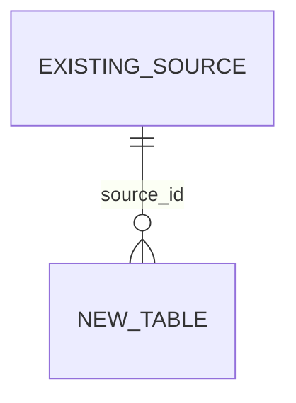

# Data Model：<change-id>

> 涉及 DB schema 或持久化状态的 Tier M/L 变更必须使用本模板或等价结构。正文中文；表名、字段名、SQL、枚举值保持原样。

## 设计结论

- [QUESTION] 新增/变更哪些表？
- [QUESTION] 是否需要 DDL？
- [QUESTION] 是否需要 DML？
- [QUESTION] SQL 是否只作为草案，还是允许在目标库执行？

## ER 图



## 可执行 SQL 草案

### Precheck

```sql
-- 查询本次 DML 使用的主键、类型或配置是否已存在。
SELECT 1;
```

### DDL

```sql
CREATE TABLE example_table (
  id BIGINT NOT NULL AUTO_INCREMENT COMMENT '主键ID',
  status TINYINT NOT NULL COMMENT '状态：1-示例状态A 2-示例状态B',
  create_time DATETIME NOT NULL DEFAULT CURRENT_TIMESTAMP COMMENT '创建时间',
  PRIMARY KEY (id)
) ENGINE=InnoDB DEFAULT CHARSET=utf8mb4 COMMENT='示例表';
```

### DML

```sql
-- 如无 DML，写“本次无 DML”。
SELECT 1;
```

## 字段来源与用途

| 表 | 字段 | 是否冗余/快照 | 来源 | 用途 | 保留理由 |
| --- | --- | --- | --- | --- | --- |
| `example_table` | `status` | 否 | PRD / 用户确认 / 现有代码 | 驱动状态流转 | 必要业务状态 |

## 范式检查

- 第一范式：字段原子，不存多个业务值拼接。
- 第二范式：非主键字段依赖完整主键。
- 第三范式：非主键字段不依赖其他非主键字段。
- 冗余字段清单：逐字段说明审计、不可重算快照、性能或兼容理由；无理由则删除。

## SQL 注释检查

- [ ] 每个字段都有 `COMMENT`。
- [ ] 状态/枚举字段的 `COMMENT` 写明所有当前值和含义。
- [ ] 没有“见枚举”“见上方”“见状态枚举”等跳转式注释。
- [ ] 字段用途能在“字段来源与用途”表中找到。
