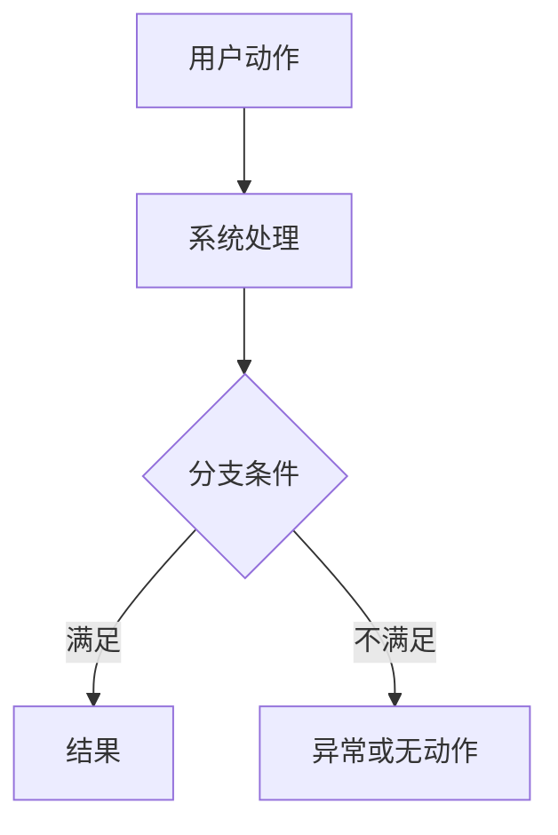

# <change-id>

> Tier L 适用于跨多个仓、多个接口、权限/状态/数据模型影响较大的变更。面向人工 review / 用户确认的正文默认中文；代码标识、命令、API 路径、字段名、错误码、YAML key、日志 key 和引用原文保持原样。

## 一句话目标

[QUESTION] 写清用户确认的业务目标。

## 必须先拍板的问题

1. [QUESTION] PRD / 需求来源是什么？
2. [QUESTION] 影响哪些仓库和模块？
3. [QUESTION] PRD 涉及哪些端：PC Web、H5、小程序、APP、后端、DB、job/MQ、导出、埋点/分析、报表？
4. [QUESTION] 是否涉及 DB schema、权限、状态机、定时任务、MQ、Nacos 或生产配置？
5. [QUESTION] 是否需要灰度、回滚开关或数据修复？

## 本次 harness 流程和停止点

- [QUESTION] 方案确认点：spec / contract / plan / data model / capability spec（如适用）和完整技术方案文档确认后才进入业务代码；技术方案使用 `templates/technical-solution.md`。
- [QUESTION] 全栈方案点：技术方案必须先按 PRD 逐项盘点后端、PC Web、H5、小程序、APP、导出、埋点/分析、DB、job/MQ；PRD 涉及的端必须有对应设计和验证项。
- [QUESTION] 状态展示点：`changes/<change-id>/harness-status.md` 是用户查看当前阶段、下一步和待确认项的单一入口。
- [QUESTION] 代码启动点：无阻塞 `[ASSUMP]` / `[QUESTION]`，且 allowed paths 已确认。
- [QUESTION] UI 确认点：复杂 PC 页面必须先跑起来给人工确认；未确认不得声明 UI 通过。
- [QUESTION] DB 停止点：真实库写操作必须二次确认；高危 SQL 全局禁止。
- [QUESTION] AI 测试确认点：`changes/<change-id>/ai-test-report.md` 经人工确认后，才允许进入测试 / 预发发布。
- [QUESTION] 合并前门禁：targeted test / PC smoke / CodeGraph sync（辅助）/ 临时写死扫描 / Reviewer。

## 范围

### IN

- [QUESTION] Frontend repos:
- [QUESTION] Backend repos:
- [QUESTION] Mini Program / H5 / APP repos:
- [QUESTION] API endpoints:
- [QUESTION] Data model:
- [QUESTION] Export / analytics / report scope:
- [QUESTION] Permissions / status transitions:

### OUT

- [FACT] No production config changes unless explicitly approved.
- [FACT] No deployment changes unless explicitly approved.
- [FACT] No unrelated refactor.

## FACTS

- [FACT] 这里只写来自 PRD、用户确认、现有代码、线上行为或契约的事实。

## PRD 全栈覆盖盘点

| PRD 项 | 影响端 | 仓库/模块 | 进入技术方案? | 说明 |
| --- | --- | --- | --- | --- |
| [QUESTION] | Backend / PC Web / H5 / Mini Program / APP / DB / Job / Export / Analytics | [QUESTION] | Yes / No / N/A | [QUESTION] |

要求：

- PRD 出现的页面、弹窗、列表、详情、筛选、排序、导出、埋点/分析、权限和验收项都要逐项盘点。
- `No` / `N/A` 必须写用户确认、PRD 不涉及、现有能力无需改动或延期来源。

## 需求理解流程图

> Tier L 必填。用 Mermaid 描述用户动作、系统动作、异步处理、待办/通知、定时任务/MQ 和异常分支。



## ASSUMPTIONS

- [ASSUMP] 这里写 AI 推断但未确认的内容；确认或移除前不得进入实现。

## OPEN QUESTIONS

- [QUESTION] 这里写阻塞实现的问题；无阻塞时使用下方 `non_blocking_questions:`。

non_blocking_questions:
  - [QUESTION] None.

## 契约与数据

| Item | Value |
| --- | --- |
| Contract doc | `changes/<change-id>/contract.md` |
| Technical solution doc | [QUESTION] `changes/<change-id>/technical-solution.md` 或飞书 Wiki 子文档 URL，必须按 `templates/technical-solution.md` 产出全栈技术方案 |
| Verification map | `changes/<change-id>/verification-map.md`，必须按 `templates/verification-map.md` 把关键约束映射到验证方式 |
| Harness status | `changes/<change-id>/harness-status.md` |
| AI test report | `changes/<change-id>/ai-test-report.md` |
| Data model doc | `changes/<change-id>/data-model.md` 或 `docs/data-models/<change-id>.md` |
| Capability / behavior spec | 可选：`changes/<change-id>/capability-spec.md` 或 `behavior-spec.md`；仅在复杂状态机、权限、跨端一致性或能力边界需要时使用 |
| Backward compatible? | [QUESTION] |
| Rollback switch? | [QUESTION] |

DB / data model 要求：

- 涉及 DB schema 或持久化任务状态时，必须单独写 data model 文档。
- data model 文档必须包含可复制执行的 DDL / DML SQL 草案、ER 图、字段来源/用途说明和范式检查。
- SQL 字段 `COMMENT` 必须写完整语义和枚举值，不允许只写“见状态枚举”等跳转描述。
- 默认遵守三大范式；任何冗余快照字段、反向关联字段都必须逐字段说明理由。

Capability / behavior spec 要求：

- 新需求只使用 `changes/<change-id>/` 作为 harness 控制面，不创建顶层 `openspec/`，也不依赖 OpenSpec CLI。
- 复杂状态机、权限矩阵、跨端一致性或能力边界需要独立规格时，补 `changes/<change-id>/capability-spec.md` 或 `behavior-spec.md`。
- 这些文件不是默认强制产物；需要时必须在 `verification-map.md` 中映射到验证命令、人工确认、Tester 结论或 Reviewer 结论。
- 业务仓已有 `openspec/` 仅作为 legacy context 读取，不作为新需求门禁来源。

Verification Map 要求：

- 进入业务代码前必须复制 `templates/verification-map.md` 到 `changes/<change-id>/verification-map.md`。
- 关键业务约束、接口、权限、状态、DB、UI、发布和回滚要求必须映射到验证命令、人工确认或 `N/A:` 原因。
- 必须运行 `gates/verification-map-gate.sh changes/<change-id>`，不得让 `TODO` / `TBD` / `BLOCKED` 行进入实现。

## Implementation Decision Matrix

> Tier L 必填。任何会进入代码、SQL、接口、权限、状态机、默认值、adapter 或回滚的决定都必须列在这里。

| Decision | Source | Status | Can enter code? | Notes |
| --- | --- | --- | --- | --- |
| [QUESTION] | PRD / 用户确认 / 现有代码 / contract | FACT / ASSUMP / QUESTION | Yes / No | [QUESTION] |

## 允许修改路径

```yaml
allowed_paths:
  frontend:
    - /absolute/path/to/frontend/src/**
  backend:
    - /absolute/path/to/backend/**
forbidden_paths:
  - "**/application-prod.yml"
  - "**/bootstrap-prod.yml"
  - "**/.env*"
  - "**/k8s/prod/**"
  - "**/db/migration/**"
approved_protected_paths: []
# 如确需触碰 protected path，逐条写入用户确认的绝对路径或环境变量路径。
```

## 验证策略

- Backend: [QUESTION] compile / targeted test / integration smoke.
- Backend test plan: [QUESTION] `changes/<change-id>/backend-test-plan.md` 是否需要；如后端行为变更，缺失 targeted test 矩阵时状态为 `BLOCKED`。
- Frontend: [QUESTION] lint / build / unit smoke.
- Contract: [QUESTION] 字段、错误码、空态、分页、兼容性检查方式。
- SIT: [QUESTION] happy path、空态、异常态、权限态。
- Complex UI: [QUESTION] `changes/<change-id>/ui-confirmation.md` 是否需要；如需要，人工确认前状态为 `BLOCKED`。

## 完成标准

- [ ] No unresolved blocking `[QUESTION]`.
- [ ] No `[ASSUMP]` item entered implementation.
- [ ] Contract / data model / plan are consistent.
- [ ] Backend test plan is recorded, or marked `NOT_APPLICABLE` with reason.
- [ ] Required backend and frontend evidence is recorded.
- [ ] AI test report is recorded and human-confirmed before test / pre-release.
- [ ] Complex UI confirmation is recorded, or marked `NOT_APPLICABLE`.
- [ ] Allowed-paths check is recorded.
- [ ] Reviewer output is recorded.
- [ ] Rollback and SIT smoke notes are recorded.

## 回滚

[QUESTION] 写清代码回滚、配置回滚、数据回滚和用户侧影响。
