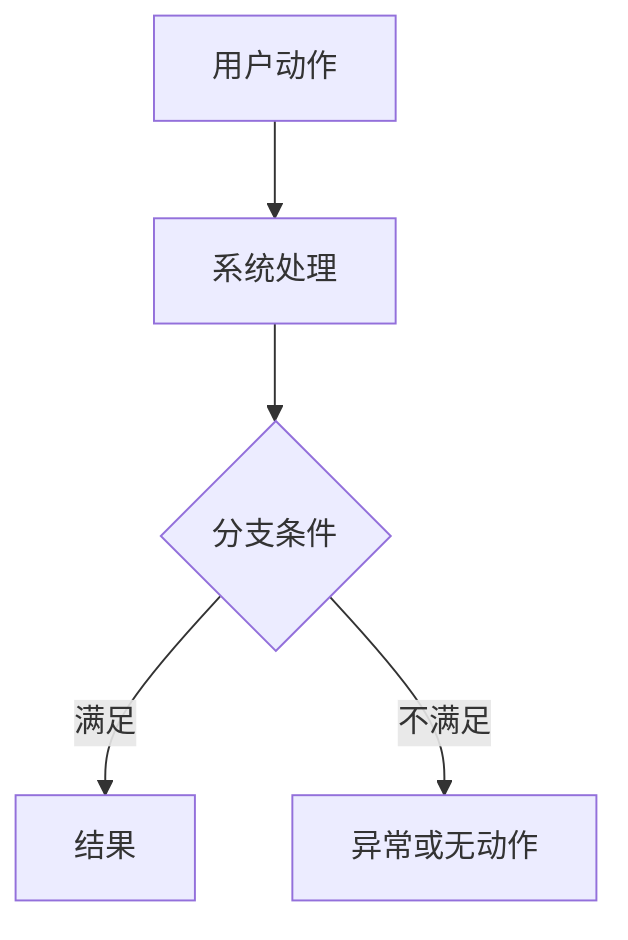

# <change-id>

> Tier M 适用于小型功能：只涉及一个前端仓和一个后端仓，包含 1-2 个 API，不涉及复杂状态机，不修改生产配置。
> 面向人工 review / 用户确认的正文默认使用中文；代码标识、命令、API 路径、字段名、错误码、YAML key、日志 key 和引用原文保持原样。

## 一句话目标

[QUESTION] 用一句中文写清用户确认的业务目标。

## 需要用户拍板的关键问题

1. [QUESTION] 本次实现对应哪个 PRD / 需求 / 问题单？
2. [QUESTION] 前端入口归属哪个页面或模块？
3. [QUESTION] PRD 是否涉及 PC Web、H5、小程序、APP、导出、埋点/分析或报表？涉及的端必须进入全栈技术方案。
4. [QUESTION] 是否需要修改 DB schema？默认：不需要。

## 本次 harness 流程和停止点

- [QUESTION] 方案确认点：spec / contract / plan / data model（如适用）和完整技术方案文档确认后才进入业务代码；技术方案使用 `templates/technical-solution.md`。
- [QUESTION] 全栈方案点：技术方案必须先按 PRD 逐项盘点后端、PC Web、H5、小程序、APP、导出、埋点/分析、DB、job/MQ；PRD 涉及的端必须有对应设计和验证项。
- [QUESTION] 状态展示点：`changes/<change-id>/harness-status.md` 是用户查看当前阶段、下一步和待确认项的单一入口。
- [QUESTION] 代码启动点：无阻塞 `[ASSUMP]` / `[QUESTION]`，且 allowed paths 已确认。
- [QUESTION] UI 确认点：复杂 PC 页面必须先跑起来给人工确认；未确认不得声明 UI 通过。
- [QUESTION] DB 停止点：真实库写操作必须二次确认；高危 SQL 全局禁止。
- [QUESTION] AI 测试确认点：`changes/<change-id>/ai-test-report.md` 经人工确认后，才允许进入测试 / 预发发布。
- [QUESTION] 合并前门禁：targeted test / PC smoke / CodeGraph sync（辅助）/ 临时写死扫描 / Reviewer。

## 范围

### IN

- [QUESTION] Frontend repo:
- [QUESTION] Backend repo:
- [QUESTION] Mini Program / H5 / APP repos:
- [QUESTION] API endpoints:
- [QUESTION] UI pages / components:
- [QUESTION] Export / analytics / report scope:

### OUT

- [FACT] No production config changes unless explicitly approved.
- [FACT] No deployment changes unless explicitly approved.
- [FACT] No changes outside allowed paths.

## 仓库路径

```yaml
control_plane: rz-harness
frontend_repo: $RZ_REPO_MAP_SYSTEM
backend_repo: $RZ_REPO_SFA_SALES_MANAGEMENT
```

## FACTS（事实）

- [FACT] 这里只写来自 PRD、用户确认、现有代码或契约的事实。

## PRD 全栈覆盖盘点

| PRD 项 | 影响端 | 仓库/模块 | 进入技术方案? | 说明 |
| --- | --- | --- | --- | --- |
| [QUESTION] | Backend / PC Web / H5 / Mini Program / APP / DB / Job / Export / Analytics | [QUESTION] | Yes / No / N/A | [QUESTION] |

要求：

- PRD 出现的页面、弹窗、列表、详情、筛选、排序、导出、埋点/分析、权限和验收项都要逐项盘点。
- `No` / `N/A` 必须写用户确认、PRD 不涉及、现有能力无需改动或延期来源。

## 需求理解流程图

> Tier M 如涉及审批、异步处理、待办、通知、定时任务/MQ、跨仓调用或状态流转，本节必填。



## ASSUMPTIONS（假设）

- [ASSUMP] 这里写 AI 推断但未确认的内容；确认或移除前不得进入实现。

## OPEN QUESTIONS（待确认问题）

- [QUESTION] 这里写阻塞实现的问题。

## 契约

| Item | Value |
| --- | --- |
| Contract doc | `changes/<change-id>/contract.md` |
| Technical solution doc | [QUESTION] `changes/<change-id>/technical-solution.md` 或飞书 Wiki 子文档 URL，必须按 `templates/technical-solution.md` 产出全栈技术方案 |
| Verification map | `changes/<change-id>/verification-map.md`，必须按 `templates/verification-map.md` 把关键约束映射到验证方式 |
| Harness status | `changes/<change-id>/harness-status.md` |
| AI test report | `changes/<change-id>/ai-test-report.md` |
| Capability / behavior spec | 可选：`changes/<change-id>/capability-spec.md` 或 `behavior-spec.md`；仅在复杂状态机、权限、跨端一致性或能力边界需要时使用 |
| Backward compatible? | [QUESTION] |
| Frontend mock needed? | [QUESTION] |

### 数据模型

如涉及 DB schema 或持久化任务状态，必须单独写：

```text
changes/<change-id>/data-model.md
```

data model 文档必须包含：

- 可复制执行的 DDL / DML SQL 草案。
- ER 图。
- 每个字段的 PRD / 用户确认 / 现有代码来源或业务理由。
- 范式检查；冗余字段和反向关联字段必须逐字段说明理由。
- SQL 字段 `COMMENT` 必须写完整语义和枚举值，不允许只写“见状态枚举”。

### Capability / Behavior Spec

新需求只使用 `changes/<change-id>/` 作为 harness 控制面，不创建顶层 `openspec/`，也不依赖 OpenSpec CLI。

如涉及复杂状态机、权限矩阵、跨端一致性或能力边界，补充：

```text
changes/<change-id>/capability-spec.md
changes/<change-id>/behavior-spec.md
```

这些文件不是默认强制产物；需要时必须在 `verification-map.md` 中映射到验证命令、人工确认、Tester 结论或 Reviewer 结论。业务仓已有 `openspec/` 仅作为 legacy context 读取，不作为新需求门禁来源。

### Verification Map

进入业务代码前必须复制 `templates/verification-map.md` 到 `changes/<change-id>/verification-map.md`，将关键业务约束、接口、权限、状态、DB、UI、发布和回滚要求映射到验证命令、人工确认或 `N/A:` 原因，并运行：

```bash
gates/verification-map-gate.sh changes/<change-id>
```

## Implementation Decision Matrix

> Tier M 如涉及接口、DB、权限、状态、错误码、默认值、adapter、capability / behavior spec 或回滚，本节必填。所有会进入代码的决定必须有来源。

| Decision | Source | Status | Can enter code? | Notes |
| --- | --- | --- | --- | --- |
| [QUESTION] | PRD / 用户确认 / 现有代码 / contract | FACT / ASSUMP / QUESTION | Yes / No | [QUESTION] |

### API 草案

| Method | Path | Purpose | Source |
| --- | --- | --- | --- |
| [QUESTION] | [QUESTION] | [QUESTION] | [QUESTION] |

### 请求字段

| Field | Type | Required | Source |
| --- | --- | --- | --- |
| [QUESTION] | [QUESTION] | [QUESTION] | [QUESTION] |

### 响应字段

| Field | Type | Meaning | Source |
| --- | --- | --- | --- |
| [QUESTION] | [QUESTION] | [QUESTION] | [QUESTION] |

## 允许修改路径

```yaml
allowed_paths:
  frontend:
    - $RZ_REPO_MAP_SYSTEM/src/**
  backend:
    - $RZ_REPO_SFA_SALES_MANAGEMENT/sfa-sales-management-interfaces/src/**
    - $RZ_REPO_SFA_SALES_MANAGEMENT/sfa-sales-management-application/src/**
    - $RZ_REPO_SFA_SALES_MANAGEMENT/sfa-sales-management-infrastructure/src/**
forbidden_paths:
  - "**/application-prod.yml"
  - "**/bootstrap-prod.yml"
  - "**/.env*"
  - "**/k8s/prod/**"
  - "**/db/migration/**"
approved_protected_paths: []
```

## 实施计划位置

计划文件：

```text
changes/<change-id>/plan.md
```

所有阻塞性 `[QUESTION]` 解决前，不得编写实现代码。

## UI 确认门禁

- [ ] 本 change 已判定是否涉及复杂 UI。
- [ ] 如涉及复杂 UI，已创建 `changes/<change-id>/ui-confirmation.md`。
- [ ] 如涉及复杂 UI，人工 / 工人确认结论为 `CONFIRMED` 后，才允许进入正式 Vue/H5 页面实现或最终 review。
- [ ] 如复杂 UI 尚未确认，当前状态必须记录为 `BLOCKED`，且不得用实现后的 PC E2E smoke 替代该确认。

## 知识引用

> 本次引用了哪些已有知识条目（pitfall / sample / decision）。ARCHIVE 阶段据此更新被引用条目的 `last_referenced` / `referenced_by`。无引用可留空。
> 用 `scripts/knowledge-reference-gate.sh <spec>` 校验引用的 ID 真实存在。

```yaml
knowledge_refs:
  - <SFA-PIT-NNN>   # 引用的已知坑（docs/pitfalls/）
  - <SFA-SMP-NNN>   # 复用的样板（docs/samples/）
```

## 完成标准

- [ ] No unresolved blocking `[QUESTION]`.
- [ ] No `[ASSUMP]` item entered implementation.
- [ ] Contract doc exists and matches frontend/backend implementation.
- [ ] Backend test plan is recorded, or marked `NOT_APPLICABLE` with reason.
- [ ] Backend compile or targeted test evidence is recorded.
- [ ] Frontend lint/build evidence is recorded.
- [ ] AI test report is recorded and human-confirmed before test / pre-release.
- [ ] Complex UI confirmation is recorded, or marked `NOT_APPLICABLE`.
- [ ] Allowed-paths check is recorded.
- [ ] Reviewer output is recorded.
- [ ] Bulky process artifacts are stored under `artifacts/<change-id>/` or external storage, with only summary paths recorded in Git.
- [ ] Rollback note is recorded.

## 产物保留策略

- [FACT] Git 中长期保留 `spec.md`、`plan.md`、精简 `evidence.md`、`review.md`、`pre-pr.md` 和必要的 `retro.md` / `contract-delta.md`。
- [FACT] 截图、录屏、trace、coverage、完整长日志、临时原型草稿和数据快照默认放到 `artifacts/<change-id>/` 或外部存储。
- [FACT] AI 默认只读取当前 active change；历史 `changes/` 只按明确线索定向检索。

## 回滚

[QUESTION] 写清最简单回滚路径，例如隐藏路由、回退 API 调用或 revert PR。

## 来源

| Source | Link / Path |
| --- | --- |
| PRD | [QUESTION] |
| Feishu doc | [QUESTION] |
| Frontend sample | [QUESTION] |
| Backend sample | [QUESTION] |
| Contract | `changes/<change-id>/contract.md` |
