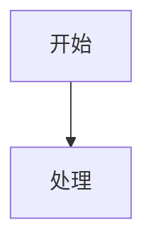
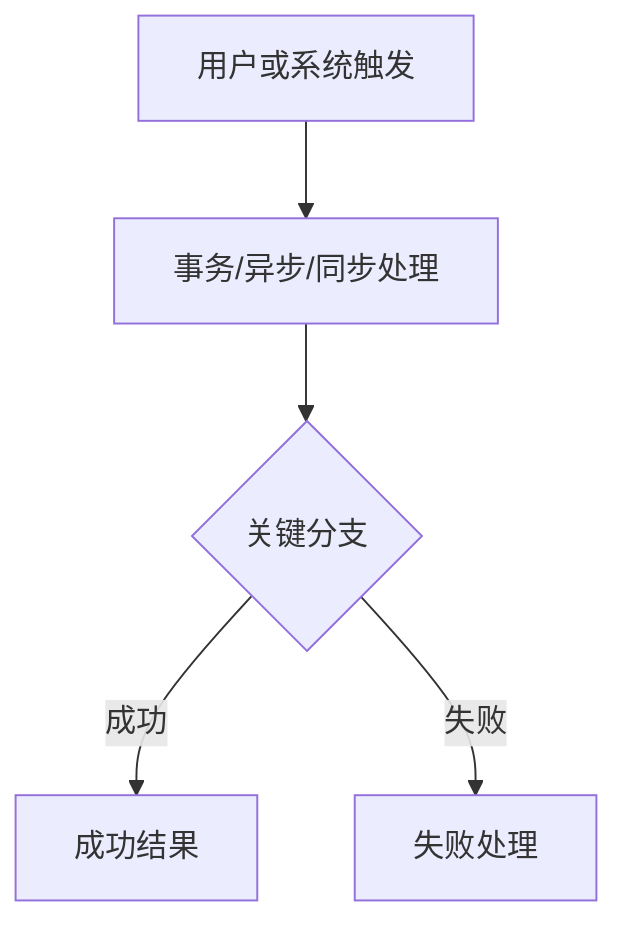
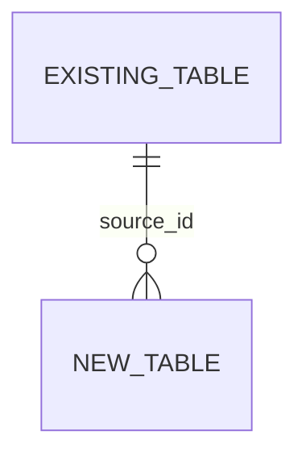

# <需求名称> 技术方案

> 用途：Tier M/L 复杂需求在进入业务代码实现前，必须把 `spec.md`、
> `plan.md`、`contract.md`、`data-model.md`、测试计划和风险结论整理成一份
> 面向人工确认的全栈技术方案文档。正文默认中文；代码标识、命令、API 路径、
> 字段名、错误码、YAML key、日志 key 和引用原文保持原样。

## 确认状态

```yaml
confirmation_status: PENDING
confirmed_by: -
confirmed_at: -
confirmed_scope: -
allowed_next_stage: none
residual_risks_accepted: -
prd_source_type: local
prd_source_url: N/A
prd_source_node_token: N/A
feishu_solution_doc_url: N/A
feishu_solution_sync_status: N/A
feishu_solution_synced_at: -
feishu_solution_source_sha256: -
```

`confirmation_status` 可选值：`PENDING` / `CONFIRMED` / `CHANGE_REQUESTED` / `BLOCKED`。
`allowed_next_stage` 可选值：`none` / `prototype` / `test_plan_design` / `code_start` / `ai_test` / `pre_release`。
> RZ：飞书同步不是停止点表里的拍板关卡。用户在对话确认后，由主 Agent 写入 `confirmation_status: CONFIRMED`。当前 `gates/technical-solution-gate.sh` 仍会调用 `gates/technical-solution-feishu-sync-gate.sh`。

`prd_source_type` 可选值：`local` / `feishu` / `other`。如果 PRD 是飞书 Wiki/Doc 链接，必须写 `prd_source_type: feishu` 和 `prd_source_url`；如果链接无法直接解析 Wiki parent node token，补充 `prd_source_node_token`。
`feishu_solution_*` 由 `gates/technical-solution-feishu-sync-gate.sh` 维护，用于证明飞书子文档已和本地方案同步。

确认语义：

- 只有 `confirmation_status: CONFIRMED` 且 `allowed_next_stage` 不是 `none`，`gates/technical-solution-gate.sh` 才能通过。
- 技术方案确认后，如果 `prd_source_type: feishu` 或 `prd_source_url` 是飞书 / Lark 链接，必须先运行
  `gates/technical-solution-feishu-sync-gate.sh changes/<change-id>`，在 PRD Wiki 节点下新建/更新技术方案子文档；
  `feishu_solution_sync_status: SYNCED` 且 `feishu_solution_source_sha256` 匹配当前本地方案后，
  `gates/technical-solution-gate.sh` 才能通过。
- 如果确认后的本地技术方案继续修改，必须重新运行 `gates/technical-solution-feishu-sync-gate.sh changes/<change-id>`，
  更新同一个飞书技术方案子文档和本地 `feishu_solution_*` 元数据。
- “确认方案方向”不等于“允许进入业务代码实现”。
- 技术方案确认后，默认下一步是独立 Test Strategy Agent 产出 `ai-test-plan.md` 并由用户确认；如允许进入测试方案设计，写 `allowed_next_stage: test_plan_design`。
- 只有 `ai-test-plan.md` 已确认后，才允许写 `allowed_next_stage: code_start` 进入业务代码实现。
- 用户要求调整时标记 `CHANGE_REQUESTED`，修订后重新确认。
- 残余风险必须在本节或文末风险章节写清；未接受的残余风险不得作为发布通过依据。

## 使用约束

- [ ] 复杂需求必须先产出完整技术方案给人工确认，再进入业务代码实现。
- [ ] 进入业务代码前必须运行 `gates/technical-solution-gate.sh changes/<change-id>` 并记录 evidence。
- [ ] 技术方案确认后必须复制 `templates/ai-test-plan.md` 到 `changes/<change-id>/ai-test-plan.md`，由独立 Test Strategy Agent 基于 PRD、技术方案和契约生成测试方案。
- [ ] `ai-test-plan.md` 必须由用户确认并通过 `gates/ai-test-plan-gate.sh changes/<change-id>`，未确认不得进入业务代码实现。
- [ ] 进入业务代码前必须复制 `templates/verification-map.md` 到 `changes/<change-id>/verification-map.md`，并运行 `gates/verification-map-gate.sh changes/<change-id>`。
- [ ] 技术方案不是替代 `spec.md`、`plan.md`、`contract.md`、`data-model.md`；
      它是把这些控制面材料整理成一份可读、可评审、可转发的总方案。
- [ ] 技术方案必须是全栈技术方案：先按 PRD 逐项盘点后端、PC Web、H5、
      小程序、APP、job/MQ、DB、导出、埋点/分析、权限、发布和回滚范围；
      PRD 涉及的端必须在正文有对应设计和验证项。
- [ ] 每个新增、修改或查询接口都必须写清 request / response / export 字段来源、
      处理逻辑、筛选逻辑、排序/分页、空值展示和验证方式；不得用“后续确认”、
      “实现时固化”、“参考现有逻辑”等模糊描述替代实现细节。
- [ ] 涉及前端 / PC Web / H5 / 小程序 / APP 的方案必须写清 UI 参考来源
      （PRD 截图、HTML demo、线上页面、现有组件）、页面结构、组件职责、状态、
      交互、校验、空态、加载态、失败态和 smoke 截图计划。
- [ ] 如果 `changes/<change-id>/data-model.md` 存在且 `schema_change_required: yes`，
      技术方案主文档必须内嵌核心 DB/DDL 设计：涉及表、DDL 或字段清单、字段语义、
      回滚风险和验证方式；不能只写“见 data-model.md”。
- [ ] 不允许只写“后端实现 + 前端字段支撑”。如某一端不实现，必须在范围、
      覆盖矩阵和验证章节写明 `N/A:` 原因和用户确认来源。
- [ ] 如果用户提供飞书 Wiki/Doc 作为 PRD 或评审入口，优先在该 Wiki 节点下
      新建子文档，而不是只写本地 Markdown；确认后必须用
      `gates/technical-solution-feishu-sync-gate.sh` 写入 / 更新飞书技术方案子文档。
- [ ] 文档必须使用最终已确认口径，不得写入早期草案、已被用户纠正的方案或
      过期 DDL。
- [ ] 技术方案确认版不得包含 `TODO`、`TBD`、`FIXME`、`READY_FOR_SQL`、
      `OPEN_SQL_DETAIL`、`[QUESTION]`、`[ASSUMP]` 或尖括号占位变量。
- [ ] 本地 Markdown 技术方案必须使用 fenced Mermaid 代码块，确保在本地 review 时可见；
      写入飞书 Wiki/Doc 时再转换为飞书画板/白板，不得把 `<whiteboard ...>` 直接写进本地 Markdown 产物。
- [ ] 长文档分段写入飞书，避免单次 `--content` 过长导致写入失败。
- [ ] 写入飞书后必须回读校验 outline 和图块类型。

## 确认前无模糊实现细节自检

> 本节必须在 `confirmation_status: CONFIRMED` 前逐项完成。任何一项为 `no`
> 时，不得把方案推进到 `code_start`；应继续补方案或回到用户确认。

| Check | Required detail | Status / Evidence |
| --- | --- | --- |
| PRD 来源 | 飞书 Wiki/Doc、HTML demo、截图、线上参考页、用户补充说明都已读取并写入 evidence；飞书 PRD 必须使用 `lark-wiki` + `lark-doc` 技能 | `<yes/no + evidence path>` |
| PRD 全面覆盖 | PRD 的页面、入口、跳转、筛选、排序、导出、埋点、权限、验收项均落到端到端覆盖矩阵；不做项写 `N/A:` 和来源 | `<yes/no + section>` |
| 接口字段来源 | 每个新增、修改、查询、导出接口的 request / response / export 字段均写明来源表/字段、DTO/VO 字段、枚举转换、聚合口径、空值展示 | `<yes/no + section>` |
| 查询处理逻辑 | 每个筛选项写明精准/模糊/范围/枚举/默认值；分页、排序、total、去重、一对多 join 防放大、时间范围边界写清楚 | `<yes/no + section>` |
| 权限与错误 | 角色、组织/产品组限制、前后端校验分工、无权限/参数错误返回和是否阻断后续查询写清楚 | `<yes/no + section>` |
| 前端 UI 细节 | 写明 UI 参考来源、路由、页面结构、组件职责、表格列、按钮/导出、入口跳转、空态、加载态、失败态、截图/smoke 计划 | `<yes/no + section>` |
| 跨页面入口 | PRD 或用户提到的来源页、详情页、客户页、编号点击、数量点击、校验去留和 route query 均写清具体实现 | `<yes/no + section>` |
| DB / BD 设计 | `data-model.md` 的核心表、DDL/字段、默认值、预留字段、字段语义、索引/回滚/造数/验证方式已内嵌到主方案 | `<yes/no/N/A + section>` |
| 导出一致性 | 导出入口、下载中心/文件流方式、导出字段来源、分页忽略规则、与列表/统计口径一致性验证写清楚 | `<yes/no/N/A + section>` |
| 埋点与敏感信息 | 埋点事件、触发点、payload 字段、禁止采集的敏感字段、验证方式写清楚 | `<yes/no/N/A + section>` |
| Tester 输入 | AI test plan 所需的本地命令、浏览器 smoke、环境阻塞、人工确认项均能从方案直接推导 | `<yes/no + section>` |
| 过期口径清理 | 用户已纠正的早期方案、过期 DDL、过期校验、已删除 PRD 模块未残留在确认版正文 | `<yes/no + evidence>` |

## 飞书创建方式

推荐使用同步助手，创建 / 更新成功后会回写 `feishu_solution_*` 元数据：

```bash
gates/technical-solution-feishu-sync-gate.sh changes/<change-id>
```

预览将执行的飞书命令：

```bash
gates/technical-solution-feishu-sync-gate.sh --dry-run changes/<change-id>
```

同步助手会用本地 `technical-solution.md` 生成飞书 payload，并把 fenced `mermaid`
代码块转换成飞书 `<whiteboard type="mermaid">`。该飞书子文档视为 harness 维护的方案镜像；
后续方案修改应重新运行同步助手，不应只改本地 Markdown。

手工方式：在目标 Wiki 节点下新建子文档：

```bash
lark-cli wiki +node-create \
  --as user \
  --parent-node-token <PARENT_NODE_TOKEN> \
  --title "<需求名称> 技术方案"
```

写入正文时默认使用 XML：

```bash
lark-cli docs +update \
  --doc "<NEW_WIKI_OR_DOC_URL>" \
  --command overwrite \
  --content "<XML_CONTENT>"
```

## 流程图 / 画板要求

本地 Markdown 产物的正确写法：

````markdown

````

写入飞书文档时，必须转换为飞书画板/白板：

正确写法：

```xml
<whiteboard type="mermaid">flowchart TD
  A[开始] --> B[处理]
</whiteboard>
```

飞书文档中的错误写法：

```xml
<pre lang="mermaid"><code>flowchart TD
  A[开始] --> B[处理]
</code></pre>
```

写入飞书文档时，ER 图也必须使用画板：

```xml
<whiteboard type="mermaid">erDiagram
  SOURCE ||--o{ TARGET : source_id
</whiteboard>
```

## 写后校验

```bash
lark-cli docs +fetch \
  --api-version v2 \
  --doc "<NEW_WIKI_OR_DOC_URL>" \
  --scope outline \
  --max-depth 2

lark-cli docs +fetch \
  --api-version v2 \
  --doc "<NEW_WIKI_OR_DOC_URL>" \
  --detail with-ids
```

校验项：

- [ ] outline 包含主要章节。
- [ ] 本地 Markdown review 时流程图可见，不能只写 `<whiteboard type="mermaid">...`。
- [ ] 飞书写入后的 Mermaid 代码块数量为 0，即不应存在 `lang="mermaid"`。
- [ ] 飞书写入后的主流程、ER 图、关键状态流转图对应 block 类型为 `whiteboard`。
- [ ] 文档链接可打开，且位于用户要求的 Wiki/Doc 节点下。

## 文档结构模板

### 0. PRD 端到端覆盖矩阵

先按 PRD 章节、页面、接口、导出、埋点、验收清单逐项盘点。每一项都必须
落到“实现端 + 技术方案章节 + 验证方式”，不能只按后端接口倒推范围。

| PRD 项 | 影响端 | 实现仓/模块 | 技术方案章节 | 验证方式 | 状态 |
| --- | --- | --- | --- | --- | --- |
| `<PRD 章节/页面/验收项>` | `Backend / PC Web / H5 / Mini Program / APP / DB / Job / Export / Analytics` | `<repo/path>` | `<section>` | `<command / screenshot / SQL / manual confirm / N/A reason>` | `IN / OUT / N/A` |

必须覆盖：

- PRD 中出现的每个页面、入口、弹窗、筛选、排序、导出、埋点、权限和验收项。
- PC Web、H5、小程序、APP 只要任一端出现在 PRD，就必须有页面/交互方案。
- 后端 API 只要被任一端消费，就必须写清消费方和兼容策略。
- 导出、报表、埋点/分析不能只写“后端返回字段”，必须写前端触发点、字段口径和验证方式。
- `OUT` / `N/A` 项必须写来源：用户确认、PRD 不涉及、现有能力无需改动或明确延期。

### 1. 范围与项目分工

| 项目 | 范围 | 主要职责 |
| --- | --- | --- |
| `<repo>` | `<前端/后端/控制面/配置>` | `<本项目写什么代码>` |

必须写清：

- 涉及哪些项目。
- 每个项目分别写什么代码。
- 明确不涉及哪些项目、页面、配置或发布项。
- 每个 PRD 涉及端至少对应一个项目或明确 `N/A:` 原因。

### 2. 关键业务结论

| 主题 | 最终结论 | 来源 |
| --- | --- | --- |
| `<业务口径>` | `<最终口径>` | `PRD / 用户确认 / 现有代码 / contract` |

要求：

- 只写已确认结论。
- 用户纠正过的点必须按最终口径写。
- 不得把 `[ASSUMP]`、早期草案值或未确认字段写成事实。

### 3. 主流程

本地 Markdown 使用 fenced Mermaid；写入飞书时转换为画板：



至少覆盖：

- 主路径。
- 关键分支。
- 用户跨端路径：PC/H5/小程序/APP/后端/DB/job/MQ 之间的调用和状态传递。
- 异步、事务、待办、通知、job/MQ、外部 adapter。
- 成功和失败结果。

### 4. 全栈实现设计

本章按端拆分。PRD 涉及的端必须保留对应小节；不涉及的端删除或标记
`N/A:`，并写明来源。

#### 4.1 后端设计

建议小节：

- 触发入口。
- 事务与异步边界。
- 查询和计算口径。
- 重复提交、幂等和覆盖规则。
- 状态机。
- 权限。
- 待办。
- APP/消息通知。
- 定时任务、MQ 或外部 adapter。
- 失败处理和错误落库。

接口字段矩阵必须按接口拆开写：

| Interface | Direction | Field | Source | Processing / filter / sort / pagination logic | Empty / enum / display | Verification |
| --- | --- | --- | --- | --- | --- | --- |
| `<path>` | `request/response/export` | `<field>` | `<table.column / config / route query / derived>` | `<exact match / like / aggregate / enum translation / page rows>` | `<default / '-' / enum text>` | `<test or smoke evidence>` |

要求：

- request 字段必须写清前端来源、后端接收 DTO、筛选条件和空值语义。
- response 字段必须写清真实数据来源、join key、聚合口径、枚举转换和排序。
- export 字段必须写清是否复用列表筛选、是否忽略分页、字段顺序和脱敏规则。
- mapper test 是验证方式，不是口径定义；技术方案必须先定义口径。

#### 4.1.x DB / 数据模型设计

如果本需求涉及 DB、DDL、索引、默认值、历史数据补齐、状态字段或查询模型变更，
本节必须保留，并内嵌核心设计。`data-model.md` 可以作为详细附件，但不能替代
技术方案主文档。

必须写清：

- 涉及表和用途。
- DDL 草案或新增/变更字段清单。
- 字段来源、默认值、空值展示、枚举含义。
- 历史数据、存量默认值和兼容策略。
- 回滚风险、执行环境、锁表/索引影响和二次确认要求。
- mapper/service/export/UI 验证方式。

#### 4.2 PC Web 设计

必须写清：

- route、菜单入口、页面名称、权限点。
- 列表/详情/表单/弹窗/批量操作/导出/筛选/排序/分页。
- API request/response 字段映射和兼容旧数据方式。
- 空态、加载态、失败态、权限态和重复提交处理。
- 复杂 UI 人工确认要求、截图/URL、smoke 覆盖点。

UI 细节矩阵必须覆盖：

| Area | Reference | Implementation detail | State / validation | Verification |
| --- | --- | --- | --- | --- |
| `<搜索区/表格/详情/弹窗/入口跳转>` | `<PRD screenshot / HTML demo / existing page>` | `<component / field / layout / event>` | `<empty/loading/error/permission/validation>` | `<screenshot or smoke case>` |

如果有产品 HTML demo，必须写明与 PRD 的一致点和冲突点；如果只有 PRD 截图，
必须逐屏拆解布局、字段、按钮、状态和跳转；如果参考现有线上页面，必须写出
具体页面路径和可复用交互。

#### 4.3 H5 / 小程序 / APP 设计

按实际端分别写小节，例如 `4.3 小程序设计`、`4.4 H5 设计`、`4.5 APP 设计`。

每个端必须写清：

- 页面路径、入口、路由参数和登录/授权前置条件。
- 页面状态、主按钮、弹窗、异常页、空态和成功页。
- 与后端 API 的字段映射、缓存/重试/幂等策略。
- 设备能力：定位、扫码、手机号授权、相机、文件、通知等。
- 埋点/分析事件、错误提示文案、兼容旧版本策略。
- 真机、开发者工具、浏览器或构建命令的验证方式。

#### 4.4 跨端契约和一致性

必须回答：

- 同一业务状态在后端、PC、H5、小程序、APP 的展示文案和枚举是否一致。
- 同一字段是否有多个消费端；若有，哪个端需要脱敏、格式化、排序或导出。
- 前端是否需要 feature flag、灰度入口、路由隐藏或兼容旧接口。
- 后端错误码如何映射到各端用户提示。

### 5. 数据模型

> 涉及 DB schema、持久化任务状态、配置 DML、状态快照或审计日志时，本节
> 必须按 `templates/data-model-sql.md` 和 `changes/<change-id>/data-model.md`
> 的同等粒度编写，不能只写“新增几张表”。

#### 5.1 设计结论

必须回答：

- 新增/变更哪些表，事实源归属哪个项目或域。
- 哪些字段必须持久化，哪些字段从现有表查询，不重复保存。
- 是否 24H、job、MQ、外部接口或审计要求导致“不可重算快照”必须固化。
- SQL 是草案、已在 SIT 执行，还是允许在目标库执行。
- DML 是否包含自增长主键、业务类型、route、菜单、角色等配置。

示例：

```markdown
- 任务数据以 <backend> 为事实源。
- 本模型只保留任务自身必须持久化的字段；来源申请、人员姓名、组织名称等可回查字段不重复保存。
- 24H 到期后不重算，因此需要固化计算结果和最终人选 ID。
- 本文 SQL 是可复制执行草案；生产执行仍按发布流程二次确认。
```

#### 5.2 现有表关系

必须列出现有表的职责和可复用字段，尤其说明哪些表是事实源，哪些表只作
展示或追溯：

```markdown
- `source_application`：已有申请单号、审核人、审核时间、审核状态。
- `source_detail`：已有申请明细；如导入非全量，只作可选触发来源，不作为全量生成范围。
- `control_table`：当前月事实源，`remain_quota < 0` 表示超编。
- `todo_table`：已有 `business_type + business_id`，不需要在业务表反向保存待办字段。
```

#### 5.3 ER 图

本地 Markdown 使用 fenced Mermaid，确保本地 review 能渲染；写入飞书文档时必须转换为飞书画板，不得在飞书中保留 Mermaid 代码块：



ER 至少覆盖：

- 来源申请/来源明细。
- 新增主表、明细表、日志表。
- 当前事实源或快照源。
- 待办表、通知表等外部关联。
- 关键业务外键或软关联字段。

#### 5.4 可执行 SQL 草案

必须写成可直接复制执行的 SQL，不得只写中文表格描述。

Precheck：

```sql
-- 1. 配置、业务类型、route、菜单或角色占用检查。
SELECT id, name, type, route
FROM example_config
WHERE type = <TYPE>
   OR route = '<ROUTE>';

-- 2. 新增表占用检查。
SELECT table_name
FROM information_schema.tables
WHERE table_schema = DATABASE()
  AND table_name IN ('new_task', 'new_candidate', 'new_log');
```

DDL：

```sql
CREATE TABLE new_task (
  id BIGINT NOT NULL AUTO_INCREMENT COMMENT '主键ID，任务ID',
  status TINYINT NOT NULL COMMENT '任务状态：1-待处理 2-处理中 3-已完成 4-处理失败',
  source_id BIGINT NOT NULL COMMENT '来源业务ID，关联source_table.id',
  snapshot_value DECIMAL(10,2) NOT NULL DEFAULT 0.00 COMMENT '生成任务时的计算快照，后续不重算',
  delete_flag TINYINT NOT NULL DEFAULT 0 COMMENT '删除标识：0-未删除 1-已删除',
  create_time DATETIME NOT NULL DEFAULT CURRENT_TIMESTAMP COMMENT '创建时间',
  update_time DATETIME NOT NULL DEFAULT CURRENT_TIMESTAMP ON UPDATE CURRENT_TIMESTAMP COMMENT '最近更新时间',
  PRIMARY KEY (id),
  KEY idx_new_task_status (status)
) ENGINE=InnoDB DEFAULT CHARSET=utf8mb4 COMMENT='示例任务表';
```

DML：

```sql
-- 如无 DML，写“本次无 DML”。
INSERT INTO example_config
(name, type, route, delete_flag, create_time, update_time)
VALUES
('<名称>', <TYPE>, '<ROUTE>', 0, NOW(), NOW());
```

SQL 要求：

- 所有字段必须有 `COMMENT`。
- 状态/枚举字段的 `COMMENT` 必须写完整值和含义。
- 不允许使用“见枚举”“见状态枚举”“见上方说明”等跳转式注释。
- 生产或真实环境写操作必须写明执行环境、影响范围和回滚/清理方案，并等待二次确认。

#### 5.5 字段来源与用途

必须逐字段说明来源、用途和保留理由：

| 表 | 字段 | 是否冗余/快照 | 来源 | 用途 | 保留理由 |
| --- | --- | --- | --- | --- | --- |
| `new_task` | `source_id` | 否 | 现有 `source_table.id` | 回查来源业务 | 任务由来源业务触发，需要来源外键 |
| `new_task` | `snapshot_value` | 是，计算快照 | 生成任务时的计算结果 | 后续展示和自动处理 | 到期不重算，必须固化 |
| `new_task` | `status` | 否 | PRD / 用户确认 | 驱动列表、处理、失败保留 | 任务状态机必需 |

#### 5.6 删除或不保存的冗余字段

必须说明哪些字段被删除或不保存，避免反向关联和重复存储：

| 原字段/候选字段 | 删除或不保存原因 |
| --- | --- |
| `application_no` | 已存在于来源申请表，通过 `source_id` 回查即可 |
| `todo_business_type/todo_business_id` | 待办表已有 `business_type + business_id` 指向业务任务，不应反向保存 |
| `audit_user_id/audit_time` | 来源申请表已有审核字段，任务表不重复保存 |
| 展示名称类字段 | 可通过人员、岗位、组织等事实表查询，不在任务表重复保存 |

#### 5.7 范式检查

必须逐项写清：

- 第一范式：字段保持原子值，不用逗号拼接人员、组织路径或状态集合。
- 第二范式：非主键字段依赖完整主键；明细、候选、日志拆表。
- 第三范式：来源表已有字段不重复保存。
- 保留的非严格三范式字段：逐字段说明是审计、不可重算快照、性能、兼容还是用户确认保留；无理由则删除。

#### 5.8 SQL 注释检查

技术方案中必须保留这一组检查项：

- [ ] 每个字段都有 `COMMENT`。
- [ ] 状态/枚举字段的 `COMMENT` 写明所有当前值和含义。
- [ ] 没有“见枚举”“见上方”“见状态枚举”等跳转式注释。
- [ ] 字段用途能在“字段来源与用途”表中找到。

#### 5.9 未进入实现或发布前确认项

列出数据侧还没有进入实现的事项：

- 生产 SQL 的发布流程和执行窗口。
- SIT/UAT/生产是否已执行 DDL/DML。
- 是否需要数据修复、初始化、清理或回滚 SQL。
- 是否需要菜单、角色、job、消息模板等配置同步。

### 6. API 契约

| 接口 | 方法 | 用途 | 关键规则 |
| --- | --- | --- | --- |
| `<path>` | `POST/GET` | `<用途>` | `<权限/状态/分页/错误>` |

必须覆盖：

- 每个消费端：Backend internal、PC Web、H5、小程序、APP。
- 列表、详情、保存/提交、确认/审批、弹窗明细、筛选、排序、分页、导出等主要接口。
- 请求字段和响应字段摘要。
- 错误码。
- 权限规则。
- 空态和失败态。
- 幂等、并发、重复提交和向后兼容。

### 7. 前端/客户端页面方案

必须写清：

- 端类型：PC Web / H5 / 小程序 / APP。
- route。
- 页面名称。
- 页面结构。
- 核心交互。
- 复杂 UI 人工确认要求。
- smoke 覆盖点。
- 与 PRD/UI 稿不一致时的取舍理由。
- PRD 截图逐屏拆解已写入 `ui-rule-checklist.md`，且 `prd_screen_breakdown_status: READY` 或 `NOT_APPLICABLE`。

按端输出页面矩阵：

| 端 | 页面/组件 | 入口 | 核心交互 | API | 验证方式 |
| --- | --- | --- | --- | --- | --- |
| `PC Web / H5 / Mini Program / APP` | `<page>` | `<route>` | `<interaction>` | `<api>` | `<lint/build/smoke/screenshot/manual>` |

PRD 截图逐屏拆解摘要：

| Screenshot ID | PRD screenshot reference | Area breakdown | Target skeleton / class mapping | Difference from sample | Decision |
| --- | --- | --- | --- | --- | --- |
| `UI-001` | `<Feishu image / prototype state / N/A: reason>` | `<header/search/table/action/pagination/...>` | `<existing class/component/sample path>` | `<PRD 特有差异>` | `<reuse / user-confirmed deviation / N/A>` |

### 8. 测试与验证方案

| 类别 | 覆盖点 | 命令或证据 |
| --- | --- | --- |
| 后端 targeted test | `validation / permission / state transition / idempotency / async-job / adapter failure` | `<test class / command>` |
| 前端 lint/build | `<改动文件>` | `<command>` |
| PC smoke | `<页面、接口、截图>` | `<report/evidence>` |
| 小程序/H5/APP smoke | `<页面、授权、异常态、真机/开发者工具>` | `<report/evidence>` |
| 导出/报表/埋点 | `<字段口径、触发点、下载文件或事件>` | `<report/evidence>` |
| CodeGraph/静态检查 | `<sync / preflight / rg fallback>` | `<command>` |

要求：

- 后端行为变更不能只写 compile。
- 复杂 UI 不能只写实现完成，必须有人工确认或明确 `BLOCKED`。
- PRD 涉及的前端、小程序、H5、APP、导出、埋点必须有验证项；无法验证时写 `BLOCKED` 或 `N/A:` 原因。
- 未覆盖项必须单独列出，不得写成通过。

### 9. 发布清单

| 事项 | 说明 | 状态 |
| --- | --- | --- |
| DB DDL/DML | `<发布流程和目标环境>` | `发布前确认` |
| 配置/待办/job/菜单权限 | `<配置项>` | `发布前确认` |
| 真实环境验证 | `<SIT/UAT/生产前验证>` | `发布前验证` |

### 10. 回滚方案

写最小可执行回滚路径：

- 隐藏入口或 route。
- 停用 job/MQ。
- 停用配置或待办。
- revert 代码版本。
- 业务数据是否保留审计，是否需要单独清理。

### 11. 残余风险

| 风险 | 影响 | 处理方式 |
| --- | --- | --- |
| `<风险>` | `<影响>` | `<跟进或用户接受>` |

### 12. 测试方案交接要求

技术方案确认后必须交给独立 Test Strategy Agent 生成测试方案：

| Item | Requirement |
| --- | --- |
| Test plan file | `changes/<change-id>/ai-test-plan.md` |
| Required sources | PRD、技术方案、contract、environment-readiness |
| Required coverage | 角色、端、环境、数据、边界、UI、接口/DB、真机/模拟器限制、token 消耗风险 |
| User confirmation | `test_plan_status: CONFIRMED` |
| Gate | `gates/ai-test-plan-gate.sh changes/<change-id>` |

### 13. 关联证据

列出本地控制面和验证材料：

- `changes/<change-id>/spec.md`
- `changes/<change-id>/plan.md`
- `changes/<change-id>/contract.md`
- `changes/<change-id>/data-model.md`
- `changes/<change-id>/ai-test-plan.md`
- `changes/<change-id>/backend-test-plan.md`
- `changes/<change-id>/ui-confirmation.md`
- `changes/<change-id>/pc-e2e-smoke-report.md`
- `changes/<change-id>/evidence.md`
- `changes/<change-id>/review.md`
